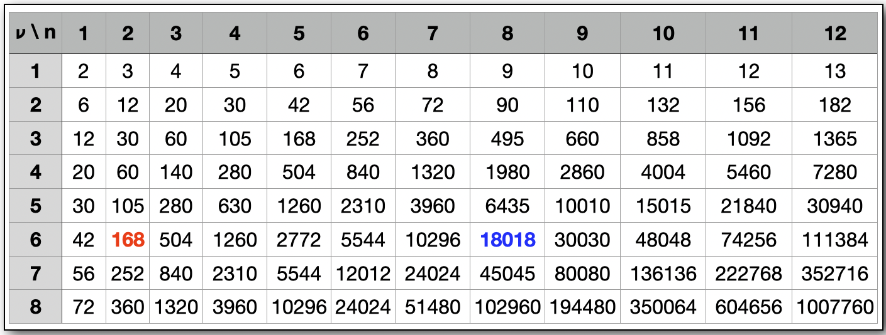
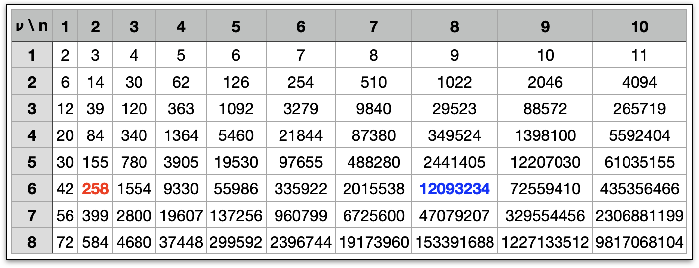

.. index::
   Differential algebra
   Taylor Series
   Generalized Truncated Power Series Algebra, GTPSA

********************
Differential Algebra
********************

This chapter describes real :type:`tpsa` and complex :type:`ctpsa` objects as supported by MAD-NG. The module for the Generalized Truncated Power Series Algebra (GTPSA) that represents parametric multivariate truncated `Taylor series <https://en.wikipedia.org/wiki/Taylor_series>`_ is not exposed, only the contructors are visible from the :mod:`MAD` environment and thus, TPSAs are handled directly by their methods or by the generic functions of the same name from the module :mod:`MAD.gmath`. Note that both :type:`tpsa` and :type:`ctpsa` are defined as C structure for direct compliance with the C API.

Introduction
============

TPSAs are numerical objects representing :math:`n`-th degrees Taylor polynomial approximation of some functions :math:`f(x)` about :math:`x=a`. They are a powerful differential algebra tool for solving physics problems described by differential equations and for `perturbation theory <https://en.wikipedia.org/wiki/Perturbation_theory>`_, e.g. for solving motion equations, but also for estimating uncertainties, modelling multidimensional distributions or calculating multivariate derivatives for optimization. There are often misunderstandings about their accuracy and limitations, so it is useful to clarify here some of these aspects here.

To begin with, GTPSAs represent multivariate Taylor series truncated at order :math:`n`, and thus behave like :math:`n`-th degrees multivariate polynomials with coefficients in :math:`\mathbb{R}` or :math:`\mathbb{C}`. MAD-NG supports GTPSAs with thousands of variables and/or parameters of arbitrary order each, up to a maximum total order of 63, but Taylor series with alternating signs in their coefficients can quickly be subject to numerical instabilities and `catastrophic cancellation <https://en.wikipedia.org/wiki/Catastrophic_cancellation>`_ as orders increase.

Other methods are not better and suffer from the same problem and more, such as symbolic differentiation, which can lead to inefficient code due to the size of the analytical expressions, or numerical differentiation, which can introduce round-off errors in the discretisation process and cancellation. Both classical methods are more problematic when computing high order derivatives, where complexity and errors increase.

Representation
--------------

A TPSA in the variable :math:`x` at order :math:`n` in the neighbourhood of the point :math:`a` in the domain of the function :math:`f`, noted :math:`T_f^n(x;a)`, has the following representation:

.. math::
   T_f^n(x;a) &= f(a) + f'(a) (x-a) + \frac{f''(a)}{2!} (x-a)^2 + \dots + \frac{f^{(n)}(a)}{n!} (x-a)^n \\
   &= \sum_{k=0}^{n} \frac{f_{a}^{(k)}}{k!}(x-a)^k

where the terms :math:`\frac{f_{a}^{(k)}}{k!}` are the coefficients stored in the :type:`tpsa` and :type:`ctpsa` objects.

The calculation of these coefficients uses a technique known as `automatic differentiation <https://en.wikipedia.org/wiki/Automatic_differentiation>`_ (AD) which operates as polynomials over the augmented (differential) algebra of `dual number <https://en.wikipedia.org/wiki/Dual_number>`_, *without any approximation*, being exact to numerical precision.

The validity of the polynomial representation :math:`T_f^n(x;a)` for the real or complex `analytic function <https://en.wikipedia.org/wiki/Analytic_function>`_ :math:`f` is characterized by the convergence of the remainder when the order :math:`n` goes to infinity:

.. math::
   \lim_{n \rightarrow \infty} R_f^n(x ; a) = \lim_{n \rightarrow \infty} f_a(x) - T_f^n(x ; a) = 0

and the `radius of convergence <https://en.wikipedia.org/wiki/Radius_of_convergence>`_ :math:`h` of :math:`T_f^n(x;a)` nearby the point :math:`a` is given by:

.. math::
   \min_{h>0} \lim_{n \rightarrow \infty} R_f^n(a\pm h ; a) \neq 0.

By using the `mean value theorem <https://en.wikipedia.org/wiki/Mean_value_theorem>`_ recursively we can derive the explicit mean-value form of the remainder:

.. math::
   R_f^n(x ; a) = \frac{f^{(n+1)}_a(\xi)}{(n+1)!} (x-a)^{n+1}

for some :math:`\xi` strictly between :math:`x` and :math:`a`, leading to the mean-value form of the `Taylor's theorem <https://en.wikipedia.org/wiki/Taylor%27s_theorem>`_:

.. math::
   f_a(x) = T_f^n(x ; a) + R_f^n(x ; a) = \sum_{k=0}^{n} \frac{f_{a}^{(k)}}{k!}(x-a)^k + \frac{f^{(n+1)}_a(\xi)}{(n+1)!} (x-a)^{n+1}

In practice, a truncation error is always present due to the truncated nature of the TPSA at order :math:`n`, but it is rarely calculated analytically for complex systems as it can be estimated by comparing the calculations at high and low orders, and determining the lowest order for which the result is sufficiently stable.

By extension, a TPSA in the two variables :math:`x` and :math:`y` at order 2 in the neighbourhood of the point :math:`(a,b)` in the domain of the function :math:`f`, noted :math:`T_f^2(x,y;a,b)`, has the following representation:

.. math::
   T_f^2(x,y;a,b) = f(a,b) + &\left(\frac{\partial f}{\partial x}\bigg\rvert_{(a,b)}\!\!\!\!\!\!\!(x-a) + \frac{\partial f}{\partial y}\bigg\rvert_{(a,b)}\!\!\!\!\!\!\!(y-b)\right) \\
   + \frac{1}{2!} &\left(\frac{\partial^2 f}{\partial x^2}\bigg\rvert_{(a,b)}\!\!\!\!\!\!\!(x-a)^2 
                   + 2\frac{\partial^2 f}{\partial x\partial y}\bigg\rvert_{(a,b)}\!\!\!\!\!\!\!(x-a)(y-b)
                   + \frac{\partial^2 f}{\partial y^2}\bigg\rvert_{(a,b)}\!\!\!\!\!\!\!(y-b)^2\right)

where the large brackets are grouping the terms in `homogeneous polynomials <https://en.wikipedia.org/wiki/Homogeneous_polynomial>`_, as stored in the :type:`tpsa` and :type:`ctpsa` objects. The central term of the second order :math:`2\frac{\partial^2 f}{\partial x\partial y}` emphasises the reason why the function :math:`f` must be analytic and independent of the integration path as it implies :math:`\frac{\partial^2 f}{\partial x\partial y} = \frac{\partial^2 f}{\partial y\partial x}` and stores the value (scaled by :math:`\frac{1}{2}`) as the coefficient of the monomial :math:`x^1 y^1`. This is an important consideration to keep in mind regarding TPSA, but it is not a pactical limitation due to the `conservative nature <https://en.wikipedia.org/wiki/Conservative_vector_field>`_ of our applications described by `Hamiltonian vector fields <https://en.wikipedia.org/wiki/Hamiltonian_vector_field>`_.

The generalization to a TPSA of :math:`\nu` variables :math:`X` at order :math:`n` nearby the point :math:`A` in the :math:`\nu`-dimensional domain of the function :math:`f`, noted :math:`T_f^n(X;A)`, has the following representation:

.. math::
   T_f^n(X;A) = \sum_{k=0}^n \frac{f_{A}^{(k)}}{k!}(X;A)^k = \sum_{k=0}^n \frac{1}{k!} \sum_{|\vec{m}|=k} \begin{pmatrix}k \\ \vec{m}\end{pmatrix} \frac{\partial^k f}{\partial X^{\vec{m}}}\bigg\rvert_{A}\!\!(X;A)^{\vec{m}}

where the term :math:`\begin{pmatrix}k \\ \vec{m}\end{pmatrix} = \frac{k!}{c_1!\,c_2!..c_{\nu}!}` is the `multinomial coefficient <https://en.wikipedia.org/wiki/Multinomial_theorem>`_ with :math:`\vec{m}` the vector of :math:`\nu` variables orders :math:`c_i, i=1..\nu` in the monomial and :math:`|\vec{m}| = \sum_i c_i` its total order. Again, we may mention that each term :math:`\frac{1}{k!} \begin{pmatrix}k \\ \vec{m}\end{pmatrix} \frac{\partial^k f}{\partial X^{\vec{m}}}\bigg\rvert_{A}` corresponds strictly to a coefficient stored in the :type:`tpsa` and :type:`ctpsa` objects.

An important point to mention is related to the *multinomial coefficient* and its relevance when computing physical quantities such as high order anharmonicities, e.g. chromaticities. When the physical quantity corresponds to the derivative of the function :math:`f^{(k)}_A`, the coefficient must be multiplied by :math:`c_1!\,c_2!\,..c_{\nu}!` in order to obtain the correct value.

Approximation
-------------

As already said, TPSAs do not perform approximations for orders :math:`0\,..n` and the Taylor's theorem gives an explicit form of the remainder for the truncation error of higher orders, while all derivatives are computed using AD. AD relies on the fact that any computer program can execute a sequence of elementary arithmetic operations and functions, and apply the chain rule to them repeatedly to automatically compute the derivatives to machine precision.

So when TPSAs introduce appromixation errors? When they are used as *interpolation functions* to approximate by substitution or perturbation, values at positions :math:`a+h` away from their initial point :math:`a`:

.. math::
   T_f^n(x+h;a) = \sum_{k=0}^{n} \frac{f_{a}^{(k)}}{k!} (x-a+h)^k 
               \quad \ne \quad
                  \sum_{k=0}^{n} \frac{f_{a+h}^{(k)}}{k!} (x-a-h)^k = T_f^n(x;a+h)

where the approximation error at order :math:`k` is given by:

.. math::
   \left|f^{(k)}_{a+h} - f^{(k)}_a\right| \approx \frac{1}{|2h|} \left|\frac{\text{d}^k T_f^n(x;a+h)}{\text{d} x^k} - \frac{\text{d}^k T_f^n(x+h;a)}{\text{d} x^k}\right| + {\cal O}(k+1)

In summary, operations and functions on TPSAs are exact while TPSAs used as functions lead to approximations even within the radius of convergence, unlike infinite Taylor series. MAD-NG never uses TPSAs as interpolation functions, but of course the module does provide users with methods for interpolating functions.

Application
-----------

MAD-NG is a tracking code that never composes elements maps during tracking, but performs a *functional application* of elements physics to user-defined input differential maps modelled as sets of TPSAs (one per variable). Tracking particles orbits is a specific case where the "differential" maps are of order 0, i.e. they contain only the scalar part of the maps and no derivatives. Therefore, TPSAs must also behave as scalars in polymorphic codes like MAD-NG, so that the same equations of motion can be applied by the same functions to particle orbits and differential maps. Thus, the :var:`track` command, and by extension the :var:`cofind` (closed orbit search) and :var:`twiss` commands, never use TPSAs as interpolation functions and the results are as accurate as for tracking particles orbits. In particular, it preserves the symplectic structure of the phase space if the applied elements maps are themselves `symplectic maps <https://en.wikipedia.org/wiki/Symplectomorphism>`_.

Users may be tempted to compute or compose elements maps to model whole elements or even large lattice sections before applying them to some input differential maps in order to speed up tracking or parallelise computations. But this approach leads to the two types of approximations that we have just explained: the resulting map is not only truncated, thus loosing local feed-down effects implied by e.g. a translation from orbit :math:`x` to :math:`x+h(s)` along the path :math:`s` or equivalently by the misalignment of the elements, but the derivatives are also approximated for each particle orbit by the global composition calculated on a nearby orbit, typically the zero orbit. So as the addition of floating point numbers is not associative, the composition of truncated maps is not associative too.

The following equations show the successive refinement of the calculations during tracking, starting from the worst but common approximations at the top-left to the more general and accurate functional application without approximation at the bottom-right, as computed by MAD-NG:

.. math::
   ({\mathcal M}_n \circ \cdots \circ {\mathcal M}_2 \circ {\mathcal M}_1) (X_0)
     &\ne {\mathcal M}_n( \cdots ({\mathcal M}_2({\mathcal M}_1 (X_0)))\cdots) \\
     &\ne \widetilde{\mathcal M}_n(\cdots (\widetilde{\mathcal M}_2 (\widetilde{\mathcal M}_1 (X_0)))\cdots) \\
     &\ne {\cal F}_n(\cdots ({\cal F}_2 ({\cal F}_1 (X_0)))\cdots) 

where :math:`{\mathcal M}_i` is the :math:`i`-th map computed at some *a priori* orbit (zero orbit), :math:`\widetilde{\mathcal M}_i` is the :math:`i`-th map computed at the input orbit :math:`X_{i-1}` which still implies some expansion, and finally :math:`{\mathcal F}_i` is the functional application of the full-fledged physics of the :math:`i`-th map without any intermediate expansion, i.e. without calculating a differential map, and with all the required knownledge including the input orbit :math:`X_{i-1}` to perform the exact calculation.

However, although MAD-NG only performs functional map applications (last right equation above) and never compute element maps or uses TPSAs as interpolation functions, it could be prone to small truncation errors during the computation of the non-linear normal forms which involves the composition of many orbitless maps, potentially breaking symplecticity of the resulting transformation for last order.

The modelling of multidimensional beam distributions is also possible with TPSAs, as when a linear phase space description is provided as initial conditions to the :var:`twiss` command through, e.g. a :var:`beta0` block. Extending the description of the initial phase space with high-order maps allows complex non-linear phase spaces to be modelled and their transformations along the lattice to be captured and analysed.

Performance
-----------

In principle, TPSAs should have equivalent performance to matrix/tensors for low orders and small number of variables, perhaps slightly slower at order 1 or 2 as the management of these data structures involves complex code and additional memory allocations. But from order 3 and higher, TPSA-based codes outperform matrix/tensor codes because the number of coefficients remains much smaller as shown in :numref:`fig.tpsa.size` and :numref:`fig.tensor.size`, and the complexity of the elementary operations (resp. multiplication) depends linearly (resp. quadratically) on the size of these data structures.

.. _fig.tpsa.size:

   Number of coefficients in TPSAs for :math:`\nu` variables at order :math:`n` is :math:`{\scriptstyle\begin{pmatrix} n+\nu \\[-1ex] \nu \end{pmatrix}} = \frac{(n+\nu)!}{n!\nu!}`.

.. _fig.tensor.size:

   Number of coefficients in tensors for :math:`\nu` variables at order :math:`n` is :math:`\sum_{k=0}^n \nu^{k+1} = \frac{\nu(\nu^{n+1}-1)}{\nu-1}`.

Constructors
============

Functions
=========

Methods
=======

Operators
=========

Iterators
=========

C API
=====

.. ---------------------------------------

.. rubric:: Footnotes

.. .. [#f1] The situation may be slightly different in RF cavities depending on the model used. 
