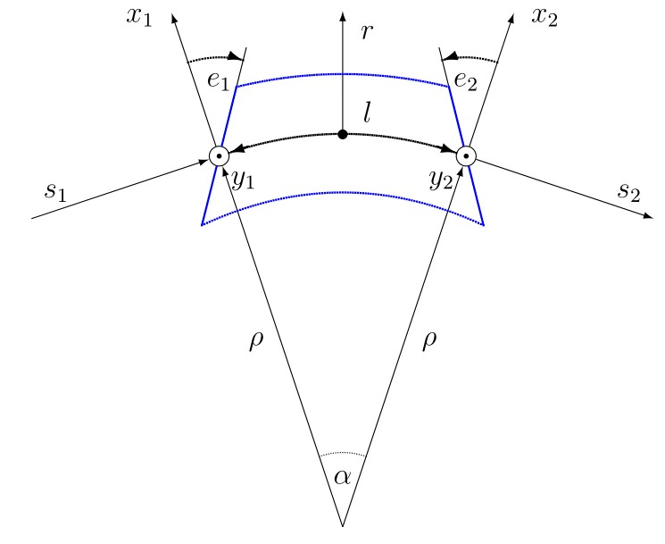
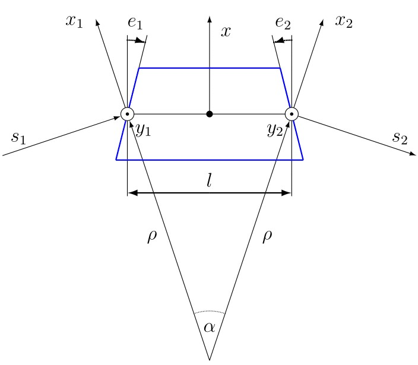
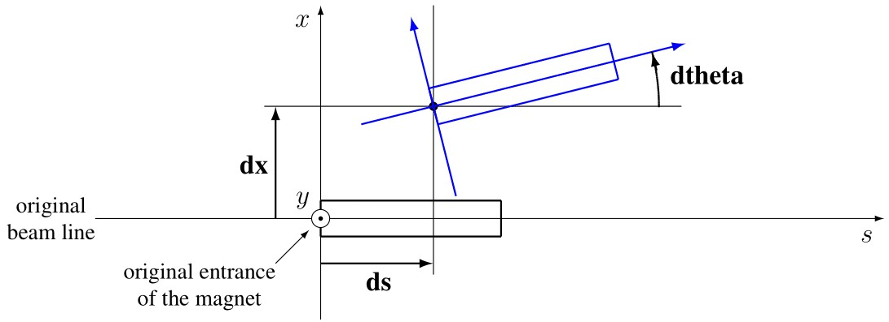
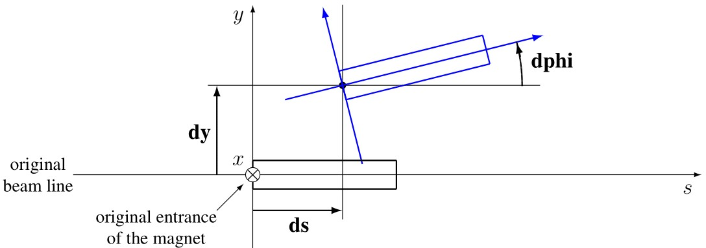
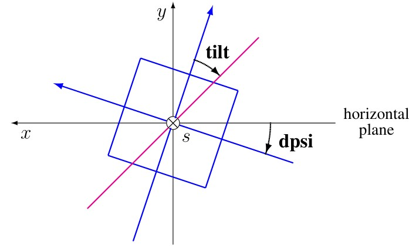

Elements
========
.. _ch.gen.elems:

The :literal:`element` object is the *root object* of all elements used to model particle accelerators, including sequences and drifts. It provides most default values inherited by all elements.

The :literal:`element` module extends the :doc:`typeid <types>` module with the :literal:`is_element` *function*, which returns :literal:`true` if its argument is an :literal:`element` object, :literal:`false` otherwise.

Taxonomy
--------

The classes defined by the :literal:`element` module are organized according to the kinds and the roles of their instances. The classes defining the kinds are:

**thin**
	 The *thin* elements have zero-length and their physics does not depend on it, i.e. the attribute :literal:`l` is discarded or forced to zero in the physics.

**thick**
	 The *thick* elements have a length and their physics depends on it. Elements like :literal:`sbend`, :literal:`rbend`, :literal:`quadrupole`, :literal:`solenoid`, and :literal:`elseparator` trigger a runtime error if they have zero-length. Other thick elements will accept to have zero-length for compatibility with MAD-X [#f1]_ , but their physics will have to be adjusted. [#f2]_ 

**drift**
	 The *drift* elements have a length with a :literal:`drift`-like physics if :math:`l\geq` :literal:`minlen` [#f3]_ otherwise they are discarded or ignored. Any space between elements with a length :math:`l\geq` :literal:`minlen` are represented by an :literal:`implicit` drift created on need by the :math:`s`-iterator of sequences and discarded afterward.

**patch**
	 The *patch* elements have zero-length and the purpose of their physics is to change the reference frame.

**extrn**
	 The *extern* elements are never part of sequences. If they are present in a sequence definition, they are expanded and replaced by their content, i.e. stay external to the lattice.

**specl**
	 The *special* elements have special roles like *marking* places (i.e. :literal:`maker`) or *branching* sequences (i.e. :literal:`slink`).

These classes are not supposed to be used directly, except for extending the hierarchy defined by the :literal:`element` module and schematically reproduced hereafter to help users understanding:

.. code-block:: lua
	
	thin_element = element  'thin_element' { is_thin    = true }
	thick_element = element 'thick_element' { is_thick   = true }
	drift_element = element 'drift_element' { is_drift   = true }
	patch_element = element 'patch_element' { is_patch   = true }
	extrn_element = element 'extrn_element' { is_extern  = true }
	specl_element = element 'specl_element' { is_special = true }
	
	sequence    = extrn_element 'sequence'    { }
	assembly    = extrn_element 'assembly'    { }
	bline       = extrn_element 'bline'       { }
	
	marker      = specl_element 'marker'      { }
	slink       = specl_element 'slink'       { }
	
	drift       = drift_element 'drift'       { }
	collimator  = drift_element 'collimator'  { }
	instrument  = drift_element 'instrument'  { }
	placeholder = drift_element 'placeholder' { }
	
	sbend       = thick_element 'sbend'       { }
	rbend       = thick_element 'rbend'       { }
	quadrupole  = thick_element 'quadrupole'  { }
	sextupole   = thick_element 'sextupole'   { }
	octupole    = thick_element 'octupole'    { }
	decapole    = thick_element 'decapole'    { }
	dodecapole  = thick_element 'dodecapole'  { }
	solenoid    = thick_element 'solenoid'    { }
	tkicker     = thick_element 'tkicker'     { }
	wiggler     = thick_element 'wiggler'     { }
	elseparator = thick_element 'elseparator' { }
	rfcavity    = thick_element 'rfcavity'    { }
	genmap      = thick_element 'genmap'      { }
	
	beambeam    = thin_element  'beambeam'    { }
	multipole   = thin_element  'multipole'   { }
	
	xrotation   = patch_element 'xrotation'   { }
	yrotation   = patch_element 'yrotation'   { }
	srotation   = patch_element 'srotation'   { }
	translate   = patch_element 'translate'   { }
	changeref   = patch_element 'changeref'   { }
	changedir   = patch_element 'changedir'   { }
	changenrj   = patch_element 'changenrj'   { }
	
	-- specializations
	rfmultipole = rfcavity      'rfmultipole' { }
	crabcavity  = rfmultipole   'crabcavity'  { }
	
	monitor     = instrument     'monitor'    { }
	hmonitor    = monitor       'hmonitor'    { }
	vmonitor    = monitor       'vmonitor'    { }
	
	kicker      = tkicker        'kicker'     { }
	hkicker     =  kicker       'hkicker'     { }
	vkicker     =  kicker       'vkicker'     { }

All the classes above, including :literal:`element`, define the attributes :literal:`kind = name` and :literal:`is_name = true` where :literal:`name` correspond to the class name. These attributes help to identify the kind and the role of an element as shown in the following code excerpt:

.. code-block:: lua
	
	local drift, hmonitor, sequence in MAD.element
	local dft = drift    {}
	local bpm = hmonitor {}
	local seq = sequence {}
	print(dft.kind)              -- display: drift
	print(dft.is_drift)          -- display: true
	print(dft.is_drift_element)  -- display: true
	print(bpm.kind)              -- display: hmonitor
	print(bpm.is_hmonitor)       -- display: true
	print(bpm.is_monitor)        -- display: true
	print(bpm.is_instrument)     -- display: true
	print(bpm.is_drift_element)  -- display: true
	print(bpm.is_element)        -- display: true
	print(bpm.is_drift)          -- display: true
	print(bpm.is_thick_element)  -- display: nil (not defined = false)
	print(seq.kind)              -- display: sequence
	print(seq.is_element)        -- display: true
	print(seq.is_extrn_element)  -- display: true
	print(seq.is_thick_element)  -- display: nil (not defined = false)

Attributes
----------

The :literal:`element` *object* provides the following attributes:

**l**
	 A *number* specifying the physical length of the element on the design orbit [m]. (default: :literal:`0`).

**lrad**
	 A *number* specifying the field length of the element on the design orbit considered by the radiation [m]. (default: :literal:`lrad = \s -> s.l`).

**angle**
	 A *number* specifying the bending angle :math:`\alpha` of the element [rad]. A positive angle represents a bend to the right, i.e. a :math:`-y`-rotation towards negative x values. (default: :literal:`0`).

**tilt**
	 A *number* specifying the physical tilt of the element [rad]. All the physical quantities defined by the element are in the tilted frame, except :literal:`misalign` that comes first when tracking through an element, see the :doc:`track <track>` command for details. (default: :literal:`0`).

**model**
	 A *string* specifying the integration model :literal:`"DKD"` or :literal:`"TKT"` to use when tracking through the element and overriding the command attribute, see the :doc:`track <track>` command for details. (default: :literal:`cmd.model`).

**method**
	 A *number* specifying the integration order 2, 4, 6, or 8 to use when tracking through the element and overriding the command attribute, see the :doc:`track <track>` command for details. (default: :literal:`cmd.method`).

**nslice**
	 A *number* specifying the number of slices or a *list* of increasing relative positions or a *callable* :literal:`(elm, mflw, lw)` returning one of the two previous kind of positions specification to use when tracking through the element and overriding the command attribute, see the :doc:`survey <survey>` or the :doc:`track <track>` commands for details. (default: :literal:`cmd.nslice`).

**refpos**
	 A *string* holding one of :literal:`"entry"`, :literal:`"centre"` or :literal:`"exit"`, or a *number* specifying a position in [m] from the start of the element, all of them resulting in an offset to substract to the :literal:`at` attribute to find the :math:`s`-position of the element entry when inserted in a sequence, see :ref:`element positions<element positions>` for details. (default: :literal:`nil` :math:`\equiv` :literal:`seq.refer`).

**aperture**
	 A *mappable* specifying aperture attributes, see :ref:`Aperture <sec.elm.aper>` for details. \\
	 (default: :literal:`{kind='circle', 1}`).

**apertype**
	 A *string* specifying the aperture type, see :ref:`Aperture <sec.elm.aper>` for details. \\
	 (default: :literal:`\s -> s.aperture.kind or 'circle'`). [#f4]_ 

**misalign**
	 A *mappable* specifying misalignment attributes, see :ref:`Misalignment <sec.elm.misalign>` for details. \\

The :literal:`thick_element` *object* adds the following multipolar and fringe fields attributes:

**knl, ksl**
	 A *list* specifying respectively the **multipolar** and skew integrated strengths of the element [m\ :math:`^{-i+1}`]. (default: ).

**dknl, dksl**
	 A *list* specifying respectively the multipolar and skew integrated strengths errors of the element [m\ :math:`^{-i+1}`]. (default: ).

**e1, e2**
	 A *number* specifying respectively the horizontal angle of the pole faces at entry and exit of the element [rad]. A positive angle goes toward inside the element, see Figures :numref:`figsbend` and :numref:`figrbend`. (default: :literal:`0`).

**h1, h2**
	 A *number* specifying respectively the horizontal curvature of the pole faces at entry and exit of the element [m\ :math:`^{-1}`]. A positive curvature goes toward inside the element. (default: ).

**hgap**
	 A *number* specifying half of the vertical gap at the center of the pole faces of the element [m]. (default: :literal:`0`).

**fint**
	 A *number* specifying the fringe field integral at entrance of the element. (default: :literal:`0`).

**fintx**
	 A *number* specifying the fringe field integral at exit of the element. (default: :literal:`fint`).

**fringe**
	 A *number* specifying the bitmask to activate fringe fields of the element, see :ref:`Flags <sec.elm.flgs>` for details. (default: :literal:`0`).

**fringemax**
	 A *number* specifying the maximum order for multipolar fringe fields of the element. (default: :literal:`2`).

**kill_ent_fringe**
	 A *log* specifying to kill the entry fringe fields of the element. (default: :literal:`false`).

**kill_exi_fringe**
	 A *log* specifying to kill the entry fringe fields of the element. (default: :literal:`false`).

**f1, f2**
	 A *number* specifying quadrupolar fringe field first and second parameter of SAD. (default: :literal:`0`).

Methods
-------

The :literal:`element` object provides the following methods:

**select**
	 A *method*	:literal:`([flg])` to select the element for the flags :literal:`flg` (default: :literal:`selected`).

**deselect**
	 A *method*	:literal:`([flg])` to deselect the element for the flags :literal:`flg` (default: :literal:`selected`).

**is_selected**
	 A *method*	:literal:`([flg])` to test the element for the flags :literal:`flg` (default: :literal:`selected`).

**is_disabled**
	 A *method*	:literal:`()` to test if the element is *disabled*, which is equivalent to call the method :literal:`is_selected(disabled)`.

**is_observed**
	 A *method*	:literal:`()` to test if the element is *observed*, which is equivalent to call the method :literal:`is_selected(observed)`.

**is_implicit**
	 A *method*	:literal:`()` to test if the element is *implicit*, which is equivalent to call the method :literal:`is_selected(implicit)`.

The :literal:`drift_element` and :literal:`thick_element` objects provide the following extra methods, see :ref:`sub-elements <sec.elm.subelm>` for details about the :literal:`sat` attribute:

**index_sat**
	 A *method*	:literal:`(sat, [cmp])` returning the lowest index :literal:`idx` (starting from 1) of the first sub-element with a relative position from the element entry that compares :literal:`true` with the *number* :literal:`sat` using the optional \CALBLA{cmp(sat, self[idx].sat)} (default: :literal:`"=="`), or :literal:`#self+1`. In the presence of multiple equal positions, :literal:`"<="` (resp. :literal:`">="`) will return the lowest index of the position while :literal:`"<"` (resp. :literal:`">"`) the lowest index next to the position for ascending (resp. descending) order.

**insert_sat**
	 A *method*	:literal:`(elm, [cmp])` returning the element after inserting the sub-element :literal:`elm` at the index determined by :literal:`:index_sat(elm.sat, [cmp])` using the optional \CALBLA{cmp} (default: :literal:`"<"`).

**replace_sat**
	 A *method*	:literal:`(elm)` returning the replaced sub-element found at the index determined by :literal:`:index_sat(elm.sat)` by the new sub-element :literal:`elm`, or :literal:`nil`.

**remove_sat**
	 A *method*	:literal:`(sat)` returning the removed sub-element found at the index determined by :literal:`:index_sat(sat)`, or :literal:`nil`.

Metamethods
-----------

The :literal:`element` object provides the following metamethods:

**__len**
	 A *metamethod*	:literal:`()` overloading the length operator :literal:`#` to return the number of subelements in the *list* part of the element.

**__add**
	 A *metamethod*	:literal:`(obj)` overloading the binary operator :literal:`+` to build a :literal:`bline` object from the juxtaposition of two elements.

**__mul**
	 A *metamethod*	:literal:`(n)` overloading the binary operator :literal:`*` to build a :literal:`bline` object from the repetition of an element :literal:`n` times, i.e. one of the two operands must be a *number*.

**__unm**
	 A *metamethod*	:literal:`(n)` overloading the unary operator :literal:`-` to build a :literal:`bline` object from the turning of an element, i.e. reflect the element.

**__tostring**
	 A *metamethod*	:literal:`()` returning a *string* built from the element information, e.g. :literal:`print(monitor 'bpm' {})` display the *string* :literal:`":monitor: 'bpm' memory-address`

The operators overloading of elements allows to unify sequence and beamline definitions in a consistent and simple way, noting that :literal:`sequence` and :literal:`bline` are (external) elements too.

**__elem**
	 A unique private *reference* that characterizes elements.

Elements
--------

Some elements define new attributes or override the default values provided by the *root object* :literal:`element`. The following subsections describe the elements supported by \MAD.

SBend
"""""

The :literal:`sbend` element is a sector bending magnet with a curved reference system as shown in :numref:`figsbend`, and defines or overrides the following attributes:

**k0**
	A :literal:`number` specifying the dipolar strength of the element [:math:`\mathrm{m}^{-1}`].
	(default: :literal:`k0 = \s -> s.angle/s.l`). [#f5]_ [#f6]_

**k0s**
	 A *number* specifying the dipolar skew strength of the element [m\ :math:`^{-1}`]. (default: :literal:`0`).

**k1, k1s**
	 A *number* specifying respectively the quadrupolar and skew strengths of the element [m\ :math:`^{-2}`]. (default: :literal:`0`).

**k2, k2s**
	 A *number* specifying respectively the sextupolar and skew strengths of the element [m\ :math:`^{-3}`]. (default: :literal:`0`).

**fringe**
	 Set to flag :literal:`fringe.bend` to activate the fringe fields by default, see :ref:`Flags <sec.elm.flgs>` for details.

	Reference system for a sector bending magnet.

RBend
"""""

The :literal:`rbend` element is a rectangular bending magnet with a straight reference system as shown in :numref:`figrbend`, and defines or overrides the following attributes:

**k0**
	A :literal:`number` specifying the dipolar strength of the element [:math:`\mathrm{m}^{-1}`].
	(default: :literal:`k0 = \s -> s.angle/s.l`). [#f5]_ [#f6]_

**k0s**
	 A *number* specifying the dipolar skew strength of the element [m\ :math:`^{-1}`]. (default: :literal:`0`).

**k1, k1s**
	 A *number* specifying respectively the quadrupolar and skew strengths of the element [m\ :math:`^{-2}`]. (default: :literal:`0`).

**k2, k2s**
	 A *number* specifying respectively the sextupolar and skew strengths of the element [m\ :math:`^{-3}`]. (default: :literal:`0`).

**fringe**
	 Set to flag :literal:`fringe.bend` to activate the fringe fields by default, see :ref:`Flags <sec.elm.flgs>` for details.

**true_rbend**
	 A *log* specifying if this :literal:`rbend` element behaves like (:literal:`false`) a :literal:`sbend` element with parallel pole faces, i.e. :math:`e_1=e_2=\alpha/2` in :numref:`figsbend` , or like (:literal:`true`) a rectangular bending magnet with a straight reference system as shown in :numref:`figrbend`. (default: :literal:`false`). [#f6]_

	Reference system for a rectangular bending magnet.

Quadrupole
""""""""""

The :literal:`quadrupole` element is a straight focusing element and defines the following attributes:

**k0, k0s**
	 A *number* specifying respectively the dipolar and skew strengths of the element [m\ :math:`^{-1}`]. (default: :literal:`0`).

**k1, k1s**
	 A *number* specifying respectively the quadrupolar and skew strengths of the element [m\ :math:`^{-2}`]. (default: :literal:`0`).

**k2, k2s**
	 A *number* specifying respectively the sextupolar and skew strengths of the element [m\ :math:`^{-3}`]. (default: :literal:`0`).

Sextupole
"""""""""

The :literal:`sextupole` element is a straight element and defines the following attributes:

**k2, k2s**
	 A *number* specifying respectively the sextupolar and skew strengths of the element [m\ :math:`^{-3}`]. (default: :literal:`0`).

Octupole
""""""""

The :literal:`octupole` element is a straight element and defines the following attributes:

**k3, k3s**
	 A *number* specifying respectively the octupolar and skew strengths of the element [m\ :math:`^{-4}`]. (default: :literal:`0`).

Decapole
""""""""

The :literal:`decapole` element is a straight element and defines the following attributes:

**k4, k4s**
	 A *number* specifying respectively the decapolar and skew strength of the element [m\ :math:`^{-5}`]. (default: :literal:`0`).

Dodecapole
""""""""""

The :literal:`dodecapole` element is a straight element and defines the following attributes:

**k5, k5s**
	 A *number* specifying respectively the dodecapolar and skew strength of the element [m\ :math:`^{-6}`]. (default: :literal:`0`).

Solenoid
""""""""

The :literal:`solenoid` element defines the following attributes:

**ks, ksi**
	 A *number* specifying respectively the strength [rad/m] and the integrated strength [rad] of the element. A positive value points toward positive :math:`s`. (default: :literal:`0`).

Multipole
"""""""""

The :literal:`multipole` element is a thin element and defines the following attributes: 

**knl, ksl**
	 A *list* specifying respectively the multipolar and skew integrated strengths of the element [m\ :math:`^{-i+1}`]. (default: :literal:`{}`).

**dknl, dksl**
	 A *list* specifying respectively the multipolar and skew integrated strengths errors of the element [m\ :math:`^{-i+1}`]. (default: :literal:`{}`).

TKicker
"""""""

The :literal:`tkicker` element is the *root object* of kickers and defines or overrides the following attributes:

**hkick**
	 A *number* specifying the horizontal strength of the element [m\ :math:`^{-1}`]. By convention, a kicker with a positive horizontal strength kicks in the direction of the reference orbit, e.g. :literal:`hkick` :math:`\equiv` :literal:`- knl[1]`. (default: :literal:`0`).

**vkick**
	 A *number* specifying the vertical strength of the element [m\ :math:`^{-1}`]. By convention, a kicker with a positive vertical strength kicks toward the reference orbit, e.g. :literal:`vkick` :math:`\equiv` :literal:`ksl[1]`. (default: :literal:`0`).

**method**
	 Set to :literal:`2` if :literal:`ptcmodel` is not set to enforce pure momentum kick and avoid dipolar strength integration that would introduce dispersion.

Kicker, HKicker, VKicker
""""""""""""""""""""""""

The :literal:`kicker` element inheriting from the :literal:`tkicker` element, is the *root object* of kickers involved in the orbit correction and defines the following attributes:

**chkick, cvkick**
	 A *number* specifying respectively the horizontal and vertical correction strength of the element set by the :doc:`correct <correct>` command [m\ :math:`^{-1}`]. (default: ).

The :literal:`hkicker` (horizontal kicker) and :literal:`vkicker` (vertical kicker) elements define the following attribute:

**kick**
	 A *number* specifying the strength of the element in its main direction [m\ :math:`^{-1}`]. (default: ).

Monitor, HMonitor, VMonitor
"""""""""""""""""""""""""""

The :literal:`monitor` element is the root object of monitors involved in the orbit correction and defines the following attributes:

**mredx, mredy**
	 A *number* specifying respectively the readout :math:`x`\ , :math:`y`\ -offset error of the element [m]. The offset is added to the beam position during orbit correction (after scaling). (default: :literal:`0`).

**mresx, mresy**
	 A *number* specifying respectively the readout :math:`x`\ ,:math:`y`\ -scaling error of the element. The scale factor multiplies the beam position by :literal:`1+mres` (before offset) during orbit correction. [#f7]_ (default: :literal:`0`).

The :literal:`hmonitor` (horizontal monitor) and :literal:`vmonitor` (vertical monitor) elements are specialisations inheriting from the :literal:`monitor` element.

RFCavity
""""""""

The :literal:`rfcavity` element defines the following attributes:

**volt**
	 A *number* specifying the peak RF voltage of the element [MV]. (default: :literal:`0`).

**freq**
	 A *number* specifying a non-zero RF frequency of the element [MHz]. (default: :literal:`0`).

**lag**
	 A *number* specifying the RF phase lag of the element in unit of :math:`2\pi`. (default: :literal:`0`).

**harmon**
	 A *number* specifying the harmonic number of the element if :literal:`freq` is zero. (default: :literal:`0`).

**n_bessel**
	 A *number* specifying the transverse focussing effects order of the element. (default: :literal:`0`).

**totalpath**
	 A *log* specifying if the totalpath must be used in the element. (default: :literal:`true`).

RFMultipole
"""""""""""

The :literal:`rfmultipole` element defines the following attributes:

**pnl, psl**
	 A *list* specifying respectively the multipolar and skew phases of the element [rad]. (default: :literal:`{}`).

**dpnl, dpsl**
	 A *list* specifying respectively the multipolar and skew phases errors of the element [rad]. (default: :literal:`{}`).

ElSeparator
"""""""""""

The :literal:`elseparator` element defines the following attributes:

**ex, ey**
	 A *number* specifying respectively the electric field :math:`x`\ , :math:`y`\ -strength of the element [MV/m]. (default: :literal:`0`).

**exl, eyl**
	 A *number* specifying respectively the integrated electric field :math:`x`\ , :math:`y`\ -strength of the element [MV]. (default: :literal:`0`).

Wiggler
"""""""

The :literal:`wiggler` element defines the following attributes: NYI, TBD

BeamBeam
""""""""

The :literal:`beambeam` element defines the following attributes: NYI, TBD

GenMap
""""""

The :literal:`genmap` element defines the following attributes: [#f8]_

**damap**
	 A :literal:`damap` used for thick integration.

**update**
	 A *callable* :literal:`(elm, mflw, lw)` invoked before each step of thick integration to update the :literal:`damap`. (default: :literal:`nil`)

**nslice**
	 A *number* specifying the number of slices or a *list* of increasing relative positions or a *callable* :literal:`(elm, mflw, lw)` returning one of the two previous kind of positions specification to use when tracking through the element and overriding the command attribute, see the :doc:`survey <survey>` or the :doc:`track <track>` commands for details. (default: :literal:`1`).

SLink
"""""

The :literal:`slink` element defines the following attributes: [#f9]_

**sequence**
	 A *sequence* to switch to right after exiting the element. (default: :literal:`nil`)

**range**
	 A *range* specifying the span over the sequence to switch to, as expected by the sequence method :literal:`:siter`. (default: :literal:`nil`).

**nturn**
	 A *number* specifying the number of turn to track the sequence to switch to, as expected by the sequence method :literal:`:siter`. (default: :literal:`nil`).

**dir**
	 A *number* specifying the :math:`s`-direction of the tracking of the sequence to switch to, as expected by the sequence method :literal:`:siter`. (default: :literal:`nil`).

**update**
	 A *callable* :literal:`(elm, mflw)` invoked before retrieving the other attributes when entering the element. (default: :literal:`nil`)

Translate
"""""""""

The :literal:`translate` element is a patch element and defines the following attributes:

**dx, dy, ds**
	 A *number* specifying respectively :math:`x`\ , :math:`y`\ , :math:`s`-translation of the reference frame [m]. (default: :literal:`0`)

XRotation, YRotation, SRotation
"""""""""""""""""""""""""""""""

The :literal:`xrotation` (rotation around :math:`x`-axis), :literal:`yrotation` (rotation around :math:`y`-axis) and :literal:`srotation` (rotation around :math:`s`-axis) elements are patches element and define the following attribute:

**angle**
	 A *number* specifying the rotation angle around the axis of the element [rad]. (default: :literal:`0`).

ChangeRef
"""""""""

The :literal:`changeref` element is a patch element and defines the following attributes:

**dx, dy, ds**
	 A *number* specifying respectively :math:`x`\ , :math:`y`\ , :math:`s`-translation of the reference frame [m]. (default: :literal:`0`)

**dtheta, dphi, dpsi**
	 A *number* specifying respectively :math:`y`\ , :math:`-x`\ , :math:`s`-rotation of the reference frame applied in this order after any translation [rad]. (default: :literal:`0`)

ChangeDir
"""""""""

The :literal:`changedir` element is a patch element that reverses the direction of the sequence during the tracking.

ChangeNrj
"""""""""

The :literal:`changenrj` element is a patch element and defines the following attributes:

**dnrj**
	 A *number* specifying the change by :math:`\delta_E` of the *reference* beam energy [GeV]. The momenta of the particles or damaps belonging to the reference beam (i.e. not owning a beam) are updated, while other particles or damaps owning their beam are ignored. (default: :literal:`0`)

.. _sec.elm.flgs:

Flags
-----

The :literal:`element` module exposes the following *object* flags through :literal:`MAD.element.flags` to use in conjunction with the methods :literal:`select` and :literal:`deselect`: [#f10]_ 

**none**
	 All bits zero.

**selected**
	 Set if the element has been selected.

**disabled**
	 Set if the element has been disabled, e.g. for orbit correction.

**observed**
	 Set if the element has been selected for observation, e.g. for output to TFS table.
	 The :literal:`$end` markers are selected for observation by default, and commands with the :literal:`observe` attribute set to :literal:`0` discard this flag and consider all elements as selected for observation.

**implicit**
	 Set if the element is implicit, like the temporary *implicit* drifts created on-the-fly by the :literal:`sequence` :math:`s`-iterator with indexes at half integers. This flag is used by commands with the :literal:`implicit` attribute.

**playout**
	 Set if the element :literal:`angle` must be used by layout plot. This flag is useful to plot multiple sequence layouts around interaction points, like :literal:`lhcb1` and :literal:`lhcb2` around :literal:`IP1` and :literal:`IP5`.

.. _sec.elm.frng:

Fringe fields
-------------

The :literal:`element` module exposes the following flags through :literal:`MAD.element.flags.fringe` to *control* the elements fringe fields through their attribute :literal:`fringe`, or to *restrict* the activated fringe fields with the commands attribute :literal:`fringe`: [#f11]_ 

**none**
	 All bits zero.

**bend**
	 Control the element fringe fields for bending fields.

**mult**
	 Control the element fringe fields for multipolar fields up to :literal:`fringemax` order.

**rfcav**
	 Control the element fringe fields for rfcavity fields.

**qsad**
	 Control the element fringe fields for multipolar fields with extra terms for quadrupolar fields for compatibility with SAD.

**comb**
	 Control the element fringe fields for combined bending and multipolar fields.

**combqs**
	 Control the element fringe fields for combined bending and multipolar fields with extra terms for quadrupolar fields for compatibility with SAD.

The :literal:`thick_element` provides a dozen of attributes to parametrize the aforementionned fringe fields. Note that in some future, part of these attributes may be grouped into a *mappable* to ensure a better consistency of their parametrization.

.. _sec.elm.subelm:

Sub-elements
------------

An element can have thin or thick sub-elements stored in its *list* part, hence the length operator :literal:`#` returns the number of them. The attribute :literal:`sat` of sub-elements, i.e. read :literal:`s`\ ub-\ :literal:`at`\ , is interpreted as their relative position from the entry of their enclosing main element, that is a fractional of its length. The positions of the sub-elements can be made absolute by dividing their :literal:`sat` attribute by the length of their main element using lambda expressions. The sub-elements are only considered and valid in the :literal:`drift_element` and :literal:`thick_element` kinds that implement the methods :literal:`:index_sat`, :literal:`:insert_sat`, :literal:`:remove_sat`, and :literal:`:replace_sat` to manage sub-elements from their :literal:`sat` attribute. The sequence method :literal:`:install` updates the :literal:`sat` attribute of the elements installed as sub-elements if the *log* :literal:`elements.subelem` of the packed form is enabled, i.e. when the :math:`s`-position determined by the :literal:`at`, :literal:`from` and :literal:`refpos` attributes falls inside a non-zero length element already installed in the sequence that is not an *implicit* drift. The physics of thick sub-elements will shield the physics of their enclosing main element along their length, unless they combine their attributes with those of their main element using lambda expressions to select some combined function physics.

.. _sec.elm.aper:

Aperture
--------

All the apertures are *mappable* defined by the following attributes in the tilted frame of an element, see the :doc:`track <track>` command for details:

**kind**
	 A *string* specifying the aperture shape. (no default).

**tilt**
	 A *number* specifying the tilt angle of the aperture [rad]. (default: :literal:`0`).

**xoff, yoff**
	 A *number* specifying the transverse :math:`x,y`\ -offset of the aperture [m]. (default: :literal:`0`).

**maper**
	 A *mappable* specifying a smaller aperture [#f12]_ than the :literal:`polygon` aperture to use before checking the polygon itself to speed up the test. The attributes :literal:`tilt`, :literal:`xoff` and :literal:`yoff` are ignored and superseded by the ones of the :literal:`polygon` aperture. (default: :literal:`nil`).

The supported aperture shapes are listed hereafter. The parameters defining the shapes are expected to be in the *list* part of the apertures and defines the top-right sector shape, except for the :literal:`polygon`:

**square**
	 A square shape with one parameter defining the side half-length. It is the default aperture check with limits set to :literal:`1`.

**rectangle**
	 A rectangular shape with two parameters defining the :math:`x`\ , :math:`y`\ -half lengths (default: :literal:`1` [m]).

**circle**
	 A circular shape with one parameter defining the radius.

**ellipse**
	 A elliptical shape with two parameters defining the :math:`x`\ , :math:`y`\ -radii. (default: :literal:`1` [m]).

**rectcircle**
	 A rectangular shape intersected with a circular shape with three parameters defining the :math:`x`\ , :math:`y`\ -half lengths and the radius. (default: :literal:`1` [m]).

**rectellipse**
	 A rectangular shape intersected with an elliptical shape with four parameters defining the :math:`x`\ , :math:`y`\ -half lengths and the :math:`x`\ , :math:`y`\ -radii.

**racetrack**
	 A rectangular shape with corners rounded by an elliptical shape with four parameters defining the :math:`x`\ , :math:`y`\ -half lengths and the corners :math:`x`\ , :math:`y`\ -radii.

**octagon**
	 A rectangular shape with corners truncated by a triangular shape with four parameters defining the :math:`x`\ , :math:`y`\ -half lengths and the triangle :math:`x`\ , :math:`y`\ -side lengths. An octagon can model hexagon or diamond shapes by equating the triangle lengths to the rectangle half-lengths.

**polygon**
	 A polygonal shape defined by two vectors :literal:`vx` and :literal:`vy` holding the vertices coordinates. The polygon does not need to be convex, simple or closed, but in the latter case it will be closed automatically by joining the first and the last vertices.

**bbox**
	 A 6D bounding box with six parameters defining the upper limits of the absolute values of the six coordinates.

.. code-block:: lua
	
	local quadrupole in MAD.element
	local mq = quadrupole 'mq' { l=1,                               -- new class
	  aperture = { kind='racetrack',
	               tilt=pi/2, xoff=1e-3, yoff=5e-4,                 -- attributes
	               0.06,0.06,0.01,0.01 }                            -- parameters
	}
	local mqdiam = quadrupole 'mqdiam' { l=1,                       -- new class
	  aperture = { kind='octagon', xoff=1e-3, yoff=1e-3,            -- attributes
	               0.06,0.04,0.06,0.04 }                            -- parameters
	}
	local mqpoly = quadrupole 'mqpoly' { l=1,                       -- new class
	  aperture = { kind='polygon', tilt=pi/2, xoff=1e-3, yoff=1e-3, -- attributes
	               vx=vector{0.05, ...}, vy=vector{0, ...},         -- parameters
	               aper={kind='circle', 0.05}                       -- 2nd aperture
	}

.. _sec.elm.misalign:

Misalignment
------------

The misalignments are *mappable* defined at the entry of an element by the following attributes, see the :doc:`track <track>` command for details:

**dx, dy, ds**
	 A *number* specifying the :math:`x`\ , :math:`y`\ , :math:`s`\ -displacement at the element entry [m], see :numref:`fig-gen-dispxs` and :numref:`fig-gen-dispys` . (default: :literal:`0`).

**dtheta**
	 A *number* specifying the :math:`y`-rotation angle (azimuthal) at the element entry [rad], see :numref:`fig-gen-dispxs`. (default: :literal:`0`).

**dphi**
	 A *number* specifying the :math:`-x`-rotation angle (elevation) at the entry of the element [rad], see :numref:`fig-gen-dispxy` . (default: :literal:`0`).

**dpsi**
	 A *number* specifying the :math:`s`-rotation angle (roll) at the element entry [rad], see :numref:`fig-gen-dispxy` . (default: :literal:`0`).

Two kinds of misalignments are available for an element and summed beforehand:

*	 The *absolute* misalignments of the element versus its local reference frame, and specified by its :literal:`misalign` attribute. These misalignments are always considered.

*	 The *relative* misalignments of the element versus a given sequence, and specified by the :literal:`:misalign` of :literal:`sequence`. These misalignments can be considered or not depending of command settings.

	Displacements in the :math:`(x, s)` plane.

	Displacements in the :math:`(y, s)` plane.

	Displacements in the :math:`(x, y)` plane.

.. rubric:: Footnotes

.. [#f1] In MAD-X, zero-length :literal:`sextupole` and :literal:`octupole` are valid but may have surprising effects...
.. [#f2] E.g. zero-length :literal:`sextupole` must define their strength with :literal:`knl[3]` instead of :literal:`k2` to have the expected effect.
.. [#f3] By default :literal:`minlen` = :math:`10^{-12}` m.
.. [#f4] This attribute was introduced to ease the translation of MAD-X sequences and may disappear in some future.
.. [#f5] By default bending magnets are ideal bends, that is :literal:`angle = k0*l`
.. [#f6] For compatibility with MAD-X.
.. [#f7] This definition comes from MAD-X default zeroed values such that undefined attribute gives a scale of :literal:`1`.
.. [#f8] This element is a generalization of the :literal:`matrix` element of MAD-X, to use with care!
.. [#f9] This element allows to switch between sequences during tracking, kind of :literal:`if-then-else` for tracking.
.. [#f10] Remember that flags are *not* inherited nor copied as they are qualifying the object itself.
.. [#f11] Those flags are *not* object flags, but fringe fields flags.
.. [#f12] It is the responsibility of the user to ensure that :literal:`maper` defines a smaller aperture than the polygon aperture.