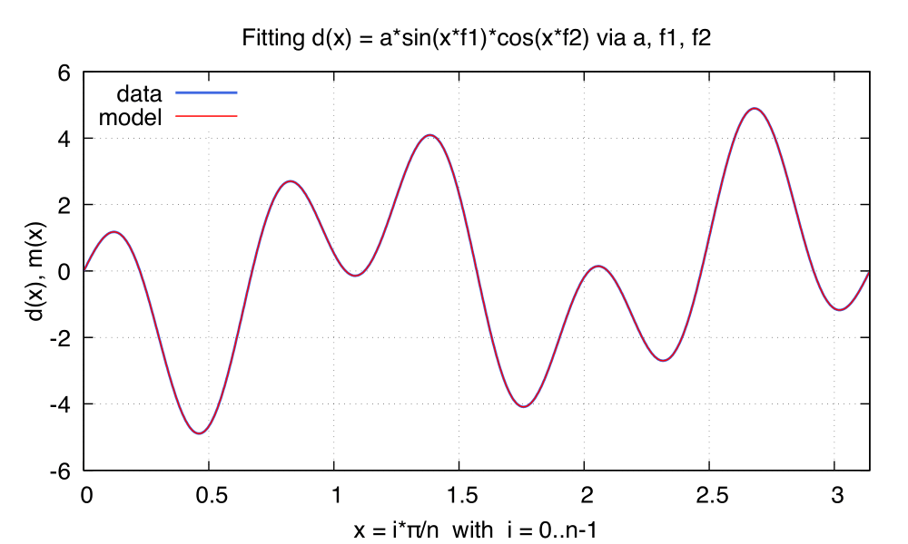
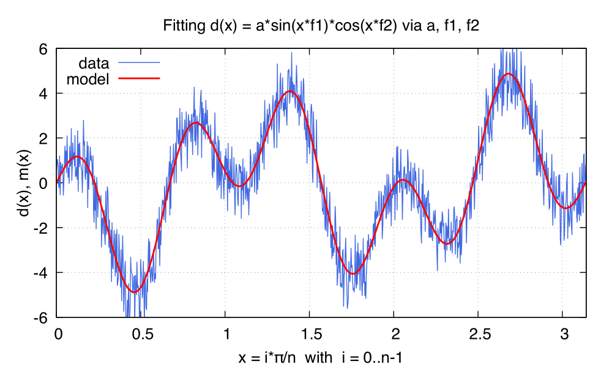
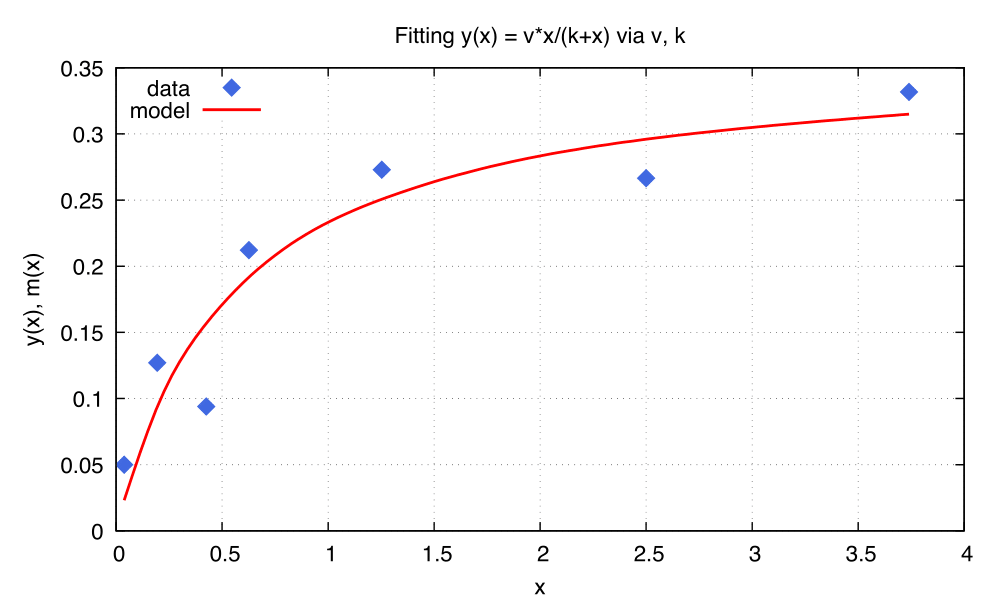

.. role:: raw-latex(raw)
   :format: latex

Match
=====
.. _ch.cmd.match:

The :literal:`match` command provides a unified interface to several optimizer. It can be used to match optics parameters (its main purpose), to fit data sets with parametric functions in the least-squares sense, or to find local or global minima of non-linear problems. Most local methods support bounds, equalities and inequalities constraints. The *least-squares* methods are custom variant of the Newton-Raphson and the Gauss-Newton algorithms implemented by the :ref:`LSopt <sec.match.lsopt>` module. The local and global *non-linear* methods are relying on the :ref:`NLopt <sec.match.lsopt>` module, which interfaces the embedded `NLopt <https://nlopt.readthedocs.io/en/latest/>`_ library that implements a dozen of well-known algorithms.

Command synopsis
----------------
.. _sec.match.synop:

The :literal:`match` command format is summarized in :numref:`fig-match-synop`. including the default setup of the attributes.

.. code-block::
	:caption: Synopsis of the :literal:`match` command with default setup.
	:name: fig-match-synop

	status, fmin, ncall = match { 
		command		= function or nil, 
		variables 	= { variables-attributes, 
					{ variable-attributes }, 
					..., more variable definitions, ... 
					{ variable-attributes } }, 
		equalities 	= { constraints-attributes, 
					{ constraint-attributes }, 
					..., more equality definitions, ... 
					{ constraint-attributes } }, 
		inequalities 	= { constraints-attributes, 
					{ constraint-attributes }, 
					..., more inequality definitions,... 
					{ constraint-attributes } }, 
		weights 	= { weights-list }, 
		objective 	= {  objective-attributes }, 
		maxcall=nil,  	-- call limit 
		maxtime=nil,  	-- time limit 
		info=nil,  	-- information level (output on terminal) 
		debug=nil, 	-- debug information level (output on terminal) 
		usrdef=nil,  	-- user defined data attached to the environment 
	}

The :literal:`match` command supports the following attributes:

.. _match.attr:

:ref:`command <sec.match.cmd>`
	A *callable* :literal:`(e)` that will be invoked during the optimization process at each iteration. (default: :const:`nil`). 

	Example: :expr:`command := twiss { twiss-attributes }`.

:ref:`variables <sec.match.var>`
	An *mappable* of single :ref:`variable <sec.match.var>` specification that can be combined with a *set* of specifications for all variables. (no default, required). 

	Example: :expr:`variables = {{ var="seq.knobs.mq_k1" }}`.

:ref:`equalities <sec.match.cst>`
	An *mappable* of single equality specification that can be combined with a *set* of specifications for all equalities. (default: :literal:`{}`). 

	Example: :expr:`equalities = {{  expr=\\t -> t.q1-64.295, name='q1' }}`.

:ref:`inequalities <sec.match.cst>`
	An *mappable* of single inequality specification that can be combined with a *set* of specifications for all inequalities. (default: :literal:`{}`). 

	Example: :expr:`inequalities = {{  expr=\\t -> t.mq4.beta11-50 }}`.

:ref:`weights <sec.match.cst>`
	A *mappable* of weights specification that can be used in the :literal:`kind` attribute of the constraints specifications. (default: :literal:`{}`). 

	Example: :expr:`weights = { px=10 }`.

:ref:`objective <sec.match.obj>`
	A *mappable* of specifications for the objective to minimize. (default: :literal:`{}`). 

	Example: :expr:`objective = { method="LD_LMDIF", fmin=1e-10 }`.

**maxcall**
	A *number* specifying the maximum allowed calls of the :literal:`command` function or the :literal:`objective` function. (default: :const:`nil`).

	Example: :expr:`maxcall = 100`.

**maxtime**
	A *number* specifying the maximum allowed time in seconds. (default: :const:`nil`).

	Example: :expr:`maxtime = 60`.

**info**	
	A *number* specifying the information level to control the verbosity of the output on the :ref:`console <sec.match.conso>`. (default: :const:`nil`). 

 	Example: :expr:`info = 3`.

.. _match.debug:

**debug** 
	A *number* specifying the debug level to perform extra assertions and to control the verbosity of the output on the :ref:`console <sec.match.conso>`. (default: :const:`nil`). 

	Example: :expr:`debug = 2`.

**usrdef** 
	Any user defined data that will be attached to the matching environment, which is passed as extra argument to all user defined functions in the :literal:`match` command. (default: :const:`nil`). 

	Example: :expr:`usrdef = { var=vector(15) }`.

The :literal:`match` command returns the following values in this order:

**status**
	 A *string* corresponding to the status of the command or the stopping reason of the method. See :numref:`tbl.match.status` for the list of supported status.

**fmin**
	 A *number* corresponding to the best minimum reached during the optimization.

**ncall**
	 The *number* of calls of the :literal:`command` function or the :literal:`objective` function.

.. table:: List of :var:`status` (*string*) returned by the :mod:`match` command.
	:name: tbl.match.status
	:align: center
	
	+---------------+------------------------------------------------------------------------------------------------------+
	| :var:`status` | Meaning                                                                                              |
	+===============+======================================================================================================+
	| SUCCESS       | Generic success (:ref:`NLopt <sec.match.nlopt>` only, unlikely).                                     |
	+---------------+------------------------------------------------------------------------------------------------------+
	| FMIN          | :var:`fmin` :ref:`criteria <sec.match.nlopt>` is fulfilled by the objective function.                |
	+---------------+------------------------------------------------------------------------------------------------------+
	| FTOL          | :var:`tol` or :var:`rtol` :ref:`criteria <sec.match.nlopt>` are fulfilled by the objective function. |
	+---------------+------------------------------------------------------------------------------------------------------+
	| XTOL          | :var:`tol` or :var:`rtol` :ref:`criteria <sec.match.nlopt>` are fulfilled by the variables step.     |
	+---------------+------------------------------------------------------------------------------------------------------+
	| MAXCALL       | :var:`maxcall` :ref:`criteria <sec.match.nlopt>` is reached.                                         |
	+---------------+------------------------------------------------------------------------------------------------------+
	| MAXTIME       | :var:`maxtime` :ref:`criteria <sec.match.nlopt>` is reached.                                         |
	+---------------+------------------------------------------------------------------------------------------------------+
	| ROUNDOFF      | Round off limited iteration progress, results may still be useful.                                   |
	+---------------+------------------------------------------------------------------------------------------------------+
	| STOPPED       | Termination forced by user, i.e. :expr:`{env.stop = true}`\ .                                        |
	+---------------+------------------------------------------------------------------------------------------------------+
	|    :raw-latex:`\qquad\qquad\qquad\qquad\qquad\qquad\qquad\qquad`  **Errors**                                         |
	+---------------+------------------------------------------------------------------------------------------------------+
	| FAILURE       |   Generic failure (:ref:`NLopt <sec.match.nlopt>` only, unlikely).                                   |
	+---------------+------------------------------------------------------------------------------------------------------+
	| INVALID_ARGS  | Invalid argument (:ref:`NLopt <sec.match.nlopt>` only, unlikely).                                    |
	+---------------+------------------------------------------------------------------------------------------------------+
	| OUT_OF_MEMORY | Ran out of memory (:ref:`NLopt <sec.match.nlopt>` only, unlikely).                                   |
	+---------------+------------------------------------------------------------------------------------------------------+

Environment
-----------
.. _sec.match.env:

The :literal:`match` command creates a matching environment, which is passed as argument to user's functions invoked during an iteration. It contains some useful attributes that can be read or changed during the optimization process (with care):

**ncall**
	 The current *number* of calls of the :literal:`command` and/or the :literal:`objective` functions.
**dtime**
	 A *number* reporting the current elapsed time.
**stop**
	 A *logical* stopping the :literal:`match` command immediately if set to :const:`true`.
**info**
	 The current information level :math:`\geq 0`.
**debug**
	 The current debugging level :math:`\geq 0`.
**usrdef**
	 The :literal:`usrdef` attribute of the :literal:`match` command or :const:`nil`.
**command**
	 The :literal:`command` attribute of the :literal:`match` command or :const:`nil`.
**variables**
	 The :literal:`variables` attribute of the :literal:`match` command.
**equalities**
	 The :literal:`equalities` attribute of the :literal:`match` command or :literal:`{}`.
**inequalities**
	 The :literal:`inequalities` attribute of the :literal:`match` command or :literal:`{}`.
**weights**
	 The :literal:`weights` attribute of the :literal:`match` command or :literal:`{}`.

Command
-------
.. _sec.match.cmd:

The attribute :literal:`command` (default: :const:`nil`) must be a *callable* :literal:`(e)` that will be invoked with the matching environment as first argument during the optimization, right after the update of the :ref:`variables <sec.match.var>` to their new values, and before the evaluation of the :ref:`constraints <par.match.cst>` and the :ref:`objective <sec.match.obj>` function. (default: :const:`nil`).

.. code-block:: 

	command = function or nil

The value returned by :literal:`command` is passed as the first argument to all constraints. If this return value is :const:`nil`, the :literal:`match` command considers the current iteration as invalid. Depending on the selected method, the optimizer can start a new iteration or stop.

A typical :literal:`command` definition for matching optics is a function that calls a :var:`twiss` command [#f1]_ :

.. code-block::

	command := mchklost( twiss { twiss-attributes } )

where the function :literal:`mchklost` surrounding the :var:`twiss` command checks if the returned :literal:`mtable` (i.e. the twiss table) has lost particles and returns :const:`nil`\ instead:

.. code-block::

	mchklost = \mt -> mt.lost == 0 and mt or nil

The function :literal:`mchklost` [#f2]_ is useful to avoid that all constraints do the check individually.

Variables
---------
.. _sec.match.var:

The attribute :literal:`variables` (no default, required) defines the variables that the command :literal:`match` will update while trying to minimize the objective function.

.. code-block:: 

	variables = { variables-attributes, 
	  { variable-attributes  }, 
	  ... ,more variable definitions, ... 
	  { variable-attributes  } }

The *variable-attributes* is a set of attributes that specify a single variable:

.. _par.match.var:

**var**
	A *string* specifying the identifier (and indirection) needed to reach the variable from the user's scope where the :literal:`match` command is defined. (default: :const:`nil`). 

	Example: :expr:`var = "lhcb1.mq_12l4_b1.k1"`.

**name**
	A *string* specifying the name of the variable to display when the :var:`info` level is positive. (default: :literal:`var`). 

	Example: :expr:`name = "MQ.12L4.B1->k1"`.

**min**
	A *number* specifying the lower bound for the variable. (default: :literal:`-inf` ). 

	Example: :expr:`min = -4`.

**max**
	A *number* specifying the upper bound for the variable. (default: :literal:`+inf` ). 

	Example: :expr:`max = 10`.

**sign** 
	A *logical* enforcing the sign of the variable by moving :var:`min` or :var:`max` to zero depending on the sign of its initial value. (default: :const:`false`). 

	Example: :expr:`sign = true`.

**slope** 
	A *number* enforcing (:ref:`LSopt <sec.match.lsopt>` methods only) with its sign the variation direction of the variable, i.e. positive will only increase and negative will only decrease. (default: :const:`0` ). 

	Example: :expr:`slope = -1`.

**step** 
	A small positive *number* used to approximate the derivatives using the :ref:`sec.match.der` method. If the value is not provided, the command will use some heuristic. (default: :const:`nil`). 

	Example: :expr:`step = 1e-6`.

**tol** 
	A *number* specifying the tolerance on the variable step. If an update is smaller than :literal:`tol`, the command will return the status :literal:`"XTOL"`. (default: :const:`0`). 

	Example: :expr:`tol = 1e-8`.

**get** 
	A *callable* :literal:`(e)` returning the variable value as a *number*, optionally using the matching environment passed as first argument. This attribute is required if the variable is *local* or an *upvalue* to avoid a significant slowdown of the code. (default: :const:`nil`). 

	Example: :expr:`get := lhcb1.mq_12l4_b1.k1`.

**set** 
	A *callable* :literal:`(v, e)` updating the variable value with the *number* passed as first argument, optionally using the matching environment passed as second argument.This attribute is required if the variable is *local* or an *upvalue* to avoid a significant slowdown of the code. (default: :const:`nil`). 

	Example: :expr:`set = \\v,e => lhcb1.mqxa_1l5.k1 = v*e.usrdef.xon end`.

The *variables-attributes* is a set of attributes that specify all variables together, but with a lower precedence than the single variable specification of the same name unless otherwise specified:

**min**
	 Idem :ref:`variable-attributes <par.match.var>`, but for all variables with no local override.

**max**
	 Idem :ref:`variable-attributes <par.match.var>`, but for all variables with no local override.

**sign**
	 Idem :ref:`variable-attributes <par.match.var>`, but for all variables with no local override.

**slope**
	 Idem :ref:`variable-attributes <par.match.var>`, but for all variables with no local override.

**step**
	 Idem :ref:`variable-attributes <par.match.var>`, but for all variables with no local override.

**tol**
	 Idem :ref:`variable-attributes <par.match.var>`, but for all variables with no local override.

**rtol** 
	A *number* specifying the relative tolerance on all variable steps. If an update is smaller than :literal:`rtol` relative to its variable value, the command will return the status :literal:`"XTOL"`\ . (default: :const:`eps`). 

	Example: :expr:`tol = 1e-8`.

**nvar**
	A *number* specifying the number of variables of the problem. It is useful when the problem is made abstract with functions and it is not possible to deduce this count from single variable definitions, or one needs to override it. (default: :const:`nil`). 

 	Example: :expr:`nvar = 15`.

**get**
	A *callable* :literal:`(x, e)` updating a *vector* passed as first argument with the values of all variables, optionally using the matching environment passed as second argument. This attribute supersedes all single variable :literal:`get` and may be useful when it is better to read all the variables together, or when they are all *local*\ s or *upvalue*\ s. (default: :const:`nil`). 

	Example: :expr:`get = \\x,e -> e.usrdef.var:copy(x)`.

**set**
	A *callable* :literal:`(x, e)` updating all the variables with the values passed as first argument in a *vector*, optionally using the matching environment passed as second argument. This attribute supersedes all single variable :literal:`set` and may be useful when it is better to update all the variables together, or when they are all *local*\ s or *upvalue*\ s.(default: :const:`nil`). 

	Example: :expr:`set = \\x,e -> x:copy(e.usrdef.var)`.

**nowarn**
	A *logical* disabling a warning emitted when the definition of :literal:`get` and :literal:`set` are advised but not defined. It is safe to not define :literal:`get` and :literal:`set` in such case, but it will significantly slowdown the code. (default: :const:`nil`). 

	Example: :expr:`nowarn = true`.

.. _sec.match.cst:

Constraints
-----------

The attributes :literal:`equalities` (default: :literal:`{}`) and :literal:`inequalities` (default: :literal:`{}`) define the constraints that the command :literal:`match` will try to satisfy while minimizing the objective function. Equalities and inequalities are considered differently when calculating the :ref:`penalty function <sec.match.fun>`.

.. code-block:: 

	equalities = { constraints-attributes,
			{ constraint-attributes } , 
			... more equality definitions ... 
			{ constraint-attributes } },

	inequalities = { constraints-attributes,
			{ constraint-attributes } , 
			... more inequality definitions ... 
			{ constraint-attributes } },

	weights = { weights-list },

.. _par.match.cst:

The *constraint-attributes* is a set of attributes that specify a single constraint, either an *equality* or an *inequality*:

	**expr** 
		A *callable* :literal:`(r, e)` returning the constraint value as a *number*, optionally using the result of :literal:`command` passed as first argument, and the matching environment passed as second argument. (default: :const:`nil`)

		Example: :expr:`expr = \\t -> t.IP8.beta11-beta_ip8`.

	**name**
	 	A *string* specifying the name of the constraint to display when the :literal:`info` level is positive. (default: :const:`nil`). 

		Example: :expr:`name = "betx@IP8"`.

	**kind** 	
		A *string* specifying the kind to refer to for the weight of the constraint, taken either in the user-defined or in the default :ref:`weights-list<par.match.wght>`\ . (default: :const:`nil`). 

		Example: :expr:`kind = "dq1"`.

	**weight**
		A *number* used to override the weight of the constraint. (default: :const:`nil`). 

		Example: :expr:`weight = 100`.

	**tol** 
		A *number* specifying the tolerance to apply on the constraint when checking for its fulfillment. (default: :const:`1e-8` ). 

		Example: :expr:`tol = 1e-6`.

The *constraints-attributes* is a set of attributes that specify all equalities or inequalities constraints together, but with a lower precedence than the single constraint specification of the same name unless otherwise specified:

	**tol**
		Idem :ref:`constraint-attributes <par.match.cst>`, but for all constraints with no local override.

	**nequ**
		A *number* specifying the number of equations (i.e. number of equalities or inequalities) of the problem. It is useful when the problem is made abstract with functions and it is not possible to deduce this count from single constraint definitions, or one needs to override it. (default: :const:`nil`). 

		Example: :expr:`nequ = 15`.

	**exec**
		A *callable* :literal:`(x, c, cjac)` updating a *vector* passed as second argument with the values of all constraints, and updating an optional *matrix* passed as third argument with the Jacobian of all constraints (if not :const:`nil`), using the variables values passed in a *vector* as first argument. This attribute supersedes all constraints :literal:`expr` and may be useful when it is better to update all the constraints together. (default: :const:`nil`). 

		Example: :expr:`exec = myinequ`, where (:literal:`nvar=2` and :literal:`nequ=2`)

.. code::

		local function myinequ (x, c, cjac) 
	  		c:fill { 8*x[1]^3 - x[2] ; (1 - x[1])^3 - x[2] } 
		 	if cjac then -- fill [2x2] matrix if present 
				cjac:fill { 24*x[1]^2, - 1 ; - 3*(1 - x[1])^2, - 1 }
	  		end
		end

\
	**disp** 
		A *logical* disabling the display of the equalities in the summary if it is explicitly set to :const:`false`. This is useful for fitting data where equalities are used to compute the residuals. (default: :const:`nil`). 

		Example: :expr:`disp = false`.

.. _par.match.wght:

The *weights-list* is a set of attributes that specify weights for kinds used by constraints. It allows to override the default weights of the supported kinds summarized in :numref:`tbl.match.wght`, or to extend this list with new kinds and weights. The default weight for any undefined :literal:`kind` is :const:`1`. 
Example: :expr:`weights = { q1=100, q2=100, mykind=3 }`.

.. table:: List of supported kinds (*string*) and their default weights (*number*).
	:name: tbl.match.wght
	:align: center

	+---------------+-------------+-------------+-------------+-------------+-------------+----------------+
	|Name           |Weight       |Name         |Weight       |Name         |Weight       |Generic name    |	
	+===============+=============+=============+=============+=============+=============+================+
	|:var:`x`       |:const:`10`  |:var:`y`     |:const:`10`  |:var:`t`     |:const:`10`  |                |   
	+---------------+-------------+-------------+-------------+-------------+-------------+----------------+
	|:var:`px`      |:const:`100` |:var:`py`    |:const:`100` |:var:`pt`    |:const:`100` |                |   
	+---------------+-------------+-------------+-------------+-------------+-------------+----------------+
	|:var:`dx`      |:const:`10`  |:var:`dy`    |:const:`10`  |:var:`dt`    |:const:`10`  |:var:`d`        |   
	+---------------+-------------+-------------+-------------+-------------+-------------+----------------+
	|:var:`dpx`     |:const:`100` |:var:`dpy`   |:const:`100` |:var:`dpt`   |:const:`100` |:var:`dp`       |   
	+---------------+-------------+-------------+-------------+-------------+-------------+----------------+
	|:var:`ddx`     |:const:`10`  |:var:`ddy`   |:const:`10`  |:var:`ddt`   |:const:`10`  |:var:`dd`       |   
	+---------------+-------------+-------------+-------------+-------------+-------------+----------------+
	|:var:`ddpx`    |:const:`100` |:var:`ddpy`  |:const:`100` |:var:`ddpt`  |:const:`100` |:var:`ddp`      |   
	+---------------+-------------+-------------+-------------+-------------+-------------+----------------+
	|:var:`wx`      |:const:`1`   |:var:`wy`    |:const:`1`   |:var:`wz`    |:const:`1`   |:var:`w`        |   
	+---------------+-------------+-------------+-------------+-------------+-------------+----------------+
	|:var:`phix`    |:const:`1`   |:var:`phiy`  |:const:`1`   |:var:`phiz`  |:const:`1`   |:var:`phi`      |   
	+---------------+-------------+-------------+-------------+-------------+-------------+----------------+
	|:var:`betx`    |:const:`1`   |:var:`bety`  |:const:`1`   |:var:`betz`  |:const:`1`   |:var:`beta`     |   
	+---------------+-------------+-------------+-------------+-------------+-------------+----------------+
	|:var:`alfx`    |:const:`10`  |:var:`alfy`  |:const:`10`  |:var:`alfz`  |:const:`10`  |:var:`alfa`     |   
	+---------------+-------------+-------------+-------------+-------------+-------------+----------------+
	|:var:`mux`     |:const:`10`  |:var:`muy`   |:const:`10`  |:var:`muz`   |:const:`10`  |:var:`mu`       |   
	+---------------+-------------+-------------+-------------+-------------+-------------+----------------+
	|:var:`beta1`   |:const:`1`   |:var:`beta2` |:const:`1`   |:var:`beta3` |:const:`1`   |:var:`beta`     |   
	+---------------+-------------+-------------+-------------+-------------+-------------+----------------+
	|:var:`alfa1`   |:const:`10`  |:var:`alfa2` |:const:`10`  |:var:`alfa3` |:const:`10`  |:var:`alfa`     |   
	+---------------+-------------+-------------+-------------+-------------+-------------+----------------+
	|:var:`mu1`     |:const:`10`  |:var:`mu2`   |:const:`10`  |:var:`mu3`   |:const:`10`  |:var:`mu`       |   
	+---------------+-------------+-------------+-------------+-------------+-------------+----------------+
	|:var:`q1`      |:const:`10`  |:var:`q2`    |:const:`10`  |:var:`q3`    |:const:`10`  |:var:`q`        |   
	+---------------+-------------+-------------+-------------+-------------+-------------+----------------+
	|:var:`dq1`     |:const:`1`   |:var:`dq2`   |:const:`1`   |:var:`dq3`   |:const:`1`   |:var:`dq`       |   
	+---------------+-------------+-------------+-------------+-------------+-------------+----------------+
.. _sec.match.obj:

Objective
---------

The attribute :literal:`objective` (default: :literal:`{}`) defines the objective that the command :literal:`match` will try to minimize.

.. code-block::

	objective = { objective-attributes },

.. _par.match.obj:

The *objective-attributes* is a set of attributes that specify the objective to fulfill:

	**method** 
		A *string* specifying the algorithm to use for solving the problem, see :numref:`tbl.match.mthd`, :numref:`tbl.match.lmthd` and :numref:`tbl.match.gmthd`. (default: :literal:`"LN_COBYLA"` if :literal:`objective.exec` is defined, :literal:`"LD_JACOBIAN"` otherwise). 

		Example: :expr:`method = "LD_LMDIF"`.

	**submethod** 
		A *string* specifying the algorithm from NLopt module to use for solving the problem locally when the method is an augmented algorithm, see :numref:`tbl.match.lmthd` and :numref:`tbl.match.gmthd` (default: :literal:`"LN_COBYLA"`). 

		Example: :expr:`method = "AUGLAG", submethod = "LD_SLSQP"`.

	**fmin** 
		A *number* corresponding to the minimum to reach during the optimization. For least squares problems, it corresponds to the tolerance on the :ref:`penalty function <sec.match.fun>`. If an iteration finds a value smaller than :literal:`fmin` and all the constraints are fulfilled, the command will return the status :literal:`"FMIN"` . (default: :const:`nil`). 

		Example: :expr:`fmin = 1e-12`.

	**tol** 
		A *number* specifying the tolerance on the objective function step. If an update is smaller than :literal:`tol`, the command will return the status :literal:`"FTOL"`. (default: :const:`0`). 

		Example: :expr:`tol = 1e-10`.

	**rtol** 
		A *number* specifying the relative tolerance on the objective function step. If an update is smaller than :literal:`rtol` relative to its step value, the command will return the status :literal:`"FTOL"` (default: :const:`0`). 

		Example: :expr:`tol = 1e-8`.

	**bstra** 
		A *number* specifying the strategy to select the *best case* of the :ref:`objective <sec.match.fun>` function. (default: :const:`nil`). 

		Example: :expr:`bstra = 0`. [#f3]_

	**broyden** 
		A *logical* allowing the Jacobian approximation by finite difference to update its columns with a *Broyden's rank one* estimates when the step of the corresponding variable is almost collinear with the variables step vector. This option may save some expensive calls to :literal:`command`, e.g. save Twiss calculations, when it does not degrade the rate of convergence of the selected method. (default: :const:`nil`).

		Example: :expr:`broyden = true`.

	**reset** 
		A *logical* specifying to the :literal:`match` command to restore the initial state of the variables before returning. This is useful to attempt an optimization without changing the state of the variables. Note that if any function amongst :literal:`command`, variables :literal:`get` and :literal:`set`, constraints :literal:`expr` or :literal:`exec`, or objective :literal:`exec` have side effects on the environment, these will be persistent. (default: :const:`nil`). 

		Example: :expr:`reset = true`.

	**exec** 
		A *callable* :literal:`(x, fgrd)` returning the value of the objective function as a *number*, and updating a *vector* passed as second argument with its gradient, using the variables values passed in a *vector* as first argument. (default: :const:`nil`). 

		Example: :expr:`exec = myfun`, where (:literal:`nvar=2`)
	
.. code-block::

		local function myfun(x, fgrd) 
			if fgrd then -- fill [2x1] vector if present
				fgrd:fill { 0, 0.5/sqrt(x[2]) }
		 	end
			return sqrt(x[2])

		end

\

	**grad** 
		A *logical* enabling (:const:`true`) or disabling (:const:`false`) the approximation by finite difference of the gradient of the objective function or the Jacobian of the constraints. A :const:`nil` value will be converted to :const:`true` if no :literal:`exec` function is defined and the selected :literal:`method` requires derivatives (:literal:`D`), otherwise it will be converted to :const:`false`. (default: :const:`nil`). 

		Example: :expr:`grad = false`.

	**bisec**
		A *number* specifying (:ref:`LSopt <sec.match.lsopt>` methods only) the maximum number of attempt to minimize an increasing objective function by reducing the variables steps by half, i.e. that is a :ref:`line search <ref.algo.linesearch>` using :math:`\alpha=0.5^k` where :math:`k=0..\text{bisec}`. (default: :literal:`3` if :attr:`objective.exec` is undefined, :const:`0` otherwise).

		Example: :expr:`bisec = 9`.

	**rcond** 
		A *number* specifying ( :ref:`LSopt <sec.match.lsopt>` methods only) how to determine the effective rank of the Jacobian while solving the least squares system (see :literal:`ssolve` from the :doc:`Linear Algebra <mad_mod_linalg>` module). This attribute can be updated between iterations, e.g. through :literal:`env.objective.rcond`. (default: :literal:`eps` ). 

		Example: :expr:`rcond = 1e-14`.

	**jtol**
		A *number* specifying (:ref:`LSopt <sec.match.lsopt>` methods only) the tolerance on the norm of the Jacobian rows to reject useless constraints. This attribute can be updated between iterations, e.g. through :literal:`env.objective.jtol`. (default: :literal:`eps`). 

		Example: :expr:`tol = 1e-14`.

	**jiter**
		A *number* specifying (:ref:`LSopt <sec.match.lsopt>` methods only) the maximum allowed attempts to solve the least squares system when variables are rejected, e.g. wrong slope or out-of-bound values. (default: :const:`10`). 

		Example: :expr:`jiter = 15`.

	**jstra**
		A *number* specifying (:ref:`LSopt <sec.match.lsopt>` methods only) the strategy to use for reducing the variables of the least squares system. (default: :const:`1`). 

		Example: :expr:`jstra = 3`. [#f4]_

======== ========================================================================= 
jstra    Strategy for reducing variables of least squares system.                 
======== ========================================================================= 
0        no variables reduction, constraints reduction is still active.           
1        reduce system variables for bad slopes and out-of-bound values.          
2        idem 1, but bad slopes reinitialize variables to their original state.   
3        idem 2, but strategy switches definitely to 0 if :literal:`jiter` is reached.  
======== ========================================================================= 

.. _sec.match.algo:

Algorithms
----------

The :literal:`match` command supports local and global optimization algorithms through the :literal:`method` attribute, as well as combinations of them with the :literal:`submethod` attribute (see :ref:`objective<sec.match.obj>`). The method should be selected according to the kind of problem that will add a prefix to the method name: local (:literal:`L`) or global (:literal:`G`), with (:literal:`D`) or without (:literal:`N`) derivatives, and least squares or nonlinear function minimization. When the method requires the derivatives (:literal:`D`) and no :literal:`objective.exec` function is defined or the attribute :literal:`grad` is set to :const:`false`, the :literal:`match` command will approximate the derivatives, i.e. gradient and Jacobian, by the finite difference method (see :ref:`derivatives <sec.match.der>`).

Most global optimization algorithms explore the variables domain with methods belonging to stochastic sampling, deterministic scanning, and splitting strategies, or a mix of them. Hence, all global methods require *boundaries* to define the searching region, which may or may not be internally scaled to a hypercube. Some global methods allow to specify with the :literal:`submethod` attribute, the local method to use for searching local minima. If this is not the case, it is wise to refine the global solution with a local method afterward, as global methods put more effort on finding global solutions than precise local minima. The global (:literal:`G`) optimization algorithms, with (:literal:`D`) or without (:literal:`N`) derivatives, are listed in :numref:`tbl.match.gmthd`.

.. _ref.iteration.step:

.. _ref.algo.linesearch:

Most local optimization algorithms with derivatives are variants of the Newton iterative method suitable for finding local minima of nonlinear vector-valued function :math:`\vec{f}(\vec{x})`, i.e. searching for stationary points. The iteration steps :math:`\vec{h}` are given by the minimization :math:`\vec{h}=-\alpha(\nabla^2\vec{f})^{-1}\nabla\vec{f}`, coming from the local approximation of the function at the point :math:`\vec{x}+\vec{h}` by its Taylor series truncated at second order :math:`\vec{f}(\vec{x}+\vec{h})\approx \vec{f}(\vec{x})+\vec{h}^T\nabla\vec{f}(\vec{x})+\frac{1}{2}\vec{h}^T\nabla^2\vec{f}(\vec{x})\vec{h}`,
and solved for :math:`\nabla_{\vec{h}}\vec{f}=0`. The factor :math:`\alpha>0` is part of the line search strategy , which is sometimes replaced or combined with a trusted region strategy like in the Leverberg-Marquardt algorithm. The local (:literal:`L`) optimization algorithms, with (:literal:`D`) or without (:literal:`N`) derivatives, are listed in :numref:`tbl.match.mthd` for least squares methods and in :numref:`tbl.match.lmthd` for non-linear methods, and can be grouped by family of algorithms:

**Newton**
	An iterative method to solve nonlinear systems that uses iteration step given by the minimization :math:`\vec{h}=-\alpha(\nabla^2\vec{f})^{-1}\nabla\vec{f}`.

**Newton-Raphson**
	An iterative method to solve nonlinear systems that uses iteration step given by the minimization :math:`\vec{h}=-\alpha(\nabla\vec{f})^{-1}\vec{f}`.

**Gradient-Descent**
	An iterative method to solve nonlinear systems that uses iteration step given by :math:`\vec{h}=-\alpha\nabla\vec{f}`.

**Quasi-Newton**
	A variant of the Newton method that uses BFGS approximation of the Hessian :math:`\nabla^2\vec{f}` or its inverse :math:`(\nabla^2\vec{f})^{-1}`, based on values from past iterations.

**Gauss-Newton** 
	A variant of the Newton method for *least-squares* problems that uses iteration step given by the minimization :math:`\vec{h}=-\alpha(\nabla\vec{f}^T\nabla\vec{f})^{-1}(\nabla\vec{f}^T\vec{f})`, where the Hessian :math:`\nabla^2\vec{f}` is approximated by :math:`\nabla\vec{f}^T\nabla\vec{f}` with :math:`\nabla\vec{f}` being the Jacobian of the residuals :math:`\vec{f}`.

**Levenberg-Marquardt**
	A hybrid G-N and G-D method for *least-squares* problems that uses iteration step given by the minimization :math:`\vec{h}=-\alpha(\nabla\vec{f}^T\nabla\vec{f}+\mu\vec{D})^{-1}(\nabla\vec{f}^T\vec{f})`, where `\mu>0` is the damping term selecting the method G-N (small :math:`\mu`) or G-D (large :math:`\mu`), and :math:`\vec{D}=\mathrm{diag}(\nabla\vec{f}^T\nabla\vec{f})`.

**Simplex**
	A linear programming method (simplex method) working without using any derivatives.

**Nelder-Mead**
	A nonlinear programming method (downhill simplex method) working without using any derivatives.

**Principal-Axis**
	An adaptive coordinate descent method working without using any derivatives, selecting the descent direction from the Principal Component Analysis.

Stopping criteria
"""""""""""""""""
.. _sec.match.stop:

The :literal:`match` command will stop the iteration of the algorithm and return one of the following :literal:`status` if the corresponding criteria, *checked in this order*, is fulfilled (see also :numref:`tbl.match.status`):

	:literal:`STOPPED` 
		Check :literal:`env.stop == true`, i.e. termination forced by a user-defined function.

	:literal:`FMIN`
		Check :math:`f\leq f_{\min}` if :math:`c_{\text{fail}} = 0` or :literal:`bstra == 0`, where :math:`f` is the current value of the objective function, and :math:`c_{\text{fail}}` is the number of failed constraints (i.e. feasible point).

	:literal:`FTOL` 
		Check :math:`|\Delta f| \leq f_{\text{tol}}` or :math:`|\Delta f| \leq f_{\text{rtol}}\,|f|` if :math:`c_{\text{fail}} = 0`, where :math:`f` and :math:`\Delta f` are the current value and step of the objective function, and :math:`c_{\text{fail}}` the number of failed constraints (i.e. feasible point).

	:literal:`XTOL`
		Check :math:`\max (|\Delta \vec{x}|-\vec{x}_{\text{tol}}) \leq 0` or :math:`\max (|\Delta \vec{x}|-\vec{x}_{\text{rtol}}\circ|\vec{x}|) \leq 0`, where :math:`\vec{x}` and :math:`\Delta\vec{x}` are the current values and steps of the variables. Note that these criteria are checked even for non feasible points, i.e. :math:`c_{\text{fail}} > 0`, as the algorithm can be trapped in a local minima that does not satisfy the constraints.

	:literal:`ROUNDOFF`
		Check :math:`\max (|\Delta \vec{x}|-\varepsilon\,|\vec{x}|) \leq 0` if :math:`\vec{x}_{\text{rtol}} < \varepsilon`, where :math:`\vec{x}` and :math:`\Delta\vec{x}` are the current values and steps of the variables. The :ref:`LSopt <sec.match.lsopt>` module returns also this status if the Jacobian is full of zeros, which is :literal:`jtol` dependent during its :literal:`jstra` reductions.

	:literal:`MAXCALL`
		Check :literal:`env.ncall >= maxcall` if :literal:`maxcall > 0`.

	:literal:`MAXTIME`
		Check :literal:`env.dtime >= maxtime` if :literal:`maxtime > 0`.

.. _sec.match.fun:

Objective function
""""""""""""""""""

The objective function is the key point of the :literal:`match` command, specially when tolerances are applied to it or to the constraints, or the best case strategy is changed. It is evaluated as follows:

#. Update user's :literal:`variables` with the *vector* :math:`\vec{x}`.

#. Evaluate the *callable* :literal:`command` if defined and pass its value to the constraints.

#. Evaluate the *callable* :literal:`objective.exec` if defined and save its value :math:`f`.

#. Evaluate the *callable* :literal:`equalities.exec` if defined, otherwise evaluate all the functions :literal:`equalities[].expr(cmd,env)`, and use the result to fill the *vector* :math:`\vec{c}^{=}`.

#. Evaluate the *callable* :literal:`inequalities.exec` if defined, otherwise evaluate all the functions :literal:`inequalities[].expr(cmd,env)` and use the result to fill the *vector* :math:`\vec{c}^{\leq}`.

#. Count the number of invalid constraints :math:`c_{\text{fail}} = \text{card}\{ |\vec{c}^{=}| > \vec{c}^{=}_{\text{tol}}\} + \text{card}\{ \vec{c}^{\leq} > \vec{c}^{\leq}_{\text{tol}}\}`.

#. Calculate the *penalty* :math:`p = \|\vec{c}\|/\|\vec{w}\|`, where :math:`\vec{c} = \vec{w}\circ \genfrac[]{0pt}{1}{\vec{c}^{=}}{\vec{c}^{\leq}}` and :math:`\vec{w}` is the weights *vector* of the constraints. Set :math:`f=p` if the *callable* :literal:`objective.exec` is undefined. [#f5]_

#. Save the current iteration state as the best state depending on the strategy :literal:`bstra`. The default :literal:`bstra=nil` corresponds to the last strategy

+-------+--------------------------------------------------------------------------------------------------------------------------------------------------------------------------------------------------------+
| bstra | Strategy for selecting the best case of the objective function.                                                                                                                                        |
+=======+========================================================================================================================================================================================================+
| 0     | :math:`f < f^{\text{best}}_{\text{min}}` , no feasible point check.                                                                                                                                    |
+-------+--------------------------------------------------------------------------------------------------------------------------------------------------------------------------------------------------------+
| 1     | :math:`c_{\text{fail}} \leq c^{\text{best}}_{\text{fail}}` and :math:`f < f^{\text{best}}_{\text{min}}` , improve both feasible point and objective.                                                   |
+-------+--------------------------------------------------------------------------------------------------------------------------------------------------------------------------------------------------------+
| \-    | :math:`c_{\text{fail}} < c^{\text{best}}_{\text{fail}}` or :math:`c_{\text{fail}} = c^{\text{best}}_{\text{fail}}` and :math:`f < f^{\text{best}}_{\text{min}}`, improve feasible point or objective.  |
+-------+--------------------------------------------------------------------------------------------------------------------------------------------------------------------------------------------------------+

.. _sec.match.der:

Derivatives
"""""""""""

The derivatives are approximated by the finite difference methods when the selected algorithm requires them (:literal:`D`) and the function :literal:`objective.exec` is undefined or the attribute :literal:`grad=false`. The difficulty of the finite difference methods is to choose the small step :math:`h` for the difference. The :literal:`match` command uses the *forward difference method* with a step :math:`h = 10^{-4}\,\|\vec{h}\|`, where :math:`\vec{h}` is the last :ref:`iteration steps <ref.iteration.step>`, unless it is overridden by the user with the variable attribute :literal:`step`. In order to avoid zero step size, which would be problematic for the calculation of the Jacobian, the choice of :math:`h` is a bit more subtle:

.. math:: 

    \frac{\partial f_j}{\partial x_i} \approx \frac{f_j(\vec{x}+h\vec{e_i}) - f_j(\vec{x})}{h}\quad ; \quad
    h =     
    \begin{cases}
    10^{-4}\,\|\vec{h}\| & \text{if } \|\vec{h}\| \not= 0 \\
    10^{-8}\,\|\vec{x}\| & \text{if } \|\vec{h}\| = 0 \text{ and }  \|\vec{x}\| \not= 0 \\
    10^{-10} & \text{otherwise.}
    \end{cases}

Hence the approximation of the Jacobian will need an extra evaluation of the objective function per variable. If this evaluation has an heavy cost, e.g. like a :var:`twiss` command, it is possible to approximate the Jacobian evolution by a Broyden's rank-1 update with the :literal:`broyden` attribute:

.. math:: 
    \vec{J}_{k+1} = \vec{J}_{k} + \frac{\vec{f}(\vec{x}_{k}+\vec{h}_k) - \vec{f}(\vec{x}_{k}) - \vec{J}_{k}\,\vec{h}_{k}}{\|\vec{h}_{k}\|^2}\,\vec{h}^T_k

The update of the :math:`i`-th column of the Jacobian by the Broyden approximation makes sense if the angle between :math:`\vec{h}` and :math:`\vec{e}_i` is small, that is when :math:`|\vec{h}^T\vec{e}_i| \geq \gamma\,\|\vec{h}\|`. The :literal:`match` command uses a rather pessimistic choice of :math:`\gamma = 0.8`, which gives good performance. Nevertheless, it is advised to always check if Broyden's update saves evaluations of the objective function for your study.

.. _sec.match.conso:

Console output
--------------

The verbosity of the output of the :literal:`match` command on the console (e.g. terminal) is controlled by the :literal:`info` level, where the level :literal:`info=0` means a completely silent command as usual. The first verbose level :literal:`info=1` displays the *final summary* at the end of the matching, as shown in :numref:`code.match.info1` and the next level :literal:`info=2` adds *intermediate summary* for each evaluation of the objective function, as shown in :numref:`code.match.info2`. The columns of these tables are self-explanatory, and the sign :literal:`>` on the right of the constraints marks those failing.

The bottom line of the *intermediate summary* displays in order:

	* the number of evaluation of the objective function so far,
	* the elapsed time in second (in square brackets) so far,
	* the current objective function value,
	* the current objective function step,
	* the current number of constraint that failed :math:`c_{\text{fail}}`.

The bottom line of the *final summary* displays the same information but for the best case found, as well as the final status returned by the :literal:`match` command. The number in square brackets right after :literal:`fbst` is the evaluation number of the best case.

The :ref:`LSopt <sec.match.lsopt>` module adds the sign :literal:`#` to mark the *adjusted* variables and the sign :literal:`*` to mark the *rejected* variables and constraints on the right of the *intermediate summary* tables to qualify the behavior of the constraints and the variables during the optimization process. If these signs appear in the *final summary* too, it means that they were always adjusted or rejected during the matching, which is useful to tune your study e.g. by removing the useless constraints.

.. _code.match.info1:

.. code-block:: console
	:caption: **Match command summary output (info=1).**

	Constraints                Type        Kind        Weight     Penalty Value
	-----------------------------------------------------------------------------
	1 IP8                      equality    beta        1          9.41469e-14
	2 IP8                      equality    beta        1          3.19744e-14
	3 IP8                      equality    alfa        10         0.00000e+00
	4 IP8                      equality    alfa        10         1.22125e-14
	5 IP8                      equality    dx          10         5.91628e-14
	6 IP8                      equality    dpx         100        1.26076e-13
	7 E.DS.R8.B1               equality    beta        1          7.41881e-10
	8 E.DS.R8.B1               equality    beta        1          1.00158e-09
	9 E.DS.R8.B1               equality    alfa        10         4.40514e-12
	10 E.DS.R8.B1              equality    alfa        10         2.23532e-11
	11 E.DS.R8.B1              equality    dx          10         7.08333e-12
	12 E.DS.R8.B1              equality    dpx         100        2.12877e-13
	13 E.DS.R8.B1              equality    mu1         10         2.09610e-12
	14 E.DS.R8.B1              equality    mu2         10         1.71063e-12

	Variables                  Final Value  Init. Value  Lower Limit  Upper Limit
	--------------------------------------------------------------------------------
	1 kq4.l8b1                -3.35728e-03 -4.31524e-03 -8.56571e-03  0.00000e+00
	2 kq5.l8b1                 4.93618e-03  5.28621e-03  0.00000e+00  8.56571e-03
	3 kq6.l8b1                -5.10313e-03 -5.10286e-03 -8.56571e-03  0.00000e+00
	4 kq7.l8b1                 8.05555e-03  8.25168e-03  0.00000e+00  8.56571e-03
	5 kq8.l8b1                -7.51668e-03 -5.85528e-03 -8.56571e-03  0.00000e+00
	6 kq9.l8b1                 7.44662e-03  7.07113e-03  0.00000e+00  8.56571e-03
	7 kq10.l8b1               -6.73001e-03 -6.39311e-03 -8.56571e-03  0.00000e+00
	8 kqtl11.l8b1              6.85635e-04  7.07398e-04  0.00000e+00  5.56771e-03
	9 kqt12.l8b1              -2.38722e-03 -3.08650e-03 -5.56771e-03  0.00000e+00
	10 kqt13.l8b1              5.55969e-03  3.78543e-03  0.00000e+00  5.56771e-03
	11 kq4.r8b1                4.23719e-03  4.39728e-03  0.00000e+00  8.56571e-03
	12 kq5.r8b1               -5.02348e-03 -4.21383e-03 -8.56571e-03  0.00000e+00
	13 kq6.r8b1                4.18341e-03  4.05914e-03  0.00000e+00  8.56571e-03
	14 kq7.r8b1               -5.48774e-03 -6.65981e-03 -8.56571e-03  0.00000e+00
	15 kq8.r8b1                5.88978e-03  6.92571e-03  0.00000e+00  8.56571e-03
	16 kq9.r8b1               -3.95756e-03 -7.46154e-03 -8.56571e-03  0.00000e+00
	17 kq10.r8b1               7.18012e-03  7.55573e-03  0.00000e+00  8.56571e-03
	18 kqtl11.r8b1            -3.99902e-03 -4.78966e-03 -5.56771e-03  0.00000e+00
	19 kqt12.r8b1             -1.95221e-05 -1.74210e-03 -5.56771e-03  0.00000e+00
	20 kqt13.r8b1             -2.04425e-03 -3.61438e-03 -5.56771e-03  0.00000e+00

	ncall=381 [4.1s], fbst[381]=8.80207e-12, fstp=-3.13047e-08, status=FMIN.

.. _code.match.info2:

.. code-block:: console
	:caption: **Match command intermediate output (info=2).**

	 Constraints                Type        Kind        Weight     Penalty Value
	-----------------------------------------------------------------------------
	1 IP8                      equality    beta        1          3.10118e+00 >
	2 IP8                      equality    beta        1          1.85265e+00 >
	3 IP8                      equality    alfa        10         9.77591e-01 >
	4 IP8                      equality    alfa        10         8.71014e-01 >
	5 IP8                      equality    dx          10         4.37803e-02 >
	6 IP8                      equality    dpx         100        4.59590e-03 >
	7 E.DS.R8.B1               equality    beta        1          9.32093e+01 >
	8 E.DS.R8.B1               equality    beta        1          7.60213e+01 >
	9 E.DS.R8.B1               equality    alfa        10         2.98722e+00 >
	10 E.DS.R8.B1              equality    alfa        10         1.04758e+00 >
	11 E.DS.R8.B1              equality    dx          10         7.37813e-02 >
	12 E.DS.R8.B1              equality    dpx         100        6.67388e-03 >
	13 E.DS.R8.B1              equality    mu1         10         7.91579e-02 >
	14 E.DS.R8.B1              equality    mu2         10         6.61916e-02 >

	Variables                  Curr. Value  Curr. Step   Lower Limit  Upper Limit
	--------------------------------------------------------------------------------
	1 kq4.l8b1                -3.36997e-03 -4.81424e-04 -8.56571e-03  0.00000e+00 #
	2 kq5.l8b1                 4.44028e-03  5.87400e-04  0.00000e+00  8.56571e-03
	3 kq6.l8b1                -4.60121e-03 -6.57316e-04 -8.56571e-03  0.00000e+00 #
	4 kq7.l8b1                 7.42273e-03  7.88826e-04  0.00000e+00  8.56571e-03
	5 kq8.l8b1                -7.39347e-03  0.00000e+00 -8.56571e-03  0.00000e+00 *
	6 kq9.l8b1                 7.09770e-03  2.58912e-04  0.00000e+00  8.56571e-03
	7 kq10.l8b1               -5.96101e-03 -8.51573e-04 -8.56571e-03  0.00000e+00 #
	8 kqtl11.l8b1              6.15659e-04  8.79512e-05  0.00000e+00  5.56771e-03 #
	9 kqt12.l8b1              -2.66538e-03  0.00000e+00 -5.56771e-03  0.00000e+00 *
	10 kqt13.l8b1              4.68776e-03  0.00000e+00  0.00000e+00  5.56771e-03 *
	11 kq4.r8b1                4.67515e-03 -5.55795e-04  0.00000e+00  8.56571e-03 #
	12 kq5.r8b1               -4.71987e-03  5.49407e-04 -8.56571e-03  0.00000e+00 #
	13 kq6.r8b1                4.68747e-03 -5.54035e-04  0.00000e+00  8.56571e-03 #
	14 kq7.r8b1               -5.35315e-03  4.58938e-04 -8.56571e-03  0.00000e+00 #
	15 kq8.r8b1                5.77068e-03  0.00000e+00  0.00000e+00  8.56571e-03 *
	16 kq9.r8b1               -4.97761e-03 -7.11087e-04 -8.56571e-03  0.00000e+00 #
	17 kq10.r8b1               6.90543e-03  4.33052e-04  0.00000e+00  8.56571e-03
	18 kqtl11.r8b1            -4.16758e-03 -5.95369e-04 -5.56771e-03  0.00000e+00 #
	19 kqt12.r8b1             -1.57183e-03  0.00000e+00 -5.56771e-03  0.00000e+00 *
	20 kqt13.r8b1             -2.57565e-03  0.00000e+00 -5.56771e-03  0.00000e+00 *

	ncall=211 [2.3s], fval=8.67502e-01, fstp=-2.79653e+00, ccnt=14.

.. _sec.match.mod:

Modules
-------

The :literal:`match` command can be extended easily with new optimizer either from external libraries or internal module, or both. The interface should be flexible and extensible enough to support new algorithms and new options with a minimal effort.

.. _sec.match.lsopt:

LSopt
"""""

The LSopt (Least Squares optimization) module implements custom variant of the Newton-Raphson and the Levenberg-Marquardt algorithms to solve least squares problems. Both support the options :literal:`rcond`, :literal:`bisec`, :literal:`jtol`, :literal:`jiter` and :literal:`jstra` described in the section :ref:`objective <sec.match.obj>`, with the same default values. :numref:`tbl.match.mthd` lists the names of the algorithms for the attribute :literal:`method`. These algorithms cannot be used with the attribute :literal:`submethod` for the augmented algorithms of the :ref:`NLopt <sec.match.nlopt>` module, which would not make sense as these methods support both equalities and inequalities.

.. table:: List of supported least squares methods (:ref:`LSopt <sec.match.lsopt>`).
	:name: tbl.match.mthd
	:align: center

	+---------------------+-----+-----+------------------------------------------+
	| Method              | Equ | Iqu | Description                              |
	+=====================+=====+=====+==========================================+
	|  :var:`LD_JACOBIAN` | y   | y   | Modified Newton-Raphson algorithm.       |
	+---------------------+-----+-----+------------------------------------------+
	| :var:`LD_LMDIF`     | y   | y   | Modified Levenberg-Marquardt algorithm.  |
	+---------------------+-----+-----+------------------------------------------+

.. _sec.match.nlopt:

NLopt
"""""

The NLopt (Non-Linear optimization) module provides a simple interface to the algorithms implemented in the embedded `NLopt <https://nlopt.readthedocs.io/en/latest/>`_ library. :numref:`tbl.match.lmthd` and :numref:`tbl.match.gmthd` list the names of the local and global algorithms respectively for the attribute :literal:`method`. The methods that do not support equalities (column Equ) or inequalities (column Iqu) can still be used with constraints by specifying them as the :literal:`submethod` of the AUGmented LAGrangian :literal:`method`. For details about these algorithms, please refer to the `Algorithms <https://nlopt.readthedocs.io/en/latest/NLopt_Algorithms/>`_ section of its `online documentation <https://nlopt.readthedocs.io/en/latest>`_.

.. table:: List of non-linear local methods (:ref:`NLopt <sec.match.nlopt>`)
	:name: tbl.match.lmthd
	:align: center

	+-------------------------------------------------+-----+-----+-------------------------------------------------------------------------------+
	| Method                                          | Equ | Iqu | Description                                                                   |
	+=================================================+=====+=====+===============================================================================+
	| *Local optimizers without derivative* (:var:`LN_`)                                                                                          |
	+-------------------------------------------------+-----+-----+-------------------------------------------------------------------------------+
	| :var:`LN_BOBYQA`                                | n   | n   | Bound-constrained Optimization BY Quadratic Approximations algorithm.         |
	+-------------------------------------------------+-----+-----+-------------------------------------------------------------------------------+
	| :var:`LN_COBYLA`                                | y   | y   | Bound Constrained Optimization BY Linear Approximations algorithm.            |
	+-------------------------------------------------+-----+-----+-------------------------------------------------------------------------------+
	| :var:`LN_NELDERMEAD`                            | n   | n   | Original Nelder-Mead algorithm.                                               |
	+-------------------------------------------------+-----+-----+-------------------------------------------------------------------------------+
	| :var:`LN_NEWUOA`                                | n   | n   | Older and less efficient :var:`LN_BOBYQA`.                                    |
	+-------------------------------------------------+-----+-----+-------------------------------------------------------------------------------+
	| :var:`LN_NEWUOA_BOUND`                          | n   | n   | Older and less efficient :var:`LN_BOBYQA` with bound constraints.             |
	+-------------------------------------------------+-----+-----+-------------------------------------------------------------------------------+
	| :var:`LN_PRAXIS`                                | n   | n   | PRincipal-AXIS algorithm.                                                     |
	+-------------------------------------------------+-----+-----+-------------------------------------------------------------------------------+
	| :var:`LN_SBPLX`                                 | n   | n   | Subplex algorithm, variant of Nelder-Mead.                                    |
	+-------------------------------------------------+-----+-----+-------------------------------------------------------------------------------+
	| *Local optimizers with derivative* (:var:`LD_`)                                                                                             |
	+-------------------------------------------------+-----+-----+-------------------------------------------------------------------------------+
	| :var:`LD_CCSAQ`                                 | n   | y   | Conservative Convex Separable Approximation with Quatratic penalty.           |
	+-------------------------------------------------+-----+-----+-------------------------------------------------------------------------------+
	| :var:`LD_LBFGS`                                 | n   | n   | BFGS algorithm with low memory footprint.                                     |
	+-------------------------------------------------+-----+-----+-------------------------------------------------------------------------------+
	| :var:`LD_LBFGS_NOCEDAL`                         | n   | n   | Variant from J. Nocedal of :var:`LD_LBFGS`.                                   |
	+-------------------------------------------------+-----+-----+-------------------------------------------------------------------------------+
	| :var:`LD_MMA`                                   | n   | y   | Method of Moving Asymptotes algorithm.                                        |
	+-------------------------------------------------+-----+-----+-------------------------------------------------------------------------------+
	| :var:`LD_SLSQP`                                 | y   | y   | Sequential Least-Squares Quadratic Programming algorithm.                     |
	+-------------------------------------------------+-----+-----+-------------------------------------------------------------------------------+
	| :var:`LD_TNEWTON`                               | n   | n   | Inexact Truncated Newton algorithm.                                           |
	+-------------------------------------------------+-----+-----+-------------------------------------------------------------------------------+
	| :var:`LD_TNEWTON_PRECOND`                       | n   | n   | Idem :var:`LD_TNEWTON` with preconditioning.                                  |
	+-------------------------------------------------+-----+-----+-------------------------------------------------------------------------------+
	| :var:`LD_TNEWTON_PRECOND_RESTART`               | n   | n   | Idem :var:`LD_TNEWTON` with preconditioning and steepest-descent restarting.  |
	+-------------------------------------------------+-----+-----+-------------------------------------------------------------------------------+
	| :var:`LD_TNEWTON_RESTART`                       | n   | n   | Idem :var:`LD_TNEWTON` with steepest-descent restarting.                      |
	+-------------------------------------------------+-----+-----+-------------------------------------------------------------------------------+
	| :var:`LD_VAR1`                                  | n   | n   | Shifted limited-memory VARiable-metric rank-1 algorithm.                      |
	+-------------------------------------------------+-----+-----+-------------------------------------------------------------------------------+
	| :var:`LD_VAR2`                                  | n   | n   | Shifted limited-memory VARiable-metric rank-2 algorithm.                      |
	+-------------------------------------------------+-----+-----+-------------------------------------------------------------------------------+

.. table:: List of supported non-linear global methods (:ref:`NLopt <sec.match.nlopt>`).
	:name: tbl.match.gmthd
	:align: center

	+---------------------------+-----+-----+----------------------------------------------------------------------------------------------------------------------------+
	| Method                    | Equ | Iqu | Description                                                                                                                |
	+===========================+=====+=====+============================================================================================================================+
	| *Global optimizers without derivative* (:var:`GN_`)                                                                                                                |
	+---------------------------+-----+-----+----------------------------------------------------------------------------------------------------------------------------+
	| :var:`GN_CRS2_LM`         | n   | n   | Variant of the Controlled Random Search algorithm with Local Mutation (mixed stochastic and genetic method).               |
	+---------------------------+-----+-----+----------------------------------------------------------------------------------------------------------------------------+
	| :var:`GN_DIRECT`          | n   | n   | DIviding RECTangles algorithm (deterministic method).                                                                      |
	+---------------------------+-----+-----+----------------------------------------------------------------------------------------------------------------------------+
	| :var:`GN_DIRECT_L`        | n   | n   | Idem :var:`GN_DIRECT` with locally biased optimization.                                                                    |
	+---------------------------+-----+-----+----------------------------------------------------------------------------------------------------------------------------+
	| :var:`GN_DIRECT_L_RAND`   | n   | n   | Idem :var:`GN_DIRECT_L` with some randomization in the selection of the dimension to reduce next.                          |
	+---------------------------+-----+-----+----------------------------------------------------------------------------------------------------------------------------+
	| :var:`GN_DIRECT*_NOSCAL`  | n   | n   | Variants of above :var:`GN_DIRECT*` without scaling the problem to a unit hypercube to preserve dimension weights.         |
	+---------------------------+-----+-----+----------------------------------------------------------------------------------------------------------------------------+
	| :var:`GN_ESCH`            | n   | n   | Modified Evolutionary algorithm (genetic method).                                                                          |
	+---------------------------+-----+-----+----------------------------------------------------------------------------------------------------------------------------+
	| :var:`GN_ISRES`           | y   | y   | Improved Stochastic Ranking Evolution Strategy algorithm (mixed genetic and variational method).                           |
	+---------------------------+-----+-----+----------------------------------------------------------------------------------------------------------------------------+
	| :var:`GN_MLSL`            | n   | n   | Multi-Level Single-Linkage algorithm (stochastic method).                                                                  |
	+---------------------------+-----+-----+----------------------------------------------------------------------------------------------------------------------------+
	| :var:`GN_MLSL_LDS`        | n   | n   | Idem :var:`GN_MLSL` with low-discrepancy scan sequence.                                                                    |
	+---------------------------+-----+-----+----------------------------------------------------------------------------------------------------------------------------+
	| *Global optimizers with derivative* (:var:`GD_`)                                                                                                                   | 
	+---------------------------+-----+-----+----------------------------------------------------------------------------------------------------------------------------+
	| :var:`GD_MLSL`            | n   | n   | Multi-Level Single-Linkage algorithm (stochastic method).                                                                  |
	+---------------------------+-----+-----+----------------------------------------------------------------------------------------------------------------------------+
	| :var:`GD_MLSL_LDS`        | n   | n   | Idem :var:`GL_MLSL` with low-discrepancy scan sequence.                                                                    |
	+---------------------------+-----+-----+----------------------------------------------------------------------------------------------------------------------------+
	| :var:`GD_STOGO`           | n   | n   | Branch-and-bound algorithm (deterministic method).                                                                         |
	+---------------------------+-----+-----+----------------------------------------------------------------------------------------------------------------------------+
	| :var:`GD_STOGO_RAND`      | n   | n   | Variant of :var:`GD_STOGO` (deterministic and stochastic method).                                                          |
	+---------------------------+-----+-----+----------------------------------------------------------------------------------------------------------------------------+
	| :var:`AUGLAG`             | y   | y   | Augmented Lagrangian algorithm, combines objective function and nonlinear constraints into a single "penalty" function.    |
	+---------------------------+-----+-----+----------------------------------------------------------------------------------------------------------------------------+
	| :var:`AUGLAG_EQ`          | y   | n   | Idem :var:`AUGLAG` but handles only equality constraints and pass inequality constraints to :var:`submethod`.              |
	+---------------------------+-----+-----+----------------------------------------------------------------------------------------------------------------------------+
	| :var:`G_MLSL`             | n   | n   | MLSL with user-specified local algorithm using :var:`submethod`.                                                           |
	+---------------------------+-----+-----+----------------------------------------------------------------------------------------------------------------------------+
	| :var:`G_MLSL_LDS`         | n   | n   | Idem :var:`G_MLSL` with low-discrepancy scan sequence.                                                                     |
	+---------------------------+-----+-----+----------------------------------------------------------------------------------------------------------------------------+
 
.. _sec.match.xmp:

Examples
--------

Matching tunes and chromaticity
"""""""""""""""""""""""""""""""

The following example below shows how to match the betatron tunes of the LHC beam 1 to :math:`q_1=64.295` and :math:`q_2=59.301` using the quadrupoles strengths :literal:`kqtf` and :literal:`kqtd`, followed by the matching of the chromaticities to :math:`dq_1=15` and :math:`dq_2=15` using the main sextupole strengths :literal:`ksf` and :literal:`ksd`.

.. code-block::

	local lhcb1 in MADX 
	local twiss, match in MAD 
	
	local status, fmin, ncall = match { 
	  command    := twiss { sequence=lhcb1, cofind=true, 
	                       method=4, observe=1 }, 
	  variables  = { rtol=1e-6, -- 1 ppm 
	                { var='MADX.kqtf_b1' }, 
	                { var='MADX.kqtd_b1' }}, 
	  equalities = {{ expr=\t -> t.q1- 64.295, name='q1' }, 
	                { expr=\t -> t.q2- 59.301, name='q2' }}, 
	  objective  = { fmin=1e-10, broyden=true }, 
	  maxcall=100, info=2 
	} 
	local status, fmin, ncall = match { 
	  command   := twiss { sequence=lhcb1, cofind=true, chrom=true, 
	                       method=4, observe=1 }, 
	  variables  = { rtol=1e-6, -- 1 ppm 
	                 { var='MADX.ksf_b1' }, 
	                 { var='MADX.ksd_b1' }}, 
	  equalities = {{ expr= \t -> t.dq1-15, name='dq1' }, 
	                { expr= \t -> t.dq2-15, name='dq2' }}, 
	  objective  = { fmin=1e-8, broyden=true }, 
	  maxcall=100, info=2 
	}

Matching interaction point
""""""""""""""""""""""""""

The following example hereafter shows how to squeeze the beam 1 of the LHC to :math:`\beta^*=\mathrm{beta_ip8}\times0.6^2`  at the IP8 while enforcing the required constraints at the interaction point and the final dispersion suppressor (i.e. at makers :literal:`"IP8"` and :literal:`"E.DS.R8.B1"`) in two iterations, using the 20 quadrupoles strengths from :literal:`kq4` to :literal:`kqt13` on left and right sides of the IP. The boundary conditions are specified by the beta0 blocks :literal:`bir8b1` for the initial conditions and :literal:`eir8b1` for the final conditions. The final summary and an instance of the intermediate summary of this :literal:`match` example are shown in :numref:`code.match.info1` and :ref:`code.match.info2`.

.. code-block::

	local SS, ES = "S.DS.L8.B1", "E.DS.R8.B1" 
	lhcb1.range = SS.."/"..ES 
	for n=1,2 do 
		 beta_ip8 = beta_ip8*0.6 
		 local status, fmin, ncall = match { 
			command := twiss { sequence=lhcb1, X0=bir8b1, method=4, observe=1 }, 
			variables = { sign=true, rtol=1e-8, -- 20 variables 
			 { var='MADX.kq4_l8b1', name='kq4.l8b1', min=-lim2, max=lim2 }, 
			 { var='MADX.kq5_l8b1', name='kq5.l8b1', min=-lim2, max=lim2 }, 
			 { var='MADX.kq6_l8b1', name='kq6.l8b1', min=-lim2, max=lim2 }, 
			 { var='MADX.kq7_l8b1', name='kq7.l8b1', min=-lim2, max=lim2 }, 
			 { var='MADX.kq8_l8b1', name='kq8.l8b1', min=-lim2, max=lim2 }, 
			 { var='MADX.kq9_l8b1', name='kq9.l8b1', min=-lim2, max=lim2 }, 
			 { var='MADX.kq10_l8b1', name='kq10.l8b1', min=-lim2, max=lim2 }, 
			 { var='MADX.kqtl11_l8b1', name='kqtl11.l8b1', min=-lim3, max=lim3 }, 
			 { var='MADX.kqt12_l8b1', name='kqt12.l8b1' , min=-lim3, max=lim3 }, 
			 { var='MADX.kqt13_l8b1', name='kqt13.l8b1', min=-lim3, max=lim3 }, 
			 { var='MADX.kq4_r8b1', name='kq4.r8b1', min=-lim2, max=lim2 }, 
			 { var='MADX.kq5_r8b1', name='kq5.r8b1', min=-lim2, max=lim2 }, 
			 { var='MADX.kq6_r8b1', name='kq6.r8b1', min=-lim2, max=lim2 }, 
			 { var='MADX.kq7_r8b1', name='kq7.r8b1', min=-lim2, max=lim2 }, 
			 { var='MADX.kq8_r8b1', name='kq8.r8b1', min=-lim2, max=lim2 }, 
			 { var='MADX.kq9_r8b1', name='kq9.r8b1', min=-lim2, max=lim2 }, 
			 { var='MADX.kq10_r8b1', name='kq10.r8b1', min=-lim2, max=lim2 }, 
			 { var='MADX.kqtl11_r8b1', name='kqtl11.r8b1', min=-lim3, max=lim3 }, 
			 { var='MADX.kqt12_r8b1', name='kqt12.r8b1', min=-lim3, max=lim3 }, 
			 { var='MADX.kqt13_r8b1', name='kqt13.r8b1', min=-lim3, max=lim3 }, 
			}, 
			equalities = { -- 14 equalities 
			 { expr=\t -> t.IP8.beta11-beta_ip8, kind='beta', name='IP8' }, 
			 { expr=\t -> t.IP8.beta22-beta_ip8, kind='beta', name='IP8' }, 
			 { expr=\t -> t.IP8.alfa11, kind='alfa', name='IP8' }, 
			 { expr=\t -> t.IP8.alfa22, kind='alfa', name='IP8' }, 
			 { expr=\t -> t.IP8.dx, kind='dx', name='IP8' }, 
			 { expr=\t -> t.IP8.dpx, kind='dpx', name='IP8' }, 
			 { expr=\t -> t[ES].beta11-eir8b1.beta11, kind='beta', name=ES }, 
			 { expr=\t -> t[ES].beta22-eir8b1.beta22, kind='beta', name=ES }, 
			 { expr=\t -> t[ES].alfa11-eir8b1.alfa11, kind='alfa', name=ES }, 
			 { expr=\t -> t[ES].alfa22-eir8b1.alfa22, kind='alfa', name=ES }, 
			 { expr=\t -> t[ES].dx-eir8b1.dx, kind='dx', name=ES }, 
			 { expr=\t -> t[ES].dpx-eir8b1.dpx, kind='dpx', name=ES }, 
			 { expr=\t -> t[ES].mu1-muxip8, kind='mu1', name=ES }, 
			 { expr=\t -> t[ES].mu2-muyip8, kind='mu2', name=ES }, 
			}, 
			objective = { fmin=1e-10, broyden=true }, 
			maxcall=1000, info=2 
		} 
		MADX.n, MADX.tar = n, fmin 

	end 

Fitting data
""""""""""""

The following example shows how to fit data with a non-linear model using the least squares methods. The "measurements" are generated by the data function:

.. math:: 

	d(x) = a \sin(x f_1) \cos(x f_2), \quad \text{with} \quad a=5, f1=3, f2=7, \text{ and } x\in[0,\pi).

The least squares minimization is performed by the small code below starting from the arbitrary values :math:`a=1`, :math:`f_1=1`, and :math:`f_2=1`. The :literal:`'LD_JACOBIAN'` 
methods finds the values :math:`a=5\pm 10^{-10}`, :math:`f_1=3\pm 10^{-11}`, and :math:`f_2=7\pm 10^{-11}` in :math:`2574` iterations and :math:`0.1`\,s. The :literal:`'LD_LMDIF'` method finds similar values in :math:`2539` iterations. The data and the model are plotted in the :numref:`fig.match.fit`.

.. _fig.match.fit:

	
	Fitting data using the Jacobian or Levenberg-Marquardt methods.}
	
.. code-block:: 

	local n, k, a, f1, f2 = 1000, pi/1000, 5, 3, 7 
	local d = vector(n):seq():map \i -> a*sin(i*k*f1)*cos(i*k*f2) -- data 
	if noise then d=d:map \x -> x+randtn(noise) end -- add noise if any 
	local m, p = vector(n), { a=1, f1=1, f2=1 } -- model parameters 
	local status, fmin, ncall = match { 
		 command	:= m:seq():map \i -> p.a*sin(i*k*p.f1)*cos(i*k*p.f2), 
		 variables 	= { { var='p.a' }, 
					{ var='p.f1' }, 
					{ var='p.f2' }, min=1, max=10 }, 
		 equalities 	= { { expr=\m -> ((d-m):norm()) } }, 
		 objective 	= { fmin=1e-9, bisec=noise and 5 }, 
		 maxcall=3000, info=1 
	}

The same least squares minimization can be achieved on noisy data by adding a gaussian RNG truncated at :math:`2\sigma` to the data generator, i.e.:literal:`noise=2`, and by increasing the attribute :literal:`bisec=5`. Of course, the penalty tolerance :literal:`fmin` must be moved to variables tolerance :literal:`tol` or :literal:`rtol`.
The :literal:`'LD_JACOBIAN'` methods finds the values :math:`a=4.98470, f_1=3.00369`, and :math:`f_2=6.99932` in :math:`704` iterations (:math:`404` for :literal:`'LD_LMDIF'`). The data and the model are plotted in :numref:`fig.match.fitnoise`.

.. _fig.match.fitnoise:

	
	Fitting data with noise using Jacobian or Levenberg-Marquardt methods.
	
	
Fitting data with derivatives
"""""""""""""""""""""""""""""

The following example shows how to fit data with a non-linear model and its derivatives using the least squares methods. The least squares minimization is performed by the small code below starting from the arbitrary values :math:`v=0.9` and :math:`k=0.2`. The :literal:`'LD_JACOBIAN'` methods finds the values :math:`v=0.362\pm 10^{-3}` and :math:`k=0.556\pm 10^{-3}` in :math:`6` iterations. The :literal:`'LD_LMDIF'` method finds similar values in :math:`6` iterations too. The data (points) and the model (curve) are plotted in the :numref:`fig.match.fit2`, where the latter has been smoothed using cubic splines.

.. _fig.match.fit2:

	Fitting data with derivatives using the Jacobian or Levenberg-Marquardt methods.

.. code-block:: 

	local x = vector{0.038, 0.194, 0.425, 0.626 , 1.253 , 2.500 , 3.740 } 
	local y = vector{0.050, 0.127, 0.094, 0.2122, 0.2729, 0.2665, 0.3317} 
	local p = { v=0.9, k=0.2 } 
	local n = #x 
	local function eqfun (_, r, jac) 
		local v, k in p 
		for i=1,n do 
			r[i] = y[i] - v*x[i]/(k+x[i]) 
			jac[2*i-1] = -x[i]/(k+x[i]) 
			jac[2*i] = v*x[i]/(k+x[i])^2 
		end 
	end 
	local status, fmin, ncall = match { 
		variables	= { tol=5e-3, min=0.1, max=2, 
					{ var='p.v' }, 
					{ var='p.k' } }, 
		equalities 	= { nequ=n, exec=eqfun, disp=false }, 
		maxcall=20 

Minimizing function
"""""""""""""""""""

The following example [#f6]_ hereafter shows how to find the minimum of the function:

.. math:: 

	\min_{\vec{x}\in\mathbb{R}^2} \sqrt{x_2}, \quad \text{subject to the constraints} \quad
	\begin{cases}
	x_2 \geq 0, \\
	x_2\geq (a_1 x_1 + b_1)^3, \\
	x_2 \geq (a_2 x_1 + b_2)^3,
	\end{cases}

for the parameters :math:`a_1=2, b_1=0, a_2=-1` and :math:`b_2=1`. The minimum of the function is :math:`f_{\min} = \sqrt{\frac{8}{27}}` at the point :math:`\vec{x} = (\frac{1}{3}, \frac{8}{27})`, and found by the method :literal:`LD_MMA` in 11 evaluations for a relative tolerance of :math:`10^{-4}` on the variables, starting at the arbitrary point :math:`\vec{x}_0=(1.234, 5.678)`.

.. code-block:: 
	
		local function testFuncFn (x, grd) 
			 if grd then x:fill{ 0, 0.5/sqrt(x[2]) } end 
			 return sqrt(x[2]) 
		end 
		local function testFuncLe (x, r, jac) 
			 if jac then jac:fill{ 24*x[1]^2, -1, -3*(1-x[1])^2, -1 } end 
			 r:fill{ 8*x[1]^3-x[2], (1-x[1])^3-x[2] } 
		end 
		local x = vector{1.234, 5.678} -- start point 
		local status, fmin, ncall = match { 
			 variables	= { rtol=1e-4, 
					 	{ var='x[1]', min=-inf }, 
					 	{ var='x[2]', min=0   } }, 
			 inequalities	= { exec=testFuncLe, nequ=2, tol=1e-8 }, 
			 objective	= { exec=testFuncFn, method='LD_MMA' }, 
			 maxcall=100, info=2 
		}

This example can also be solved with least squares methods, where the :literal:`LD_JACOBIAN` method finds the minimum in 8 iterations with a precision of :math:`\pm 10^{-16}`, and the :literal:`LD_LMDIF` method finds the minimum in 10 iterations with a precision of :math:`\pm 10^{-11}`.

.. [#f1] Here, the function (i.e. the deferred expression) ignores the matching environment passed as first argument.
.. [#f2] The function :literal:`mchklost` is provided by the :doc:`GPhys module. <mad_mod_gphys>` 
.. [#f3] MAD-X matching corresponds to :literal:`bstra=0`.
.. [#f4] MAD-X :literal:`JACOBIAN` with :literal:`strategy=3` corresponds to :literal:`jstra=3`.
.. [#f5] The `LSopt <sec.match.lsopt>`_ module sets the values of valid inequalities to zero, i.e. :math:`\vec{c}^{\leq} = 0` if :math:`\vec{c}^{\leq} \leq\vec{c}^{\leq}_{\text{tol}}`.
.. [#f6] This example is taken from the NLopt `documentation <https://nlopt.readthedocs.io/en/latest/NLopt_Tutorial>`_.