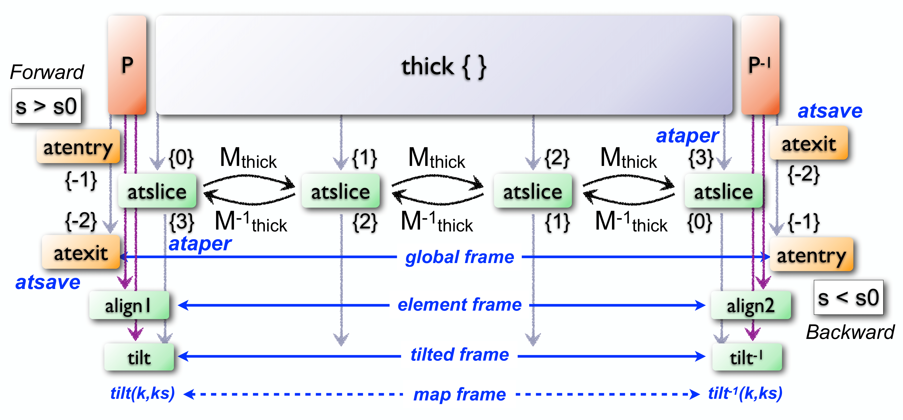

Objects
=======
.. _ch.gen.obj:

The object model is of key importance as it implements many features used extensively by objects like ``beam``, ``sequence``, ``mtable``, all the commands, all the elements, and the ``MADX`` environment. The aim of the object model is to extend the scripting language with concepts like objects, inheritance, methods, metamethods, deferred expressions, commands and more.

	*	 A *prototypical object* is an object created from a prototype, [#f1]_ named its parent.
	*	 *Single inheritance* specifies that an object has only one direct parent.
	*	 *Dynamic lookup* means that undefined attributes are searched in the parents at *each* read.

A prototype represents the default state and behavior, and new objects can reuse part of the knowledge stored in the prototype by inheritance, or by defining how the new object differs from the prototype. Because any object can be used as a prototype, this approach holds some advantages for representing default knowledge, and incrementally and dynamically modifying them.

Creation
--------

The creation of a new object requires to hold a reference to its parent, i.e. the prototype, which indeed will create the child and return it as if it were returned from a function:

.. code-block::

	local object in MAD
	local obj = object { }

The special *root object* ``object`` from the ``MAD`` environment is the parent of *all* objects, including elements, sequences, TFS tables and commands. It provides by inheritance the methods needed to handle objects, environments, and more. In this minimalist example, the created object has ``object`` as parent, so it is the simplest object that can be created.

It is possible to name immutably an object during its creation:

.. code-block::
	
	local obj = object 'myobj' { }
	print(obj.name) -- display: myobj

Here, [#f2]_ ``obj`` is the variable holding the object while the *string* :var:`'myobj'` is the name of the object. It is important to distinguish well the variable that holds the *object* from the object's name that holds the *string*, because they are very often named the same.

It is possible to define attributes during object creation or afterward:

.. code-block::
	
	local obj = object 'myobj' { a=1, b='hello' }
	obj.c = { d=5 } -- add a new attribute c
	print(obj.name, obj.a, obj.b, obj.c.d)  -- display: myobj 1 hello 5

Constructors
""""""""""""

The previous object creation can be done equivalently using the prototype as a constructor:

.. code-block::
	
	local obj = object('myobj',{ a=1, b='hello' })

An object constructor expects two arguments, an optional *string* for the name, and a required *table* for the attributes placeholder, optionally filled with initial attributes. The table is used to create the object itself, so it cannot be reused to create a different object:

.. code-block::
	
	local attr = { a=1, b='hello' }
	local obj1 = object('obj1',attr) -- ok
	local obj2 = object('obj2',attr) -- runtime error, attr is already used.

The following objects creations are all semantically equivalent but use different syntax that may help to understand the creation process and avoid runtime errors:

.. code-block::
	
	-- named objects:
	local nobj = object 'myobj'  { }  -- two stages creation.
	local nobj = object 'myobj' ({ }) -- idem.
	local nobj = object('myobj') { }  -- idem.
	local nobj = object('myobj')({ }) -- idem.
	local nobj = object('myobj', { }) -- one stage creation.
	-- unnamed objects:
	local uobj = object   { }         -- one stage creation.
	local uobj = object  ({ })        -- idem.
	local uobj = object() { }         -- two stages creation.
	local uobj = object()({ })        -- idem.
	local uobj = object(nil,{ })      -- one stage creation.

Incomplete objects
""""""""""""""""""

The following object creation shows how the two stage form can create an incomplete object that can only be used to complete its construction:

.. code-block::
	
	local obj = object 'myobj'   -- obj is incomplete, table is missing
	print(obj.name)              -- runtime error.
	obj = obj { }                -- now obj is complete.
	print(obj.name)              -- display: myobj

Any attempt to use an incomplete object will trigger a runtime error with a message like: 

.. code-block:: console
	
	file:line: forbidden read access to incomplete object.

or 

.. code-block:: console
	
	file:line: forbidden write access to incomplete object.

depending on the kind of access.

Classes
"""""""

An object used as a prototype to create new objects becomes a *class*, and a class cannot change, add, remove or override its methods and metamethods. This restriction ensures the behavioral consistency between the children after their creation. An object qualified as *final* cannot create instances and therefore cannot become a class.

Identification
""""""""""""""

The ``object`` module extends the :doc:`typeid <mad_mod_types>` module with the ``is_object(a)`` *function*, which returns ``true`` if its argument ``a`` is an object, ``false`` otherwise:

.. code-block::
	
	local is_object in MAD.typeid
	print(is_object(object), is_object(object), is_object)
	-- display: true  true  false

It is possible to know the objects qualifiers using the appropriate methods: 
.. code-block::
	
	print(object:is_class(), object:is_final(), object:is_readonly())
	-- display: true  false  true

Customizing creation
""""""""""""""""""""

During the creation process of objects, the metamethod ``__init(self)`` is invoked if it exists, with the newly created object as its sole argument to let the parent finalize or customize its initialization *before* it is returned. This mechanism is used by commands to run their :meth:`:exec()` *method* during their creation.

Inheritance
-----------

The object model allows to build tree-like inheritance hierarchy by creating objects from classes, themselves created from other classes, and so on until the desired hierarchy is modeled. The example below shows an excerpt of the taxonomy of the elements as implemented by the :doc:`element <mad_gen_elements>` module, with their corresponding depth levels in comment:

.. code-block::
	
	local object in MAD                    -- depth level 1
	local element = object           {...} -- depth level 2
	
	local drift_element = element    {...} -- depth level 3
	local instrument = drift_element {...} -- depth level 4
	local monitor  = instrument      {...} -- depth level 5
	local hmonitor = monitor         {...} -- depth level 6
	local vmonitor = monitor         {...} -- depth level 6
	
	local thick_element = element    {...} -- depth level 3
	local tkicker = thick_element    {...} -- depth level 4
	local kicker  = tkicker          {...} -- depth level 5
	local hkicker = kicker           {...} -- depth level 6
	local vicker  = kicker           {...} -- depth level 6

Reading attributes
""""""""""""""""""

Reading an attribute not defined in an object triggers a recursive dynamic lookup along the chain of its parents until it is found or the root ``object`` is reached. Reading an object attribute defined as a *function* automatically evaluates it with the object passed as the sole argument and the returned value is forwarded to the reader as if it were the attribute's value. When the argument is not used by the function, it becomes a *deferred expression* that can be defined directly with the operator :literal:`:=` as explained in section :ref:`ssec.defexpr`. This feature allows to use attributes holding values and functions the same way and postpone design decisions, e.g. switching from simple value to complex calculations without impacting the users side with calling parentheses at every use.

The following example is similar to the second example of the section :ref:`ssec.defexpr`, and it must be clear that ``fun`` must be explicitly called to retrieve the value despite that its definition is the same as the attribute ``v2``.

.. code-block::
	
	local var = 10
	local fun = \-> var -- here := is invalid
	local obj = object { v1 := var, v2 =\-> var, v3 = var }
	print(obj.v1, obj.v2, obj.v3, fun()) -- display: 10 10 10 10
	var = 20
	print(obj.v1, obj.v2, obj.v3, fun()) -- display: 20 20 10 20

Writing attributes
""""""""""""""""""

Writing to an object uses direct access and does not involve any lookup. Hence setting an attribute with a non-\ ``nil`` value in an object hides his definition inherited from the parents, while setting an attribute with ``nil`` in an object restores the inheritance lookup:

.. code-block::
	
	local obj1 = object { a=1, b='hello' }
	local obj2 = obj1 { a=\s-> s.b..' world' }
	print(obj1.a, obj2.a) -- display: 1 hello world
	obj2.a = nil
	print(obj1.a, obj2.a) -- display: 1 1

This property is extensively used by commands to specify their attributes default values or to rely on other commands attributes default values, both being overridable by the users.

It is forbidden to write to a read-only objects or to a read-only attributes. The former can be set using the :meth:`:readonly` *method*, while the latter corresponds to attributes with names that start by :literal:`__`, i.e. two underscores.

Class instances
"""""""""""""""

To determine if an object is an instance of a given class, use the :meth:`:is_instanceOf` *method*:

.. code-block::
	
	local hmonitor, instrument, element in MAD.element
	print(hmonitor:is_instanceOf(instrument)) -- display: true

To get the list of *public* attributes of an instance, use the :meth:`:get_varkeys` *method*:

.. code-block::
	
	for _,a in ipairs(hmonitor:get_varkeys()) do print(a) end
	for _,a in ipairs(hmonitor:get_varkeys(object)) do print(a) end
	for _,a in ipairs(hmonitor:get_varkeys(instrument)) do print(a) end
	for _,a in ipairs(element:get_varkeys()) do print(a) end

	*	 the object ``hmonitor`` (only).
	*	 the objects in the hierachy from ``hmonitor`` to ``object`` included.
	*	 the objects in the hierachy from ``hmonitor`` to ``instrument`` included.
	*	 the object ``element`` (only), the root of all elements.

Examples
""""""""

.. _fig.gen.objmod:

	
	Object model and inheritance.

:numref:`fig.gen.objmod` summarizes inheritance and attributes lookup with arrows and colors, which are reproduced by the example hereafter:

.. code-block::
	
	local element, quadrupole in MAD.element    -- kind
	local mq  = quadrupole 'mq'  { l  =  2.1  } -- class
	local qf  = mq         'qf'  { k1 =  0.05 } -- circuit
	local qd  = mq         'qd'  { k1 = -0.06 } -- circuit
	local qf1 = qf         'qf1' {}             -- element
	... -- more elements
	print(qf1.k1)                    -- display: 0.05 (lookup)
	qf.k1 = 0.06                     -- update strength of 'qf' circuit
	print(qf1.k1)                    -- display: 0.06 (lookup)
	qf1.k1 = 0.07                    -- set strength of 'qf1' element
	print(qf.k1, qf1.k1)             -- display: 0.06 0.07 (no lookup)
	qf1.k1 = nil                     -- cancel strength of 'qf1' element
	print(qf1.k1, qf1.l)             -- display: 0.06 2.1 (lookup)
	print(#element:get_varkeys())    -- display: 33 (may vary)

The element ``quadrupole`` provided by the :doc:`element <mad_gen_elements>` module is the father of the objects created on its left. The *black arrows* show the user defined hierarchy of object created from and linked to the ``quadrupole``. The main quadrupole ``mq`` is a user class representing the physical element, e.g. defining a length, and used to create two new classes, a focusing quadrupole ``qf`` and a defocusing quadrupole ``qd`` to model the circuits, e.g. hold the strength of elements connected in series, and finally the real individual elements ``qf1``, ``qd1``, ``qf2`` and ``qd2`` that will populate the sequence. A tracking command will request various attributes when crossing an element, like its length or its strength, leading to lookup of different depths in the hierarchy along the *red arrow*. A user may also write or overwrite an attribute at different level in the hierarchy by accessing directly to an element, as shown by the *purple arrows*, and mask an attribute of the parent with the new definitions in the children. The construction shown in this example follows the *separation of concern* principle and it is still highly reconfigurable despite that is does not contain any deferred expression or lambda function.

Attributes
----------

New attributes can be added to objects using the dot operator :literal:`.` or the indexing operator :literal:`[]` as for tables. Attributes with non-*string* keys are considered as private. Attributes with *string* keys starting by two underscores are considered as private and read-only, and must be set during creation:

.. code-block::
	
	mq.comment = "Main Arc Quadrupole"
	print(qf1.comment)      -- displays: Main Arc Quadrupole
	qf.__k1 = 0.01          -- error
	qf2 = qf { __k1=0.01 }  -- ok

The root ``object`` provides the following attributes:

**name**
	 A *lambda* returning the *string* ``__id``.

**parent**
	 A *lambda* returning a *reference* to the parent *object*.

**Warning**: the following private and read-only attributes are present in all objects as part of the object model and should *never be used, set or changed*; breaking this rule would lead to an *undefined behavior*:

**__id**
	 A *string* holding the object's name set during its creation.

**__par**
	 A *reference* holding the object's parent set during its creation.

**__flg**
	 A *number* holding the object's flags.

**__var**
	 A *table* holding the object's variables, i.e. pairs of (*key*, *value*).

**__env**
	 A *table* holding the object's environment.

**__index**
	 A *reference* to the object's parent variables.

Methods
-------

New methods can be added to objects but not classes, using the :literal:`:set_methods(set)` ``set`` being the *set* of methods to add as in the following example:

.. code-block::
	
	sequence :set_methods {
	  name_of   = name_of,
	  index_of  = index_of,
	  range_of  = range_of,
	  length_of = length_of,
	  ...
	}

where the keys are the names of the added methods and their values must be a *callable* accepting the object itself, i.e. ``self``, as their first argument. Classes cannot set new methods.

The root ``object`` provides the following methods:

**is_final**
	 A *method*	``()`` returning a *boolean* telling if the object is final, i.e. cannot have instance.

**is_class**
	 A *method*	``()`` returning a *boolean* telling if the object is a *class*, i.e. had/has an instance.

**is_readonly**
	 A *method*	``()`` returning a *boolean* telling if the object is read-only, i.e. attributes cannot be changed.

**is_instanceOf**
	 A *method*	``(cls)`` returning a *boolean* telling if ``self`` is an instance of ``cls``.

**set_final**
	 A *method*	``([a])`` returning ``self`` set as final if ``a ~= false`` or non-final.

**set_readonly**
	 A *method*	``([a])`` returning ``self`` set as read-only if ``a ~= false`` or read-write.

**same**
	 A *method*	``([name])`` returning an empty clone of ``self`` and named after the *string* ``name`` (default: ``nil``).

**copy**
	 A *method*	``([name])`` returning a copy of ``self`` and named after the *string* ``name`` (default: ``nil``). The private attributes are not copied, e.g. the final, class or read-only qualifiers are not copied.

**get_varkeys**
	 A *method*	``([cls])`` returning both, the *list* of the non-private attributes of ``self`` down to ``cls`` (default: ``self``) included, and the *set* of their keys in the form of pairs (*key*, *key*).

**get_variables**
	 A *method*	``(lst, [set], [noeval])`` returning a *set* containing the pairs (*key*, *value*) of the attributes listed in ``lst``. If ``set`` is provided, it will be used to store the pairs. If ``noveval == true``, the functions are not evaluated. The full *list* of attributes can be retrieved from ``get_varkeys``. Shortcut ``getvar``.

**set_variables**
	 A *method*	``(set, [override])`` returning ``self`` with the attributes set to the pairs (*key*, *value*) contained in ``set``. If ``override ~= true``, the read-only attributes (with *key* starting by ``"__"``) cannot be updated.

**copy_variables**
	 A *method*	``(set, [lst], [override])`` returning ``self`` with the attributes listed in ``lst`` set to the pairs (*key*, *value*) contained in ``set``. If ``lst`` is not provided, it is replaced by ``self.__attr``. If ``set`` is an *object* and ``lst.noeval`` exists, it is used as the list of attributes to copy without function evaluation. [#f3] If ``override ~= true``, the read-only attributes (with *key* starting by ``"__"``) cannot be updated. Shortcut ``cpyvar``.

**wrap_variables**
	 A *method*	``(set, [override])`` returning ``self`` with the attributes wrapped by the pairs (*key*, *value*) contained in ``set``, where the *value* must be a *callable* ``(a)`` that takes the attribute (as a callable) and returns the wrapped *value*. If ``override ~= true``, the read-only attributes (with *key* starting by ``"__"``) cannot be updated.

The following example shows how to convert the length ``l`` of an RBEND from cord to arc, [#f4]_ keeping its strength ``k0`` to be computed on the fly:

.. code-block::
	
	local cord2arc in MAD.gmath
	local rbend    in MAD.element
	local printf   in MAD.utility
	local rb = rbend 'rb' { angle=pi/10, l=2, k0=\s s.angle/s.l }
	printf("l=%.5f, k0=%.5f\n", rb.l, rb.k0) -- l=2.00000, k0=0.15708
	rb:wrap_variables { l=\l\s cord2arc(l(),s.angle) } -- RBARC
	printf("l=%.5f, k0=%.5f\n", rb.l, rb.k0) -- l=2.00825, k0=0.15643
	rb.angle = pi/20 -- update angle
	printf("l=%.5f, k0=%.5f\n", rb.l, rb.k0) -- l=2.00206, k0=0.07846

The method converts non-\ *callable* attributes into callables automatically to simplify the user-side, i.e. ``l()`` can always be used as a *callable* whatever its original form was. At the end, ``k0`` and ``l`` are computed values and updating ``angle`` affects both as expected.

**clear_variables**
	 A *method*	``()`` returning ``self`` after setting all non-private attributes to ``nil``.

**clear_array**
	 A *method*	``()`` returning ``self`` after setting the array slots to ``nil``, i.e. clear the *list* part.

**clear_all**
	 A *method*	``()`` returning ``self`` after clearing the object except its private attributes.

**set_methods**
	 A *method*	``(set, [override])`` returning ``self`` with the methods set to the pairs (*key*, *value*) contained in ``set``, where *key* must be a *string* (the method's name) and *value* must be a *callable*(the method itself). If ``override ~= true``, the read-only methods (with *key* starting by ``"__"``) cannot be updated. Classes cannot update their methods.

**set_metamethods**
	 A *method*	``(set, [override])`` returning ``self`` with the attributes set to the pairs (*key*, *value*) contained in ``set``, where *key* must be a *string* (the metamethod's name) and *value* must be a *callable*\ (the metamethod itself). If ``override == false``, the metamethods cannot be updated. Classes cannot update their metamethods.

**insert**
	 A *method*	``([idx], a)`` returning ``self`` after inserting ``a`` at the position ``idx`` (default: ``#self+1``) and shifting up the items at positions ``idx..``.

**remove**
	 A *method*	``([idx])`` returning the *value* removed at the position ``idx`` (default: ``#self``) and shifting down the items at positions ``idx..``.

**move**
	 A *method*	``(idx1, idx2, idxto, [dst])`` returning the destination object ``dst`` (default: ``self``) after moving the items from ``self`` at positions ``idx1..idx2`` to ``dst`` at positions ``idxto..``. The destination range can overlap with the source range.

**sort**
	 A *method*	``([cmp])`` returning ``self`` after sorting in-place its *list* part using the ordering *callable* (``cmp(ai, aj)``) (default: ``"<"``), which must define a partial order over the items. The sorting algorithm is not stable.

**bsearch**
	 A *method*	``(a, [cmp], [low], [high])`` returning the lowest index ``idx`` in the range specified by ``low..high`` (default: ``1..#self``) from the **ordered** *list* of ``self`` that compares ``true`` with item ``a`` using the *callable* (``cmp(a, self[idx])``) (default: ``"<="`` for ascending, ``">="`` for descending), or ``high+1``. In the presence of multiple equal items, ``"<="`` (resp. ``">="``) will return the index of the first equal item while ``"<"`` (resp. ``">"``) the index next to the last equal item for ascending (resp. descending) order. [#f5]_ 

**lsearch**
	 A *method*	``(a, [cmp], [low], [high])`` returning the lowest index ``idx`` in the range specified by ``low..high`` (default: ``1..#self``) from the *list* of ``self`` that compares ``true`` with item ``a`` using the *callable* (``cmp(a, self[idx])``) (default: ``"=="``), or ``high+1``. In the presence of multiple equal items in an ordered *list*, ``"<="`` (resp. ``">="``) will return the index of the first equal item while ``"<"`` (resp. ``">"``) the index next to the last equal item for ascending (resp. descending) order. [#f5]_

**get_flags**
	 A *method*	``()`` returning the flags of ``self``. The flags are not inherited nor copied.

**set_flags**
	 A *method*	``(flgs)`` returning ``self`` after setting the flags determined by ``flgs``.

**clear_flags**
	 A *method*	``(flgs)`` returning ``self`` after clearing the flags determined by ``flgs``.

**test_flags**
	 A *method*	``(flgs)`` returning a *boolean* telling if all the flags determined by ``flgs`` are set.

**open_env**
	 A *method*	``([ctx])`` returning ``self`` after opening an environment, i.e. a global scope, using ``self`` as the context for ``ctx`` (default: 1). The argument ``ctx`` must be either a *function* or a *number* defining a call level :math:`\geq 1`.

**close_env**
	 A *method*	``()`` returning ``self`` after closing the environment linked to it. Closing an environment twice is safe.

**load_env**
	 A *method*	``(loader)`` returning ``self`` after calling the ``loader``, i.e. a compiled chunk, using ``self`` as its environment. If the loader is a *string*, it is interpreted as the filename of a script to load, see functions ``load`` and ``loadfile`` in `Lua 5.2 <http://github.com/MethodicalAcceleratorDesign/MADdocs/blob/master/lua52-refman-madng.pdf>`_ §6.1 for details.

**dump_env**
	 A *method*	``()`` returning ``self`` after dumping its content on the terminal in the rought form of pairs (*key*, *value*), including content of table and object *value*, useful for debugging environments.

**is_open_env**
	 A *method*	``()`` returning a *boolean* telling if ``self`` is an open environment.

**raw_len**
	 A *method*	``()`` returning the *number* of items in the *list* part of the object. This method should not be confused with the native *function* ``rawlen``.

**raw_get**
	 A *method*	``(key)`` returning the *value* of the attribute ``key`` without *lambda* evaluation nor inheritance lookup. This method should not be confused with the native *function* ``rawget``.

**raw_set**
	 A *method*	``(key, val)`` setting the attribute ``key`` to the *value* ``val``, bypassing all guards of the object model. This method should not be confused with the native *function* ``rawset``. **Warning**: use this dangerous method at your own risk!

**var_get**
	 A *method*	``(key)`` returning the *value* of the attribute ``key`` without *lambda* evaluation.

**var_val**
	 A *method*	``(key, val)`` returning the *value* ``val`` of the attribute ``key`` with *lambda* evaluation. This method is the complementary of ``var_get``, i.e. ``__index`` :math:`\equiv` ``var_val`` :math:`\circ` ``var_get``.

**dumpobj**
	 A *method*	``([fname], [cls], [patt], [noeval])`` return ``self`` after dumping its non-private attributes in file ``fname`` (default: ``stdout``) in a hierarchical form down to ``cls``. If the *string* ``patt`` is provided, it filters the names of the attributes to dump. If ``fname == '-'``, the dump is returned as a *string* in place of ``self``. The *log* ``noeval`` prevents the evaluatation the deferred expressions and reports the functions addresses instead. In the output, ``self`` and its parents are displayed indented according to their inheritance level, and preceeded by a ``+`` sign. The attributes overridden through the inheritance are tagged with :math:`n` ``*`` signs, where :math:`n` corresponds to the number of overrides since the first definition.

Metamethods
-----------

New metamethods can be added to objects but not classes, using the :meth:`:set_metamethods(set)` *method* with ``set`` being the *set* of metamethods to add as in the following example:

.. code-block::
	
	sequence :set_metamethods {
	  __len      = len_mm,
	  __index    = index_mm,
	  __newindex = newindex_mm,
	  ...
	}

The root ``object`` provides the following metamethods:

**__init**
	 A *metamethod*	``()`` called to finalize ``self`` before returning from the constructor.

**__same**
	 A *metamethod*	``()`` similar to the ``same``.

**__copy**
	 A *metamethod*	``()`` similar to the ``copy``.

**__len**
	 A *metamethod*	``()`` called by the length operator ``#`` to return the size of the *list* part of ``self``.

**__call**
	 A *metamethod*	``([name], tbl)`` called by the call operator ``()`` to return an instance of ``self`` created from ``name`` and ``tbl``, i.e. using ``self`` as a constructor.

**__index**
	 A *metamethod*	``(key)`` called by the indexing operator ``[key]`` to return the *value* of an attribute determined by *key* after having performed *lambda* evaluation and inheritance lookup.

**__newindex**
	 A *metamethod*	``(key, val)`` called by the assignment operator ``[key]=val`` to create new attributes for the pairs (*key*, *value*).

**__pairs**
	 A *metamethod*	``()`` called by the ``pairs`` *function* to return an iterator over the non-private attributes of ``self``.

**__ipairs**
	 A *metamethod*	``()`` called by the ``ipairs`` *function* to return an iterator over the *list* part of ``self``.

**__tostring**
	 A *metamethod*	``()`` called by the ``tostring`` *function* to return a *string* describing succinctly ``self``.

The following attributes are stored with metamethods in the metatable, but have different purposes:

**__obj**
	 A unique private *reference* that characterizes objects.

**__metatable**
	 A *reference* to the metatable itself protecting against modifications.

Flags
-----
.. _sec.obj.flgs:

The object model uses *flags* to qualify objects, like *class*-object, *final*-object and *readonly*-object. The difference with *boolean* attributes is that flags are *not* inherited nor copied.
The flags of objects are managed by the methods :meth:`:get_flags`, :meth:`:set_flags`, :meth:`:clear_flags` and :meth:`:test_flags`. Methods like :meth:`:is_class`, :meth:`:is_final` and :meth:`:is_readonly` are roughly equivalent to call the method :meth:`:test_flags` with the corresponding (private) flag as argument. Note that functions from the :func:`typeid` module that check for types or kinds, like :func:`is_object` or :func:`is_beam`, never rely on flags because types and kinds are not qualifers.

From the technical point of view, flags are encoded into a 32-bit integer and the object model uses the protected bits 29-31, hence bits 0-28 are free of use. Object flags can be used and extended by other modules introducing their own flags, like the ``element`` module that relies on bits 0-4 and used by many commands. In practice, the bit index does not need to be known and should not be used directly but through its name to abstract its value.

Environments
------------

The object model allows to transform an object into an environment; in other words, a global workspace for a given context, i.e. scope. Objects-as-environments are managed by the methods ``open_env``, ``close_env``, ``load_env``, ``dump_env`` and ``is_open_env``.

Things defined in this workspace will be stored in the object, and accessible from outside using the standard ways to access object attributes:

.. code-block::
	
	local object in MAD
	local one = 1
	local obj = object { a:=one } -- obj with 'a' defined
	-- local a = 1                -- see explication below
	
	obj:open_env()                -- open environment
	b = 2                         -- obj.b defined
	c =\ -> a..":"..b             -- obj.c defined
	obj:close_env()               -- close environment
	
	print(obj.a, obj.b, obj.c)    -- display: 1   2   1:2
	one = 3
	print(obj.a, obj.b, obj.c)    -- display: 3   2   3:2
	obj.a = 4
	print(obj.a, obj.b, obj.c)    -- display: 4   2   4:2

Uncommenting the line ``local a = 1`` would change the last displayed column to :literal:`1:2` for the three prints because the *lambda* defined for ``obj.c`` would capture the local ``a`` as it would exist in its scope. As seen hereabove, once the environment is closed, the object still holds the variables as attributes.

The MADX environment is an object that relies on this powerful feature to load MAD-X lattices, their settings and their "business logic", and provides functions, constants and elements to mimic the behavior of the global workspace of MAD-X to some extend:

.. code-block::
	
	MADX:open_env()
	mq_k1 = 0.01                     -- mq.k1 is not a valid identifier!
	MQ = QUADRUPOLE {l=1, k1:=MQ_K1} -- MADX environment is case insensitive
	MADX:close_env()                 -- but not the attributes of objects!
	local mq in MADX
	print(mq.k1)                     -- display: 0.01
	MADX.MQ_K1 = 0.02
	print(mq.k1)                     -- display: 0.02

Note that MAD-X workspace is case insensitive and everything is "global" (no scope, namespaces), hence the ``quadrupole`` element has to be directly available inside the MADX environment. Moreover, the MADX object adds the method ``load`` to extend ``load_env`` and ease the conversion of MAD-X lattices. For more details see chapter :doc:`MADX <mad_gen_madx>`

.. rubric:: Footnotes

.. [#f1] Objects are not clones of prototypes, they share states and behaviors with their parents but do not hold copies.
.. [#f2] This syntax for creating objects eases the lattices translation from MAD-X to MAD-NG.
.. [#f3] This feature is used to setup a command from another command, e.g. ``track`` from ``twiss``
.. [#f4] This approach is safer than the volatile option ``RBARC`` of MAD-X.
.. [#f5] ``bsearch`` and ``lsearch`` stand for binary (ordered) search and linear (unordered) search respectively.

