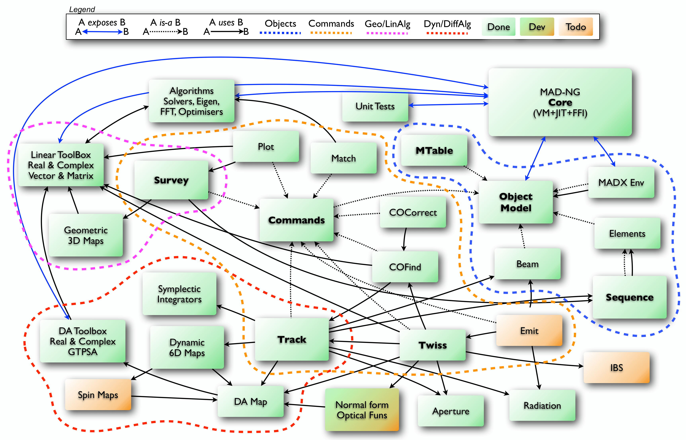

.. _ch.gen.scrpt:

Scripting
=========

The choice of the scripting language for MAD-NG was sixfold: the *simplicity* and the *completeness* of the programming language, the *portability* and the *efficiency* of the implementation, and its easiness to be *extended* and *embedded* in an application. In practice, very few programming languages and implementations fulfill these requirements, and Lua and his Just-In-Time (JIT) compiler LuaJIT were not only the best solutions but almost the only ones available when the development of MAD-NG started in 2016.

Lua and LuaJIT
--------------

The easiest way to shortly describe these choices is to cite their authors.

*"Lua is a powerful, efficient, lightweight, embeddable scripting language. It supports procedural programming, object-oriented programming, functional programming, data-driven programming, and data description. Lua combines simple procedural syntax with powerful data description constructs based on associative arrays and extensible semantics. Lua is dynamically typed and has automatic memory management with incremental garbage collection, making it ideal for configuration, scripting, and rapid prototyping."* [#f1]_ 

*"LuaJIT\index{LuaJIT} is widely considered to be one of the fastest dynamic language implementations. It has outperformed other dynamic languages on many cross-language benchmarks since its first release in 2005 --- often by a substantial margin --- and breaks into the performance range traditionally reserved for offline, static language compilers."* [#f2]_ 

Lua and LuaJIT are free open-source software, distributed under the very liberal MIT license.

MAD-NG embeds a patched version of LuaJIT 2.1, a very efficient implementation of Lua 5.2. [#f3]_ Hence, the scripting language of MAD-NG is Lua 5.2 with some extensions detailed in the next section, and used for both, the development of most parts of the application, and as the user scripting language. There is no strong frontier between these two aspects of the application, giving full access and high flexibility to the experienced users. The filename extension of MAD-NG scripts is :literal:`.mad`.

Learning Lua is easy and can be achieved within a few hours. The following links should help to quickly become familiar with Lua and LuaJIT:

	*	 `Lua <http://www.lua.org>`_ website.
	*	 `Lua 5.2 <http://github.com/MethodicalAcceleratorDesign/MADdocs/blob/master/lua52-refman-madng.pdf>`_ manual for MAD-NG (30 p. PDF).
	*	 `Lua 5.0 <http://www.lua.org/pil/contents.html>`_ free online book (old).
	*	 `LuaJIT <http://luajit.org>`__ website.
	*	 `LuaJIT <http://wiki.luajit.org/Home>`__ wiki.
	*	 `LuaJIT <https://repo.or.cz/w/luajit-2.0.git/blob_plain/v2.1:/doc/luajit.html>`__ 2.1 documentation.
	*	 `LuaJIT <https://github.com/LuaJIT/LuaJIT>`__ 2.1 on GitHub.

Lua primer
----------

The next subsections introduce the basics of the Lua programming language with syntax highlights, namely variables, control flow, functions, tables and methods. [#f4]_ 

Variables
"""""""""

.. literalinclude:: learn15min.lua
	:start-after: [vars]
	:end-before: [vars-end]

Control flow
""""""""""""

.. literalinclude:: learn15min.lua
	:start-after: [cflow]
	:end-before: [cflow-end]

Functions
"""""""""

.. literalinclude:: learn15min.lua
	:start-after: [funs]
	:end-before: [funs-end]

Tables
""""""

.. literalinclude:: learn15min.lua
	:start-after: [tbls]
	:end-before: [tbls-end]

Methods
"""""""

.. literalinclude:: learn15min.lua
	:start-after: [mthds]
	:end-before: [mthds-end]

Extensions
----------

The aim of the extensions patches applied to the embedded LuaJIT in MAD-NG is to extend the Lua syntax in handy directions, like for example to support the deferred expression operator. A serious effort has been put to develop a Domain Specific Language (DSL) embedded in Lua using these extensions and the native language features to mimic as much as possible the syntax of MAD-X in the relevant aspects of the language, like the definition of elements, lattices or commands, and ease the transition of MAD-X users.

Bending and extending a programming language like Lua to embed a DSL is more general and challenging than creating a freestanding DSL like in MAD-X. The former is compatible with the huge codebase written by the Lua community, while the latter is a highly specialized niche language. The chosen approach attempts to get the best of the two worlds.

Line comment
""""""""""""

The line comment operator :literal:`!` is valid in MAD-NG, but does not exists in Lua: [#f5]_:

.. code-block::
	
	local a = 1     ! this remaining part is a comment
	local b = 2     -- line comment in Lua

Unary plus
""""""""""

The unary plus operator :literal:`+` is valid in MAD-NG, but does not exists in Lua: [#f5]_

.. code-block::
	
	local a = +1    -- syntax error in Lua
	local b = +a    -- syntax error in Lua

Local in table
""""""""""""""

The local :literal:`in` table syntax provides a convenient way to retrieve values from a *mappable* and avoid error-prone repetitions of attributes names. The syntax is as follows:

.. code-block::
	
	local sin, cos, tan in math      -- syntax error in Lua
	local a, b, c in { a=1, b=2, c=3 }
	! a, b, c in { a=1, b=2, c=3 }   -- invalid with global variables

which is strictly equivalent to the Lua code:

.. code-block::
	
	local sin, cos, tan = math.sin, math.cos, math.tan
	local tbl = { a=1, b=2, c=3 }
	local a, b, c = tbl.a, tbl.b, tbl.c
	! local sin, cos, tan = math.cos, math.sin, math.tan   -- nasty typo

The JIT has many kinds of optimization to improve a lot the execution speed of the code, and these work much better if variables are declared :literal:`local` with minimal lifespan.
*This language extension is of first importance for writing fast clean code!*

Lambda function
"""""""""""""""

The lambda function syntax is pure syntactic sugar for function definition and therefore fully compatible with the Lua semantic. The following definitions are all semantically equivalent:

.. code-block::
	
	local f = function(x) return x^2 end  -- Lua syntax
	local f = \x x^2                      -- most compact form
	local f = \x -> x^2                   -- most common form
	local f = \(x) -> x^2                 -- for readability
	local f = \(x) -> (x^2)               -- less compact form
	local f = \x (x^2)                    -- uncommon valid form
	local f = \(x) x^2                    -- uncommon valid form
	local f = \(x) (x^2)                  -- uncommon valid form

The important point is that no space must be present between the *lambda* operator :literal:`\\` and the first formal parameter or the first parenthesis; the former will be considered as an empty list of parameters and the latter as an expressions list returning multiple values, and both will trigger a syntax error. For the sake of readability, it is possible without changing the semantic to add extra spaces anywhere in the definition, add an arrow operator :literal:`->`, or add parentheses around the formal parameter list, whether the list is empty or not.

The following examples show *lambda* functions with multiple formal parameters:

.. code-block::
	
	local f = function(x,y) return x+y end  -- Lua syntax
	local f = \x x+y                        -- most compact form
	local f = \x,y -> x+y                   -- most common form
	local f = \x, y -> x + y                -- aerial style

The lambda function syntax supports multiple return values by enclosing the list of returned expressions within (not optional!) parentheses:

.. code-block::
	
	local f = function(x,y) return x+y, x-y end  -- Lua syntax
	local f = \x,y(x+y,x-y)                      -- most compact form
	local f = \x,y -> (x+y,x-y)                  -- most common form

Extra surrounding parentheses can also be added to disambiguate false multiple return values syntax:

.. code-block::
	
	local f = function(x,y) return (x+y)/2 end  -- Lua syntax
	local f = \x,y -> ((x+y)/2)     -- disambiguation: single value returned
	! local f = \x,y -> (x+y)/2     -- invalid syntax at '/'
	
	local f = function(x,y) return (x+y)*(x-y) end -- Lua syntax
	local f = \x,y -> ((x+y)*(x-y)) -- disambiguation: single value returned
	! local f = \x,y -> (x+y)*(x-y) -- invalid syntax at '*'

It is worth understanding the error message that invalid syntaxes above would report,

.. code-block:: console
	
	file:line: attempt to perform arithmetic on a function value. }

as it is a bit subtle and needs some explanations: the *lambda* is syntactically closed at the end of the returned expression :expr:`(x+y)`, and the following operations :literal:`/` or :literal:`*` are considered as being outside the *lambda* definition, that is applied to the freshly created function itself...

Finally, the *lambda* function syntax supports full function syntax (for consistency) using the *fat* arrow operator :literal:`=>` in place of the arrow operator:

.. code-block::
	
	local c = 0
	local f = function(x) c=c+1 return x^2 end   -- Lua syntax
	local f = \x => c=c+1 return x^2 end         -- most compact form

The fat arrow operator requires the :literal:`end` keyword to close syntactically the *lambda* function, and the :literal:`return` keyword to return values (if any), as in Lua functions definitions.

.. _ssec.defexpr:

Deferred expression
"""""""""""""""""""

The deferred expression operator :literal:`:=` is semantically equivalent to a *lambda* function without argument. It is syntactically valid only inside *table* constructors (see `Lua 5.2 <http://github.com/MethodicalAcceleratorDesign/MADdocs/blob/master/lua52-refman-madng.pdf>`_ §3.4.8): [#f5]_

.. code-block::
	
	local var = 10
	local fun = \-> var
	! local fun := var  -- invalid syntax outside table constructors
	local tbl = { v1 := var, v2 =\-> var, v3 = var }
	print(tbl.v1(), tbl.v2(), tbl.v3, fun()) -- display: 10 10 10 10
	var = 20
	print(tbl.v1(), tbl.v2(), tbl.v3, fun()) -- display: 20 20 10 20

The deferred expressions hereabove have to be explicitly called to retrieve their values, because they are defined in a *table*. It is a feature of the object model making the deferred expressions behaving like values. Still, it is possible to support deferred expressions as values in a raw *table*, i.e. a table without metatable, using the :func:`deferred` function from the :doc:`typeid <mad_mod_types>` module:

.. code-block::
	
	local deferred in MAD.typeid
	local var = 10
	local tbl = deferred { v1 := var, v2 =\-> var, v3 = var }
	print(tbl.v1, tbl.v2, tbl.v3) -- display: 10 10 10
	var = 20
	print(tbl.v1, tbl.v2, tbl.v3) -- display: 20 20 10

Ranges
""""""

The ranges are created from pairs or triplets of concatenated numbers: [#f6]_ 

.. code-block::
	
	start..stop..step   -- order is the same as numerical 'for'
	start..stop         -- default step is 1
	3..4                -- spaces are not needed around concat operator
	3..4..0.1           -- floating numbers are handled
	4..3..-0.1          -- negative steps are handled
	stop..start..-step  -- operator precedence

The default value for unspecified :var:`step` is :const:`1`. The Lua syntax has been modified to accept concatenation operator without surrounding spaces for convenience.

Ranges are *iterable* and *lengthable* so the following code excerpt is valid:

.. code-block::
	
	local rng = 3..4..0.1
	print(#rng) -- display: 11
	for i,v in ipairs(rng) do print(i,v) end

More details on ranges can be found in the :doc:`Range <mad_mod_numrange>` module, especially about the :mod:`range` and :mod:`logrange` constructors that may adjust :var:`step` to ensure precise loops and iterators behaviors with floating-point numbers.

Lua syntax and extensions
"""""""""""""""""""""""""

The operator precedence (see `Lua 5.2`_ §3.4.7) is recapped and extended in :numref:`tbl-opprec` with their precedence level (on the left) from lower to higher priority and their associativity (on the right).

.. table:: Operators precedence with priority and associativity.
	:name: tbl-opprec

	+--+-----------------------------------------------+------------------+
	|1:| 	or                                         |  left            |
	+--+-----------------------------------------------+------------------+
	|2:| 	and                                        |  left            |
	+--+-----------------------------------------------+------------------+
	|3:| 	<  >  <=  >=  ~=  ==                       |  left            |
	+--+-----------------------------------------------+------------------+
	|4:| 	\.\.                                       |  right           |
	+--+-----------------------------------------------+------------------+
	|5:| 	\+  \- (binary)                            |  left            |
	+--+-----------------------------------------------+------------------+
	|6:| 	\*  /  \%                                  |  left            |
	+--+-----------------------------------------------+------------------+
	|7:| 	not   #  -  + (unary)                      |  left            |
	+--+-----------------------------------------------+------------------+
	|8:| 	\POW                                       |  right           |
	+--+-----------------------------------------------+------------------+
	|9:| 	.  []  () (call)                           |  left            |
	+--+-----------------------------------------------+------------------+

The *string* literals, *table* constructors, and *lambda* definitions can be combined with function calls (see `Lua 5.2`_ §3.4.9) advantageously like in the object model to create objects in a similar way to MAD-X. The following function calls are semantically equivalent by pairs:

.. code-block::
	
	! with parentheses                  ! without parentheses
	func( 'hello world!' )              func  'hello world!'
	func( "hello world!" )              func  "hello world!"
	func( [[hello world!]] )            func  [[hello world!]]
	func( {...fields...} )              func  {...fields...} 
	func( \x -> x^2 )                   func  \x -> x^2
	func( \x,y -> (x+y,x-y) )           func  \x,y -> (x+y,x-y)

	
Types
-----
.. _sec.typeid:

MAD-NG is based on Lua, a dynamically typed programming language that provides the following *basic types* often italicized in this textbook:

*nil*
	The type of the value :const:`nil`. Uninitialized variables, unset attributes, mismatched arguments, mismatched return values etc, have :const:`nil` values.

*boolean*
	The type of the values :const:`true` and :const:`false`.

*number*
	The type of IEEE 754 double precision floating point numbers. They are exact for integers up to :math:`\pm 2^{53}` (:math:`\approx \pm 10^{16}`). Values like :const:`0`, :const:`1`, :const:`1e3`, :const:`1e-3` are numbers.

*string*
	The type of character strings. Strings are "internalized" meaning that two strings with the same content compare equal and share the same memory address:
	:expr:`a="hello"; b="hello"; print(a==b) -- display: true`.

*table*
	The type of tables, see `Lua 5.2`_ §3.4.8 for details. In this textbook, the following qualified types are used to distinguish between two kinds of special use of tables:

    *	 A *list* is a table used as an array, that is a table indexed by a *continuous* sequence of integers starting from :const:`1` where the length operator :literal:`#` has defined behavior. [#f7]_

    *	 A *set* is a table used as a dictionary, that is a table indexed by keys --- strings or other types --- or a *sparse* sequence of integers where the length operator :literal:`#` has undefined behavior.

*function*
	The type of functions, see `Lua 5.2`_ §3.4.10 for details. In this textbook, the following qualified types are used to distinguish between few kinds of special use of functions:

    *	 A *lambda* is a function defined with the :literal:`\\` syntax.

    *	 A *functor* is an object [#f8]_ that behaves like a function.

    *	 A *method* is a function called with the :literal:`:` syntax and its owner as first argument. A *method* defined with the :literal:`:` syntax has an implicit first argument named :literal:`self` [#f10]_

*thread* 
	See `Lua 5.2`_ §2.6 for details.

*userdata*
	The type of raw pointers with memory managed by Lua, and its companion *lightuserdata* with memory managed by the host language, usually C. They are mainly useful for interfacing Lua with its C API, but MAD-NG favors the faster FFI [#f11]_ extension of LuaJIT.

*cdata* 
	The type of C data structures that can be defined, created and manipulated directly from Lua as part of the FFI [#f11]_ extension of LuaJIT. The numeric ranges, the complex numbers, the (complex) matrices, and the (complex) GTPSA are *cdata* fully compatible with the embedded C code that operates them.

This textbook uses also some extra terms in place of types:

*value*
	An instance of any type.
*reference*
	A valid memory location storing some *value*.
*logical*
	A *value* used by control flow, where :const:`nil` :math:`\equiv` :const:`false` and *anything-else* :math:`\equiv` :const:`true`.

Value vs reference
""""""""""""""""""

The types *nil*, *boolean* and *number* have a semantic by *value*, meaning that variables, arguments, return values, etc., hold their instances directly. As a consequence, any assignment makes a copy of the *value*, i.e. changing the original value does not change the copy.

The types *string*, *function*, *table*, *thread*, *userdata* and *cdata* have a semantic by *reference*, meaning that variables, arguments, return values, etc., do not store their instances directly but a *reference* to them. As a consequence, any assignment makes a copy of the *reference* and the instance becomes shared, i.e. references have a semantic by *value* but changing the content of the value does change the copy. [#f12]_ 

The types *string*, *function* [#f13]_, *thread* , :var:`cpx` *cdata* and numeric (:literal:`log`):literal:`range` *cdata* have a hybrid semantic. In practice these types have a semantic by *reference*, but they behave like types with semantic by *value* because their instances are immutable, and therefore sharing them is safe.

Concepts
--------

The concepts are natural extensions of types that concentrate more on behavior of objects [#f8]_than on types. MAD-NG introduces many concepts to validate objects passed as argument before using them. The main concepts used in this textbook are listed below, see the \hyperref[ch:mod:types]{\TT{typeid} module for more concepts:

*lengthable*
	An object that can be sized using the length operator :literal:`#`. Strings, lists, vectors and ranges are examples of *lengthable* objects.

*indexable*
	An object that can be indexed using the square bracket operator :literal:`[]`. Tables, vectors and ranges are examples of *indexable* objects.

*iterable*
	An object that can be iterated with a loop over indexes or a generic :literal:`for` with the :literal:`ipairs` iterator. Lists, vectors and ranges are examples of *iterable* objects.

*mappable*
	An object that can be iterated with a loop over keys or a generic :literal:`for` with the :literal:`pairs` iterator. Sets and objects (from the object model) are examples of *mappable* objects.

*callable* An object that can be called using the call operator :literal:`()`. Functions and functors are examples of *callable* objects.

Ecosystem
---------

:numref:`fig-gen-ecosys` shows a schematic representation of the ecosystem of MAD-NG, which should help the users to understand the relatioship between the different components of the application. The dashed lines are grouping the items (e.g. modules) by topics while the arrows are showing interdependencies between them and the colors their status.

	
	MAD-NG ecosystem and status.

.. rubric:: Footnotes

.. [#f1] This text is taken from the "What is Lua?" section of the Lua website.
.. [#f2] This text is taken from the "Overview" section of the LuaJIT website.
.. [#f3] The :literal:`ENV` feature of Lua 5.2 is not supported and will never be according to M. Pall.
.. [#f4] This primer was adapted from the blog "Learn Lua in 15 minutes" by T. Neylon.
.. [#f5] This feature was introduced to ease the automatic translation of lattices from MAD-X to MAD-NG.
.. [#f6] This is the only feature of MAD-NG that is incompatible with the semantic of Lua.
.. [#f7] The Lua community uses the term *sequence* instead of *list*, which is confusing is the context of MAD-NG.
.. [#f8] Here the term "object" is used in the Lua sense, not as an object from the object model of MAD-NG.
.. [#f10] This *hidden* methods argument is named :literal:`self` in Lua and Python, or :literal:`this` in Java and C++.
.. [#f11] FFI stands for Foreign Function Interface, an acronym well known in high-level languages communities.
.. [#f12] References semantic in Lua is similar to pointers semantic in C, see ISO/IEC 9899:1999 §6.2.5.
.. [#f13] Local variables and upvalues of functions can be modified using the :literal:`debug` module.