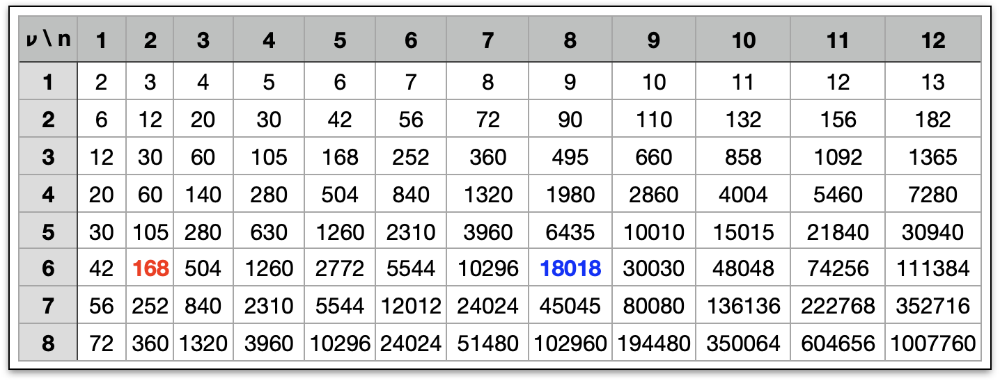
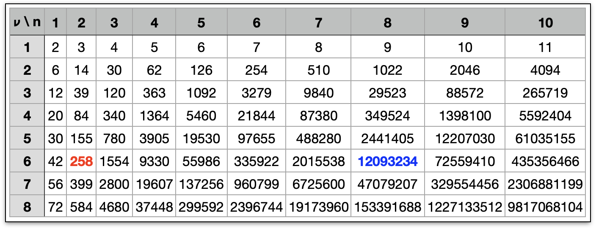

.. index::
   Differential algebra
   Taylor Series
   Generalized Truncated Power Series Algebra, GTPSA

********************
Differential Algebra
********************

This chapter describes real :type:`tpsa` and complex :type:`ctpsa` objects as supported by MAD-NG. The module for the `Generalized Truncated Power Series Algebra <https://accelconf.web.cern.ch/ipac2015/papers/mopje039.pdf>`_ [GTPSA]_ that represents parametric multivariate truncated `Taylor series <https://en.wikipedia.org/wiki/Taylor_series>`_ is not exposed, only the contructors are visible from the :mod:`MAD` environment and thus, GTPSAs are handled directly by their methods or by the generic functions of the same name from the module :mod:`MAD.gmath`. Note that both :type:`tpsa` and :type:`ctpsa` are defined as C structure for direct compliance with the C API.

Introduction
============

TPSAs are numerical objects representing :math:`n`-th degrees Taylor polynomial approximation of some functions :math:`f(x)` about :math:`x=a`. They are a powerful differential algebra tool for solving physics problems described by differential equations and for `perturbation theory <https://en.wikipedia.org/wiki/Perturbation_theory>`_, but also for estimating uncertainties, modelling multidimensional distributions or calculating multivariate derivatives for optimization. There are often misunderstandings about their accuracy and limitations, so it is useful to clarify some of these aspects.

To begin with, TPSAs represent multivariate Taylor series truncated at order :math:`n`, and thus behave like :math:`n`-th degrees multivariate polynomials with coefficients in :math:`\mathbb{R}` or :math:`\mathbb{C}`. MAD-NG supports GTPSAs with thousands of variables and/or parameters of arbitrary order each, up to a maximum total order of 63, but Taylor series with alternating signs in their coefficients can quickly be subject to numerical instabilities and `catastrophic cancellation <https://en.wikipedia.org/wiki/Catastrophic_cancellation>`_ as orders increase.

Other methods are not better and suffer from the same problem and more, such as symbolic differentiation, which can lead to inefficient code due to the size of the analytical expressions, or numerical differentiation, which can introduce round-off errors in the discretisation process and cancellation. Both classical methods are more problematic when computing high order derivatives, where complexity and errors increase.

Representation
--------------

A TPSA in the variable :math:`x` at order :math:`n` in the neighbourhood of the point :math:`a` in the domain of the function :math:`f`, noted :math:`T_f^n(x;a)`, has the following representation:

.. math::
   T_f^n(x;a) &= f(a) + f'(a) (x-a) + \frac{f''(a)}{2!} (x-a)^2 + \dots + \frac{f^{(n)}(a)}{n!} (x-a)^n \\
   &= \sum_{k=0}^{n} \frac{f_{a}^{(k)}}{k!}(x-a)^k

where the terms :math:`\frac{f_{a}^{(k)}}{k!}` are the coefficients stored in the :type:`tpsa` and :type:`ctpsa` objects.

The calculation of these coefficients uses a technique known as `automatic differentiation <https://en.wikipedia.org/wiki/Automatic_differentiation>`_ (AD) which operates as polynomials over the augmented (differential) algebra of `dual number <https://en.wikipedia.org/wiki/Dual_number>`_, *without any approximation*, being exact to numerical precision.

The validity of the polynomial representation :math:`T_f^n(x;a)` for the real or complex `analytic function <https://en.wikipedia.org/wiki/Analytic_function>`_ :math:`f` is characterized by the convergence of the remainder when the order :math:`n` goes to infinity:

.. math::
   \lim_{n \rightarrow \infty} R_f^n(x ; a) = \lim_{n \rightarrow \infty} f_a(x) - T_f^n(x ; a) = 0

and the `radius of convergence <https://en.wikipedia.org/wiki/Radius_of_convergence>`_ :math:`h` of :math:`T_f^n(x;a)` nearby the point :math:`a` is given by:

.. math::
   \min_{h>0} \lim_{n \rightarrow \infty} R_f^n(x\pm h ; a) \neq 0.

By using the `mean value theorem <https://en.wikipedia.org/wiki/Mean_value_theorem>`_ recursively we can derive the explicit mean-value form of the remainder:

.. math::
   R_f^n(x ; a) = \frac{f^{(n+1)}_a(\xi)}{(n+1)!} (x-a)^{n+1}

for some :math:`\xi` strictly between :math:`x` and :math:`a`, leading to the mean-value form of the `Taylor's theorem <https://en.wikipedia.org/wiki/Taylor%27s_theorem>`_:

.. math::
   f_a(x) = T_f^n(x ; a) + R_f^n(x ; a) = \sum_{k=0}^{n} \frac{f_{a}^{(k)}}{k!}(x-a)^k + \frac{f^{(n+1)}_a(\xi)}{(n+1)!} (x-a)^{n+1}

Note that a large radius of convergence does not necessarily mean rapid convergence of the Taylor series to the function, although there is a relationship between the rate of convergence, the function :math:`f`, the point :math:`a` and the length :math:`h`. Nevertheless, Taylor series are known to be slow to converge in most cases for numerical applications, except in some cases where appropriate range reduction or `convergence acceleration <https://en.wikipedia.org/wiki/Series_acceleration>`_ methods give good results. Thus, Taylor series should not be used as interpolation functions when better formulas exist for this purpose, see for example fixed-point or `minmax <https://en.wikipedia.org/wiki/Minimax_approximation_algorithm>`_ algorithms. But in our case, Taylor series are never used as interpolation functions and this point is therefore secondary.

In our practice, a truncation error is always present due to the truncated nature of the TPSA at order :math:`n`, but it is rarely calculated analytically for complex systems as it can be estimated by comparing the calculations at high and low orders, and determining the lowest order for which the result is sufficiently stable.

By extension, a TPSA in the two variables :math:`x` and :math:`y` at order 2 in the neighbourhood of the point :math:`(a,b)` in the domain of the function :math:`f`, noted :math:`T_f^2(x,y;a,b)`, has the following representation:

.. math::
   T_f^2(x,y;a,b) = f(a,b) + &\left(\frac{\partial f}{\partial x}\bigg\rvert_{(a,b)}\!\!\!\!\!\!\!(x-a) + \frac{\partial f}{\partial y}\bigg\rvert_{(a,b)}\!\!\!\!\!\!\!(y-b)\right) \\
   + \frac{1}{2!} &\left(\frac{\partial^2 f}{\partial x^2}\bigg\rvert_{(a,b)}\!\!\!\!\!\!\!(x-a)^2 
                   + 2\frac{\partial^2 f}{\partial x\partial y}\bigg\rvert_{(a,b)}\!\!\!\!\!\!\!(x-a)(y-b)
                   + \frac{\partial^2 f}{\partial y^2}\bigg\rvert_{(a,b)}\!\!\!\!\!\!\!(y-b)^2\right)

where the large brackets are grouping the terms in `homogeneous polynomials <https://en.wikipedia.org/wiki/Homogeneous_polynomial>`_, as stored in the :type:`tpsa` and :type:`ctpsa` objects. The central term of the second order :math:`2\frac{\partial^2 f}{\partial x\partial y}` emphasises the reason why the function :math:`f` must be analytic and independent of the integration path as it implies :math:`\frac{\partial^2 f}{\partial x\partial y} = \frac{\partial^2 f}{\partial y\partial x}` and stores the value (scaled by :math:`\frac{1}{2}`) as the coefficient of the monomial :math:`x^1 y^1`. This is an important consideration to keep in mind regarding GTPSA, but it is not a pactical limitation due to the `conservative nature <https://en.wikipedia.org/wiki/Conservative_vector_field>`_ of our applications described by `Hamiltonian vector fields <https://en.wikipedia.org/wiki/Hamiltonian_vector_field>`_.

The generalization to a TPSA of :math:`\nu` variables :math:`X` at order :math:`n` nearby the point :math:`A` in the :math:`\nu`-dimensional domain of the function :math:`f`, noted :math:`T_f^n(X;A)`, has the following representation:

.. math::
   T_f^n(X;A) = \sum_{k=0}^n \frac{f_{A}^{(k)}}{k!}(X;A)^k = \sum_{k=0}^n \frac{1}{k!} \sum_{|\vec{m}|=k} \begin{pmatrix}k \\ \vec{m}\end{pmatrix} \frac{\partial^k f}{\partial X^{\vec{m}}}\bigg\rvert_{A}\!\!(X;A)^{\vec{m}}

where the term :math:`\begin{pmatrix}k \\ \vec{m}\end{pmatrix} = \frac{k!}{c_1!\,c_2!..c_{\nu}!}` is the `multinomial coefficient <https://en.wikipedia.org/wiki/Multinomial_theorem>`_ with :math:`\vec{m}` the vector of :math:`\nu` variables orders :math:`c_i, i=1..\nu` in the monomial and :math:`|\vec{m}| = \sum_i c_i` its total order. Again, we may mention that each term :math:`\frac{1}{k!} \begin{pmatrix}k \\ \vec{m}\end{pmatrix} \frac{\partial^k f}{\partial X^{\vec{m}}}\bigg\rvert_{A}` corresponds strictly to a coefficient stored in the :type:`tpsa` and :type:`ctpsa` objects.

An important point to mention here is related to the *multinomial coefficient* and its relevance when computing physical quantities such as high order anharmonicities, e.g. chromaticities. When the quantity sought corresponds to the derivative of the function :math:`f^{(k)}_A`, the coefficient must be multiplied by :math:`c_1!\,c_2!\,..c_{\nu}!` in order to obtain the correct value.

Approximation
-------------

As already said, the TPSAs themselves do not perform approximations for orders :math:`0\,..n` and the Taylor's theorem gives an explicit form of the remainder for the truncation error of higher orders, while all derivatives are computed to machine precision using AD. AD relies on the fact that any computer program can execute a sequence of elementary arithmetic operations and functions, and apply the chain rule to them repeatedly to automatically compute the exact derivatives.

So when TPSAs do introduce appromixation errors? When they are used as *interpolation functions* to approximate by substitution or perturbation, values at positions :math:`a+h` away from their initial evaluation point :math:`a`:

.. math::
   T_f^n(x+h;a) = \sum_{k=0}^{n} \frac{f_{a}^{(k)}}{k!} (x-a+h)^k 
               \quad \ne \quad
                  \sum_{k=0}^{n} \frac{f_{a+h}^{(k)}}{k!} (x-a-h)^k = T_f^n(x;a+h)

where the approximation error at order :math:`k` is given by:

.. math::
   \left|f^{(k)}_{a+h} - f^{(k)}_a\right| = \frac{1}{|2h|} \left|\frac{\text{d}^k T_f^n(x;a+h)}{\text{d} x^k} - \frac{\text{d}^k T_f^n(x+h;a)}{\text{d} x^k}\right| + {\cal O}(k+1)

In summary, operations and functions on TPSAs are exact while TPSAs used as functions lead to approximations even within the radius of convergence, unlike infinite Taylor series. MAD-NG never uses TPSAs as interpolation functions, but of course the module does provide users with methods for interpolating functions.

Application
-----------

MAD-NG is a tracking code that never composes elements maps during tracking, but performs a *functional application* of elements physics to user-defined input differential maps modelled as sets of TPSAs (one per variable). Tracking particles orbits is a specific case where the "differential" maps are of order 0, i.e. they contain only the scalar part of the maps and no derivatives. Therefore, TPSAs must also behave as scalars in polymorphic codes like MAD-NG, so that the same equations of motion can be applied by the same functions to particle orbits and differential maps. Thus, the :var:`track` command, and by extension the :var:`cofind` (closed orbit search) and :var:`twiss` commands, never use TPSAs as interpolation functions and the results are as accurate as for tracking particles orbits. In particular, it preserves the symplectic structure of the phase space if the applied elements maps are themselves `symplectic maps <https://en.wikipedia.org/wiki/Symplectomorphism>`_.

Users may be tempted to compute or compose elements maps to model whole elements or even large lattice sections before applying them to some input differential maps in order to speed up tracking or parallelise computations. But this approach leads to the two types of approximations that we have just explained: the resulting map is not only truncated, thus loosing local feed-down effects implied by e.g. a translation from orbit :math:`x` to :math:`x+h(s)` along the path :math:`s` or equivalently by the misalignment of the elements, but the derivatives are also approximated for each particle orbit by the global composition calculated on a nearby orbit, typically the zero orbit like in MAD-X. So as the addition of floating point numbers is not associative, the composition of truncated maps is not associative too.

The following equations show the successive refinement of the type of calculations performed by the tracking codes, starting from the worst but common approximations at the top-left to the more general and accurate functional application without approximation or expansion at the bottom-right, as computed by MAD-NG:

.. math::
   ({\mathcal M}_n \circ \cdots \circ {\mathcal M}_2 \circ {\mathcal M}_1) (X_0)
     &\ne {\mathcal M}_n( \cdots ({\mathcal M}_2({\mathcal M}_1 (X_0)))\cdots) \\
     &\ne \widetilde{\mathcal M}_n(\cdots (\widetilde{\mathcal M}_2 (\widetilde{\mathcal M}_1 (X_0)))\cdots) \\
     &\ne {\cal F}_n(\cdots ({\cal F}_2 ({\cal F}_1 (X_0)))\cdots) 

where :math:`{\mathcal M}_i` is the :math:`i`-th map computed for some *a priori* input map (e.g. identity map), :math:`\widetilde{\mathcal M}_i` is the :math:`i`-th map computed at the input map :math:`X_{i-1}` which still implies some intermediate expansion and order limitations due to the use of per-order explicit equations, and finally :math:`{\mathcal F}_i` is the functional application of the full-fledged physics of the :math:`i`-th map to the input map :math:`X_{i-1}` without any intermediate expansion, composition or order limitation. The drawback is that the functional approach can only be achieved with TPSAs, whereas the previous alternatives can be realised with explicit equations, but remain very complicated for non-linear orders, or even inaccessible.

Some codes use a hybrid scheme, such as MAD-X which uses the top-left approximation to represent the concatenated maps of an element at the zero orbit *a priori* [#f1]_, and uses the second order of this map to translate its first order onto the orbit *a posteriori*, thus reducing the approximation made for very small orbits where one order is sufficient.

However, although MAD-NG only performs functional map applications (last right equation above) and never compute element maps or uses TPSAs as interpolation functions, it could be prone to small truncation errors during the computation of the non-linear normal forms which involves the composition of many orbitless maps, potentially breaking symplecticity of the resulting transformation for the last order.

The modelling of multidimensional beam distributions is also possible with TPSAs, such as when a linear phase space description is provided as initial conditions to the :var:`twiss` command through, e.g. a :var:`beta0` block or, even better, a complete high-order map. Extending the description of the initial phase space with high-order maps allows complex non-linear phase spaces to be modelled and their transformations along the lattice to be scrutinized and analysed.

Performance
-----------

In principle, TPSAs should have equivalent performance to matrix/tensors for low orders and small number of variables, perhaps slightly slower at order 1 or 2 as the management of these data structures involves complex code and additional memory allocations. But from order 3 and higher, GTPSA-based codes outperform matrix/tensor codes because the number of coefficients remains much smaller as shown in :numref:`fig.tpsa.size` and :numref:`fig.tensor.size`, and the complexity of the elementary operations (resp. multiplication) depends linearly (resp. quadratically) on the size of these data structures.

.. _fig.tpsa.size:

   Number of coefficients in TPSAs for maps with :math:`\nu` variables at order :math:`n` is :math:`\nu {\scriptstyle\begin{pmatrix} n+\nu \\[-1ex] \nu \end{pmatrix}} = \frac{(n+\nu)!}{n!(\nu-1)!}`.

.. _fig.tensor.size:

   Number of coefficients in tensors for maps with :math:`\nu` variables at order :math:`n` is :math:`\sum_{k=0}^n \nu^{k+1} = \frac{\nu(\nu^{n+1}-1)}{\nu-1}`.

Types promotion
===============

The GTPSA operations may involve other data types like real and complex numbers leading to many combinations of types. In order to simplify the descriptions, the generic names :var:`num`, :var:`cpx` and :var:`idx` (indexes) are used for real, complex and integer numbers respectively, and :var:`tpsa` and :var:`ctpsa` for real and complex GTPSA respectively. For example, the sum of a complex number :var:`cpx` and a real GTPSA :var:`tpsa` gives a complex GTPSA :var:`ctpsa`. The case of :var:`idx` means that a :type:`number` will be interpreted as an index and automatically rounded if it does not hold an integer value. The following table summarizes all valid combinations of types for binary operations involving at least one GTPSA type:

=================  ==================  ===============
Left Operand Type  Right Operand Type  Result Type
=================  ==================  ===============
:type:`number`     :type:`tpsa`        :type:`tpsa` 
:type:`tpsa`       :type:`number`      :type:`tpsa`  
:type:`tpsa`       :type:`tpsa`        :type:`tpsa`  
                                       
:type:`number`     :type:`ctpsa`       :type:`ctpsa`
:type:`complex`    :type:`tpsa`        :type:`ctpsa` 
:type:`complex`    :type:`ctpsa`       :type:`ctpsa`
:type:`tpsa`       :type:`complex`     :type:`ctpsa`
:type:`tpsa`       :type:`ctpsa`       :type:`ctpsa`
:type:`ctpsa`      :type:`number`      :type:`ctpsa`  
:type:`ctpsa`      :type:`complex`     :type:`ctpsa`
:type:`ctpsa`      :type:`tpsa`        :type:`ctpsa`  
:type:`ctpsa`      :type:`ctpsa`       :type:`ctpsa`
=================  ==================  ===============

Constructors
============

The constructors for GTPSA are directly available from the :mod:`MAD` environment. Note that real and complex GTPSAs of zero order are allowed and behave like scalars, but descriptors with zero as maximum order are not allowed. GTPSA are thread-safe but not the descriptors, i.e. :func:`gtpsad` and :func:`gtpsad_del` should only be called by the master thread.

.. function:: tpsa ([td_,] mo_)
              ctpsa ([td_,] mo_)

   Return a real or complex GTPSA filled with zeros. If the GTPSA descriptor :var:`td` is omitted, the current descriptor is used, see :func:`gtpsad`. If :var:`mo` is omitted, the maximum order of the descriptor is used. 

.. function:: gtpsad (nv_, mo_, np_, po_, no_)
              gtpsad ({nv=, mo=, np=, po=, no=})

   Return a descriptor suitable for creating and using real or complex GTPSA with the structure defined by the arguments where:

   - :var:`nv` defines the number of variables.

   - :var:`mo` defines the maximum order of variables.

   - :var:`np` defines the number of parameters.

   - :var:`po` defines the maximum order of parameters, and it must be lower than :var:`mo`.

   - :var:`no` defines the maximum order of variables and parameters individually. The list must define :var:`nv+np` :math:`\leq 100000` orders.

   The returned descriptor is automatically set as the new default descriptor used to create GTPSA when :var:`td` is not supplied to :func:`tpsa` and :func:`ctpsa`. It is also saved in a list of registered descriptors to be returned by :func:`gtpsad` when the same structure is requested multiple times, i.e. descriptors are unique for a given input.

   Default: :expr:`nv=6`, :expr:`mo=1`, :expr:`np=0`, :expr:`po=1`, :expr:`no=nil`

.. function:: gtpsad_del (td_)

   Destroy the descriptor :var:`td`, assuming that there are no more GTPSAs belonging to that descriptor in memory. If :var:`td` is omitted, all registered descriptors will be destroyed. *It is the user's responsibility to ensure that this constraint is satisfied, as MAD-NG does not keep track of created GTPSAs*. Using GTPSA belonging to released descriptors results in undefined behavior, most likely a "segmentation fault".

   In principle, very few descriptors are created during a run. MAD-NG can handle up to 100 different descriptors at a time. Therefore, a common policy is to never release descriptors, or to release them all before exiting the process, e.g. to detect memory leaks.

Attributes
==========

.. constant:: tpsa.mo

   The maximum order of the real or complex GTPSA, which may be lower than the maximum order reported by its descriptor.

.. constant:: tpsa.uid

   A 32-bit integer useful to store user-defined id.

.. constant:: tpsa.d

   The descriptor of the real or complex GTPSA.

Functions
=========

.. function:: is_tpsa (a)
              is_ctpsa (a)

   Return :const:`true` if :var:`a` is respectively a real or complex GTPSA, :const:`false` otherwise. These functions are only available from the module :mod:`MAD.typeid`.

.. function:: isa_tpsa (a)

   Return :const:`true` if :var:`a` is a real or complex GTPSA (i.e. is-a GTPSA), :const:`false` otherwise. This function is only available from the module :mod:`MAD.typeid`.

.. function:: is_gtpsad (a)

   Return :const:`true` if :var:`a` is a descriptor for real or complex GTPSA, :const:`false` otherwise. This function is only available from the module :mod:`MAD.typeid`.

Methods
=======

Sizes and Indexing
------------------

Getters and Setters
-------------------

Cloning
-------

.. function:: tpsa:copy (r_)

   Return a GTPSA or :var:`r` filled with a copy of the real or complex GTPSA :var:`tpsa`.

.. function:: tpsa:same (v_, mo_)

   Return a GTPSA with elements of the type of :var:`v` and with :var:`mo` maximum order. Default: :expr:`v_ = tpsa:get0()`, :expr:`mo_ = tpsa.mo`.

Operator-like Methods
---------------------

Special Methods
---------------

Input and Output
----------------

Operators
=========

.. function:: #tpsa

   Return the size of the real or complex GTPSA :var:`tpsa`, i.e. the number of coefficients stored.

.. function:: -tpsa

   Return a real or complex GTPSA resulting from the unary minus applied individually to all elements of the GTPSA :var:`tpsa`.

.. function:: num + tpsa
              tpsa + num
              tpsa + tpsa2

   Return a :type:`matrix` resulting from the sum of the left and right operands that must have compatible sizes. If one of the operand is a scalar, the operator will be applied individually to all elements of the matrix.

.. function:: num + ctpsa
              cpx + tpsa
              cpx + ctpsa
              tpsa + cpx
              tpsa + ctpsa
              ctpsa + num
              ctpsa + cpx
              ctpsa + tpsa
              ctpsa + ctpsa2

   Return a :type:`cmatrix` resulting from the sum of the left and right operands that must have compatible sizes. If one of the operand is a scalar, the operator will be applied individually to all elements of the matrix.

.. function:: num - tpsa
              tpsa - num
              tpsa - tpsa2

   Return a :type:`matrix` resulting from the difference of the left and right operands that must have compatible sizes. If one of the operand is a scalar, the operator will be applied individually to all elements of the matrix.

.. function:: num - ctpsa
              cpx - tpsa
              cpx - ctpsa
              tpsa - cpx
              tpsa - ctpsa
              ctpsa - num
              ctpsa - cpx
              ctpsa - tpsa
              ctpsa - ctpsa2

   Return a :type:`cmatrix` resulting from the difference of the left and right operands that must have compatible sizes. If one of the operand is a scalar, the operator will be applied individually to all elements of the matrix.

.. function:: num * tpsa
              tpsa * num
              tpsa * tpsa2

   Return a :type:`matrix` resulting from the product of the left and right operands that must have compatible sizes. If one of the operand is a scalar, the operator will be applied individually to all elements of the matrix. If the two operands are matrices, the mathematical `matrix multiplication <https://en.wikipedia.org/wiki/Matrix_multiplication>`_ is performed.

.. function:: num * ctpsa
              cpx * tpsa
              cpx * ctpsa
              tpsa * cpx
              tpsa * ctpsa
              ctpsa * num
              ctpsa * cpx
              ctpsa * tpsa
              ctpsa * ctpsa2

   Return a :type:`cmatrix` resulting from the product of the left and right operands that must have compatible sizes. If one of the operand is a scalar, the operator will be applied individually to all elements of the matrix. If the two operands are matrices, the mathematical `matrix multiplication <https://en.wikipedia.org/wiki/Matrix_multiplication>`_ is performed.

.. function:: num / tpsa
              tpsa / num
              tpsa / tpsa2

   Return a :type:`matrix` resulting from the division of the left and right operands that must have compatible sizes. If the right operand is a scalar, the operator will be applied individually to all elements of the matrix. If the left operand is a scalar the operation :expr:`x/Y` is converted to :expr:`x (I/Y)` where :var:`I` is the identity matrix with compatible sizes. If the right operand is a matrix, the operation :expr:`X/Y` is performed using a system solver based on LU, QR or LQ factorisation depending on the shape of the system. 

.. function:: num / ctpsa
              cpx / tpsa
              cpx / ctpsa
              tpsa / cpx
              tpsa / ctpsa
              ctpsa / num
              ctpsa / cpx
              ctpsa / tpsa
              ctpsa / ctpsa2

   Return a :type:`cmatrix` resulting from the division of the left and right operands that must have compatible sizes. If the right operand is a scalar, the operator will be applied individually to all elements of the matrix. If the left operand is a scalar the operation :expr:`x/Y` is converted to :expr:`x (I/Y)` where :var:`I` is the identity matrix with compatible sizes. If the right operand is a matrix, the operation :expr:`X/Y` is performed using a system solver based on LU, QR or LQ factorisation depending on the shape of the system.

.. function:: num ^ tpsa
              tpsa ^ num
              tpsa ^ tpsa2

   Return a :type:`matrix` or :type:`cmatrix` resulting from :var:`n` products of the square input matrix by itself. If :var:`n` is negative, the inverse of the matrix is used for the product.

.. function:: num ^ ctpsa
              cpx ^ tpsa
              cpx ^ ctpsa
              tpsa ^ cpx
              tpsa ^ ctpsa
              ctpsa ^ num
              ctpsa ^ cpx
              ctpsa ^ tpsa
              ctpsa ^ ctpsa2

   Return a :type:`matrix` or :type:`cmatrix` resulting from :var:`n` products of the square input matrix by itself. If :var:`n` is negative, the inverse of the matrix is used for the product.

.. function:: num == tpsa
              num == ctpsa
              cpx == tpsa
              cpx == ctpsa            
              tpsa == num
              tpsa == cpx
              tpsa == tpsa2
              tpsa == ctpsa
              ctpsa == num
              ctpsa == cpx
              ctpsa == tpsa
              ctpsa == ctpsa2

   Return :const:`false` if the left and right operands have incompatible sizes or if any element differ in a one-to-one comparison, :const:`true` otherwise. If one of the operand is a scalar, the operator will be applied individually to all elements of the matrix.

.. function:: num < tpsa
              num <= tpsa
              tpsa < num
              tpsa <= num
              tpsa < tpsa2
              tpsa <= tpsa2

   Return :const:`false` if the left and right operands have incompatible sizes or if any element differ in a one-to-one comparison, :const:`true` otherwise. If one of the operand is a scalar, the operator will be applied individually to all elements of the matrix.

Iterators
=========

.. TODO: cycle

C API
=====

This C Application Programming Interface describes only the C functions declared in the scripting language and used by the higher level functions and methods presented before in this chapter. For more functions and details, see the C headers. This module introduce also few new C types described hereafter. The :const:`const` :type:`tpsa_t` and :type:`ctpsa_t` are inputs, while the non-:const:`const` :type:`tpsa_t` and :type:`ctpsa_t` are outpouts or are modified *inplace*. 

.. c:type:: desc_t

   The :c:type:`desc_t` type is an `abstract data type <https://en.wikipedia.org/wiki/Abstract_data_type>`_ (ADT) representing the descriptor shared by all real and complex GTPSAs with the same internal structure driven by the number of variables and parameters, and their maximum order(s).

.. c:type:: tpsa_t

   The :c:type:`tpsa_t` type is an ADT representing GTPSA with real coefficients of type :c:type:`num_t`.

.. c:type:: ctpsa_t

   The :c:type:`ctpsa_t` type is an ADT representing GTPSA with complex coefficients of type :c:type:`cpx_t`.

Descriptors
-----------

.. constant:: const ord_t mad_tpsa_default

   A special constant to use in place of :var:`mo` in GTPSA constructors to specify the default maximum order of the descriptor used to build the new GTPSA.
 
.. constant:: const ord_t mad_tpsa_same

   A special constant to use in place of :var:`mo` in GTPSA constructors to specify the same order as the current GTPSA used to build the new GTPSA.

.. constant:: const desc_t *mad_desc_curr

   A pointer to the current default descriptor. Each new built descriptor becomes auomatically the new default descriptor that can be used to create new GTPSA without specifying a descriptor. 

.. -- ctor

.. c:function:: const desc_t* mad_desc_newv(int nv, ord_t mo)

   Return a descriptor suitable for handling GTPSAs with :var:`nv` variables of :var:`mo` maximum order.

.. c:function:: const desc_t* mad_desc_newvp(int nv, ord_t mo, int np_, ord_t po_)

   Return a descriptor suitable for handling GTPSAs with :var:`nv` variables of :var:`mo` maximum order and :var:`np` parameters of :var:`po` maximum order. If :expr:`np = 0`, it is equivalent to :func:`mad_desc_newv`.

.. c:function:: const desc_t* mad_desc_newvpo(int nv, ord_t mo_, int np_, ord_t po_, const ord_t no_[])

   Return a descriptor suitable for handling GTPSAs with :var:`nv` variables of :var:`mo` maximum order and :var:`np` parameters of :var:`po` maximum order. 
   The extra array allows to specify the maximum order of each parameters and variables individually. If :expr:`no = null`, it is equivalent to :func:`mad_desc_newvp`.

.. -- dtor

.. c:function:: void mad_desc_del (const desc_t *d)

   Destroy the descriptor pointed by :var:`d`, assuming that no more GTPSAs belong to this descriptor in memory, see also the function :func:`mad_desc_cleanup`. *It is the user's responsibility to ensure that this constraint is satisfied, as the library does not keep track of allocated GTPSAs*.

.. -- introspection

.. c:function:: int mad_desc_getnv (const desc_t *d, ord_t *mo_, int *np_, ord_t *po_)

   Return the number of variables :var:`nv` and optionally their maximum order :var:`mo`, the number of parameters :var:`np` and the their maximum order :var:`po`. 

.. c:function:: ord_t mad_desc_maxord (const desc_t *d, int nn, ord_t no_[nn])

   Return the maximum order :var:`mo` and the maximum order for each variable and parameter in :var:`no`.

.. c:function:: ssz_t mad_desc_maxlen (const desc_t *d, ord_t mo)

   Return the number of coeffients stored, e.g. in an array, by a GTPSA belonging to :var:`d` up to the order :var:`mo`. If :expr:`mo = mad_tpsa_default`, the maximum order is used for :var:`mo`.

.. c:function:: ord_t mad_desc_gtrunc (const desc_t *d, ord_t to)

   Return the current global truncation order of the descriptor :var:`d` and replace it with the new order :var:`to`. The truncation order limits the order of all calculations performed on the GTPSAs that belong to this descriptor.

.. -- indexes / monomials

.. c:function:: log_t mad_desc_isvalids (const desc_t *d, ssz_t n, str_t s)
                log_t mad_desc_isvalidm (const desc_t *d, ssz_t n, const ord_t m[n])
                log_t mad_desc_isvalidsm (const desc_t *d, ssz_t n, const idx_t m[n])

   Return :const:`TRUE` if the monomial passed as argument in the string :var:`s` or in the (sparse) monomial :var:`m` is a valid monomial for the descriptor :var:`d`.

.. c:function:: idx_t mad_desc_idxs (const desc_t *d, ssz_t n, str_t s)
                idx_t mad_desc_idxm (const desc_t *d, ssz_t n, const ord_t m[n])
                idx_t mad_desc_idxsm (const desc_t *d, ssz_t n, const idx_t m[n])

   Return the index of the coefficient specified by the monomial passed as argument in the string :var:`s` or in the (sparse) monomial :var:`m` for the descriptor :var:`d`.

.. c:function:: idx_t mad_desc_nxtbyvar (const desc_t *d, ssz_t n, ord_t m[n])

   Return the index of the coefficient next to the monomial :var:`m` of length :var:`n` when increasing order by *variable order*, and update the monomial inplace.

.. c:function:: idx_t mad_desc_nxtbyord (const desc_t *d, ssz_t n, ord_t m[n])

   Return the index of the coefficient next to the monomial :var:`m` of length :var:`n` when increasing order by *homogeneous order*, and update the monomial inplace.

.. c:function:: ord_t mad_desc_mono (const desc_t *d, idx_t i, ssz_t n, ord_t m_[n])

   Return the order of the monomial at index :var:`i` and copy the variables and parameters orders into array :var:`m` up to length :var:`n` if provided.

.. // for debugging

.. c:function:: void  mad_desc_info (const desc_t *d, FILE *fp_)

   Print some information stored in the header of the descriptor :var:`d` to the file :var:`fp` for debugging purpose. Default: :expr:`fp_ = stdout`.

.. // global cleanup (warning: no GTSPA must still be in use!)

.. c:function:: void  mad_desc_cleanup(void)

   Destroy all the descriptors created since the start of the application or the last call to this function. A maximum of a 100 descriptors with different GTPSA structures can be created and used simultaneously. *It is the user's responsibility to ensure that no GTPSAs exist in memory, as the library does not keep track of allocated GTPSAs*.

TPSA and CTPSA
--------------

.. // ctors, dtor, shape
.. c:function:: tpsa_t* mad_tpsa_newd (const desc_t *d, ord_t mo)
                ctpsa_t* mad_ctpsa_newd (const desc_t *d, ord_t mo)

.. c:function:: tpsa_t* mad_tpsa_new (const tpsa_t *t, ord_t mo)
                ctpsa_t* mad_ctpsa_new (const ctpsa_t *t, ord_t mo)

.. c:function:: void mad_tpsa_del (const tpsa_t *t)
                void mad_ctpsa_del (const ctpsa_t *t)

   Destroy the GTPSA pointed by :var:`t`.

.. // introspection
.. c:function:: const desc_t* mad_tpsa_desc (const tpsa_t *t)
                const desc_t* mad_ctpsa_desc (const ctpsa_t *t)

.. c:function:: int32_t mad_tpsa_uid (tpsa_t *t, int32_t uid_)
                int32_t mad_ctpsa_uid (ctpsa_t *t, int32_t uid_)

.. c:function:: ssz_t mad_tpsa_len (const tpsa_t *t)
                ssz_t mad_ctpsa_len (const ctpsa_t *t)

.. c:function:: str_t mad_tpsa_nam (const tpsa_t *t)
                str_t mad_ctpsa_nam (const ctpsa_t *t)

.. c:function:: ord_t mad_tpsa_ord (const tpsa_t *t)
                ord_t mad_ctpsa_ord (const ctpsa_t *t)

.. c:function:: ord_t mad_tpsa_ordv (const tpsa_t *t, ...)
                ord_t mad_ctpsa_ordv (const ctpsa_t *t, ...)

.. c:function:: ord_t mad_tpsa_ordn (ssz_t n, const tpsa_t *t[n])
                ord_t mad_ctpsa_ordn (ssz_t n, const ctpsa_t *t[n])

.. // initialization
.. c:function:: void mad_tpsa_copy (const tpsa_t *t, tpsa_t *r)
                void mad_ctpsa_copy (const ctpsa_t *t, ctpsa_t *r)

.. c:function:: void mad_tpsa_sclord (const tpsa_t *t, tpsa_t *r, log_t inv)
                void mad_ctpsa_sclord (const ctpsa_t *t, ctpsa_t *r, log_t inv)

.. c:function:: void mad_tpsa_getord (const tpsa_t *t, tpsa_t *r, ord_t ord)
                void mad_ctpsa_getord (const ctpsa_t *t, ctpsa_t *r, ord_t ord)

.. c:function:: void mad_tpsa_cutord (const tpsa_t *t, tpsa_t *r, int ord)
                void mad_ctpsa_cutord (const ctpsa_t *t, ctpsa_t *r, int ord)

.. c:function:: idx_t mad_tpsa_maxord (const tpsa_t *t, ssz_t n, idx_t idx_[n])
                idx_t mad_ctpsa_maxord (const ctpsa_t *t, ssz_t n, idx_t idx_[n])

.. c:function:: void mad_tpsa_convert (const tpsa_t *t, tpsa_t *r, ssz_t n, idx_t t2r_[n], int pb)
                void mad_ctpsa_convert (const ctpsa_t *t, ctpsa_t *r, ssz_t n, idx_t t2r_[n], int pb)

.. c:function:: void mad_tpsa_setvar (tpsa_t *t, num_t v, idx_t iv_, num_t scl_)
                void mad_ctpsa_setvar (ctpsa_t *t, cpx_t v, idx_t iv_, cpx_t scl_)
                void mad_ctpsa_setvar_r (ctpsa_t *t, num_t v_re, num_t v_im, idx_t iv_, num_t scl_re_, num_t scl_im_)

.. c:function:: void mad_tpsa_setnam (tpsa_t *t, str_t nam)
                void mad_ctpsa_setnam (ctpsa_t *t, str_t nam)

.. c:function:: void mad_tpsa_clear (tpsa_t *t)
                void mad_ctpsa_clear (ctpsa_t *t)

.. c:function:: log_t mad_tpsa_isnul (const tpsa_t *t)
                log_t mad_ctpsa_isnul (const ctpsa_t *t)

.. // indexing / monomials (return idx_t = -1 if invalid)
.. c:function:: ord_t mad_tpsa_mono (const tpsa_t *t, idx_t i, ssz_t n, ord_t m_[n])
                ord_t mad_ctpsa_mono (const ctpsa_t *t, idx_t i, ssz_t n, ord_t m_[n])

.. c:function:: idx_t mad_tpsa_idxs (const tpsa_t *t, ssz_t n, str_t s)
                idx_t mad_ctpsa_idxs (const ctpsa_t *t, ssz_t n, str_t s)

.. c:function:: idx_t mad_tpsa_idxm (const tpsa_t *t, ssz_t n, const ord_t m[n])
                idx_t mad_ctpsa_idxm (const ctpsa_t *t, ssz_t n, const ord_t m[n])

.. c:function:: idx_t mad_tpsa_idxsm (const tpsa_t *t, ssz_t n, const int m[n])
                idx_t mad_ctpsa_idxsm (const ctpsa_t *t, ssz_t n, const int m[n])

.. c:function:: idx_t mad_tpsa_cycle (const tpsa_t *t, idx_t i, ssz_t n, ord_t m_[n], num_t *v_)
                idx_t mad_ctpsa_cycle (const ctpsa_t *t, idx_t i, ssz_t n, ord_t m_[n], cpx_t *v_)

.. // accessors
.. c:function:: num_t mad_tpsa_get0 (const tpsa_t *t)
                cpx_t mad_ctpsa_get0 (const ctpsa_t *t)
                void  mad_ctpsa_get0_r (const ctpsa_t *t, cpx_t *r)

.. c:function:: num_t mad_tpsa_geti (const tpsa_t *t, idx_t i)
                cpx_t mad_ctpsa_geti (const ctpsa_t *t, idx_t i)
                void  mad_ctpsa_geti_r (const ctpsa_t *t, idx_t i, cpx_t *r)

.. c:function:: num_t mad_tpsa_gets (const tpsa_t *t, ssz_t n, str_t s)
                cpx_t mad_ctpsa_gets (const ctpsa_t *t, ssz_t n, str_t s)
                void  mad_ctpsa_gets_r (const ctpsa_t *t, ssz_t n, str_t s, cpx_t *r)

.. c:function:: num_t mad_tpsa_getm (const tpsa_t *t, ssz_t n, const ord_t m[n])
                cpx_t mad_ctpsa_getm (const ctpsa_t *t, ssz_t n, const ord_t m[n])
                void  mad_ctpsa_getm_r (const ctpsa_t *t, ssz_t n, const ord_t m[n], cpx_t *r)

.. c:function:: num_t mad_tpsa_getsm (const tpsa_t *t, ssz_t n, const int m[n])
                cpx_t mad_ctpsa_getsm (const ctpsa_t *t, ssz_t n, const int   m[n])
                void  mad_ctpsa_getsm_r (const ctpsa_t *t, ssz_t n, const int m[n], cpx_t *r)

.. c:function:: void mad_tpsa_set0 (tpsa_t *t, num_t a, num_t b)
                void mad_ctpsa_set0 (ctpsa_t *t, cpx_t a, cpx_t b)
                void mad_ctpsa_set0_r (ctpsa_t *t, num_t a_re, num_t a_im, num_t b_re, num_t b_im)

.. c:function:: void mad_tpsa_seti (tpsa_t *t, idx_t i, num_t a, num_t b)
                void mad_ctpsa_seti (ctpsa_t *t, idx_t i, cpx_t a, cpx_t b)
                void mad_ctpsa_seti_r (ctpsa_t *t, idx_t i, num_t a_re, num_t a_im, num_t b_re, num_t b_im)

.. c:function:: void mad_tpsa_sets (tpsa_t *t, ssz_t n, str_t s, num_t a, num_t b)
                void mad_ctpsa_sets (ctpsa_t *t, ssz_t n, str_t s, cpx_t a, cpx_t b)
                void mad_ctpsa_sets_r (ctpsa_t *t, ssz_t n, str_t s, num_t a_re, num_t a_im, num_t b_re, num_t b_im)

.. c:function:: void mad_tpsa_setm (tpsa_t *t, ssz_t n, const ord_t m[n], num_t a, num_t b)
                void mad_ctpsa_setm (ctpsa_t *t, ssz_t n, const ord_t m[n], cpx_t a, cpx_t b)
                void mad_ctpsa_setm_r (ctpsa_t *t, ssz_t n, const ord_t m[n], num_t a_re, num_t a_im, num_t b_re, num_t b_im)

.. c:function:: void mad_tpsa_setsm (tpsa_t *t, ssz_t n, const int m[n], num_t a, num_t b)
                void mad_ctpsa_setsm (ctpsa_t *t, ssz_t n, const int   m[n], cpx_t a, cpx_t b)
                void mad_ctpsa_setsm_r (ctpsa_t *t, ssz_t n, const int m[n], num_t a_re, num_t a_im, num_t b_re, num_t b_im)

.. // accessors vector based
.. c:function:: void mad_tpsa_getv (const tpsa_t *t, idx_t i, ssz_t n, num_t v[n])
                void mad_ctpsa_getv (const ctpsa_t *t, idx_t i, ssz_t n, cpx_t v[n])

.. c:function:: void mad_tpsa_setv (tpsa_t *t, idx_t i, ssz_t n, const num_t v[n])
                void mad_ctpsa_setv (ctpsa_t *t, idx_t i, ssz_t n, const cpx_t v[n])

.. // operators
.. c:function:: log_t mad_tpsa_equ (const tpsa_t *a, const tpsa_t *b, num_t tol_)
                log_t mad_ctpsa_equ (const ctpsa_t *a, const ctpsa_t *b, num_t tol_)
                log_t mad_ctpsa_equt (const ctpsa_t *a, const  tpsa_t *b, num_t tol)

.. c:function:: void mad_tpsa_dif (const tpsa_t *a, const tpsa_t *b, tpsa_t *c)
                void mad_ctpsa_dif (const ctpsa_t *a, const ctpsa_t *b, ctpsa_t *c)
                void mad_ctpsa_dift (const ctpsa_t *a, const  tpsa_t *b, ctpsa_t *c)
                void mad_ctpsa_tdif (const  tpsa_t *a, const ctpsa_t *b, ctpsa_t *c)

.. c:function:: void mad_tpsa_add (const tpsa_t *a, const tpsa_t *b, tpsa_t *c)
                void mad_ctpsa_add (const ctpsa_t *a, const ctpsa_t *b, ctpsa_t *c)
                void mad_ctpsa_addt (const ctpsa_t *a, const  tpsa_t *b, ctpsa_t *c)

.. c:function:: void mad_tpsa_sub (const tpsa_t *a, const tpsa_t *b, tpsa_t *c)
                void mad_ctpsa_sub (const ctpsa_t *a, const ctpsa_t *b, ctpsa_t *c)
                void mad_ctpsa_subt (const ctpsa_t *a, const  tpsa_t *b, ctpsa_t *c)
                void mad_ctpsa_tsub (const  tpsa_t *a, const ctpsa_t *b, ctpsa_t *c)

.. c:function:: void mad_tpsa_mul (const tpsa_t *a, const tpsa_t *b, tpsa_t *c)
                void mad_ctpsa_mul (const ctpsa_t *a, const ctpsa_t *b, ctpsa_t *c)
                void mad_ctpsa_mult (const ctpsa_t *a, const  tpsa_t *b, ctpsa_t *c)

.. c:function:: void mad_tpsa_div (const tpsa_t *a, const tpsa_t *b, tpsa_t *c)
                void mad_ctpsa_div (const ctpsa_t *a, const ctpsa_t *b, ctpsa_t *c)
                void mad_ctpsa_divt (const ctpsa_t *a, const  tpsa_t *b, ctpsa_t *c)
                void mad_ctpsa_tdiv (const  tpsa_t *a, const ctpsa_t *b, ctpsa_t *c)

.. c:function:: void mad_tpsa_pow (const tpsa_t *a, const tpsa_t *b, tpsa_t *c)
                void mad_ctpsa_pow (const ctpsa_t *a, const ctpsa_t *b, ctpsa_t *c)
                void mad_ctpsa_powt (const ctpsa_t *a, const  tpsa_t *b, ctpsa_t *c)
                void mad_ctpsa_tpow (const  tpsa_t *a, const ctpsa_t *b, ctpsa_t *c)

.. c:function:: void mad_tpsa_powi (const tpsa_t *a, int n, tpsa_t *c)
                void mad_tpsa_pown (const tpsa_t *a, num_t v, tpsa_t *c)
                void mad_ctpsa_powi (const ctpsa_t *a, int n, ctpsa_t *c)
                void mad_ctpsa_pown (const ctpsa_t *a, cpx_t v, ctpsa_t *c)
                void mad_ctpsa_pown_r (const ctpsa_t *a, num_t v_re, num_t v_im, ctpsa_t *c)

.. // functions
.. c:function:: void mad_tpsa_unit (const tpsa_t *a, tpsa_t *c)
                void mad_ctpsa_unit (const ctpsa_t *a, ctpsa_t *c)

.. c:function:: num_t mad_tpsa_nrm (const tpsa_t *a)
                num_t mad_ctpsa_nrm (const ctpsa_t *a)

.. c:function:: void mad_tpsa_sqrt (const tpsa_t *a, tpsa_t *c)
                void mad_ctpsa_sqrt (const ctpsa_t *a, ctpsa_t *c)

.. c:function:: void mad_tpsa_exp (const tpsa_t *a, tpsa_t *c)
                void mad_ctpsa_exp (const ctpsa_t *a, ctpsa_t *c)

.. c:function:: void mad_tpsa_log (const tpsa_t *a, tpsa_t *c)
                void mad_ctpsa_log (const ctpsa_t *a, ctpsa_t *c)

.. c:function:: void mad_tpsa_sincos (const tpsa_t *a, tpsa_t *s, tpsa_t *c)
                void mad_ctpsa_sincos (const ctpsa_t *a, ctpsa_t *s, ctpsa_t *c)

.. c:function:: void mad_tpsa_sin (const tpsa_t *a, tpsa_t *c)
                void mad_ctpsa_sin (const ctpsa_t *a, ctpsa_t *c)

.. c:function:: void mad_tpsa_cos (const tpsa_t *a, tpsa_t *c)
                void mad_ctpsa_cos (const ctpsa_t *a, ctpsa_t *c)

.. c:function:: void mad_tpsa_tan (const tpsa_t *a, tpsa_t *c)
                void mad_ctpsa_tan (const ctpsa_t *a, ctpsa_t *c)

.. c:function:: void mad_tpsa_cot (const tpsa_t *a, tpsa_t *c)
                void mad_ctpsa_cot (const ctpsa_t *a, ctpsa_t *c)

.. c:function:: void mad_tpsa_sinc (const tpsa_t *a, tpsa_t *c)
                void mad_ctpsa_sinc (const ctpsa_t *a, ctpsa_t *c)

.. c:function:: void mad_tpsa_sincosh (const tpsa_t *a, tpsa_t *s, tpsa_t *c)
                void mad_ctpsa_sincosh (const ctpsa_t *a, ctpsa_t *s, ctpsa_t *c)

.. c:function:: void mad_tpsa_sinh (const tpsa_t *a, tpsa_t *c)
                void mad_ctpsa_sinh (const ctpsa_t *a, ctpsa_t *c)

.. c:function:: void mad_tpsa_cosh (const tpsa_t *a, tpsa_t *c)
                void mad_ctpsa_cosh (const ctpsa_t *a, ctpsa_t *c)

.. c:function:: void mad_tpsa_tanh (const tpsa_t *a, tpsa_t *c)
                void mad_ctpsa_tanh (const ctpsa_t *a, ctpsa_t *c)

.. c:function:: void mad_tpsa_coth (const tpsa_t *a, tpsa_t *c)
                void mad_ctpsa_coth (const ctpsa_t *a, ctpsa_t *c)

.. c:function:: void mad_tpsa_sinhc (const tpsa_t *a, tpsa_t *c)
                void mad_ctpsa_sinhc (const ctpsa_t *a, ctpsa_t *c)

.. c:function:: void mad_tpsa_asin (const tpsa_t *a, tpsa_t *c)
                void mad_ctpsa_asin (const ctpsa_t *a, ctpsa_t *c)

.. c:function:: void mad_tpsa_acos (const tpsa_t *a, tpsa_t *c)
                void mad_ctpsa_acos (const ctpsa_t *a, ctpsa_t *c)

.. c:function:: void mad_tpsa_atan (const tpsa_t *a, tpsa_t *c)
                void mad_ctpsa_atan (const ctpsa_t *a, ctpsa_t *c)

.. c:function:: void mad_tpsa_acot (const tpsa_t *a, tpsa_t *c)
                void mad_ctpsa_acot (const ctpsa_t *a, ctpsa_t *c)

.. c:function:: void mad_tpsa_asinc (const tpsa_t *a, tpsa_t *c)
                void mad_ctpsa_asinc (const ctpsa_t *a, ctpsa_t *c)

.. c:function:: void mad_tpsa_asinh (const tpsa_t *a, tpsa_t *c)
                void mad_ctpsa_asinh (const ctpsa_t *a, ctpsa_t *c)

.. c:function:: void mad_tpsa_acosh (const tpsa_t *a, tpsa_t *c)
                void mad_ctpsa_acosh (const ctpsa_t *a, ctpsa_t *c)

.. c:function:: void mad_tpsa_atanh (const tpsa_t *a, tpsa_t *c)
                void mad_ctpsa_atanh (const ctpsa_t *a, ctpsa_t *c)

.. c:function:: void mad_tpsa_acoth (const tpsa_t *a, tpsa_t *c)
                void mad_ctpsa_acoth (const ctpsa_t *a, ctpsa_t *c)

.. c:function:: void mad_tpsa_asinhc (const tpsa_t *a, tpsa_t *c)
                void mad_ctpsa_asinhc (const ctpsa_t *a, ctpsa_t *c)

.. c:function:: void mad_tpsa_erf (const tpsa_t *a, tpsa_t *c)
                void mad_ctpsa_erf (const ctpsa_t *a, ctpsa_t *c)

.. c:function:: void mad_tpsa_erfc (const tpsa_t *a, tpsa_t *c)              
                void mad_ctpsa_erfc (const ctpsa_t *a, ctpsa_t *c)

.. c:function:: void mad_tpsa_acc (const tpsa_t *a, num_t v, tpsa_t *c)
                void mad_ctpsa_acc (const ctpsa_t *a, cpx_t v, ctpsa_t *c)
                void mad_ctpsa_acc_r (const ctpsa_t *a, num_t v_re, num_t v_im, ctpsa_t *c)

.. c:function:: void mad_tpsa_scl (const tpsa_t *a, num_t v, tpsa_t *c)
                void mad_ctpsa_scl (const ctpsa_t *a, cpx_t v, ctpsa_t *c)
                void mad_ctpsa_scl_r (const ctpsa_t *a, num_t v_re, num_t v_im, ctpsa_t *c)

.. c:function:: void mad_tpsa_inv (const tpsa_t *a, num_t v, tpsa_t *c)
                void mad_ctpsa_inv (const ctpsa_t *a, cpx_t v, ctpsa_t *c)
                void mad_ctpsa_inv_r (const ctpsa_t *a, num_t v_re, num_t v_im, ctpsa_t *c)

.. c:function:: void mad_tpsa_invsqrt (const tpsa_t *a, num_t v, tpsa_t *c)
                void mad_ctpsa_invsqrt (const ctpsa_t *a, cpx_t v, ctpsa_t *c)
                void mad_ctpsa_invsqrt_r (const ctpsa_t *a, num_t v_re, num_t v_im, ctpsa_t *c)

.. c:function:: void mad_tpsa_hypot (const tpsa_t *x, const tpsa_t *y, tpsa_t *r)
                void mad_ctpsa_hypot (const ctpsa_t *x, const ctpsa_t *y, ctpsa_t *r)

.. c:function:: void mad_tpsa_hypot3 (const tpsa_t *x, const tpsa_t *y, const tpsa_t *z, tpsa_t *r)
                void mad_ctpsa_hypot3 (const ctpsa_t *x, const ctpsa_t *y, const ctpsa_t *z, ctpsa_t *r)

.. c:function:: void mad_tpsa_integ (const tpsa_t *a, tpsa_t *c, int iv)
                void mad_ctpsa_integ (const ctpsa_t *a, ctpsa_t *c, int iv)

.. c:function:: void mad_tpsa_deriv (const tpsa_t *a, tpsa_t *c, int iv)
                void mad_ctpsa_deriv (const ctpsa_t *a, ctpsa_t *c, int iv)

.. c:function:: void mad_tpsa_derivm (const tpsa_t *a, tpsa_t *c, ssz_t n, const ord_t m[n])
                void mad_ctpsa_derivm (const ctpsa_t *a, ctpsa_t *c, ssz_t n, const ord_t m[n])

.. c:function:: void mad_tpsa_poisbra (const tpsa_t *a, const tpsa_t *b, tpsa_t *c, int nv)
                void mad_ctpsa_poisbra (const ctpsa_t *a, const ctpsa_t *b, ctpsa_t *c, int nv)
                void mad_ctpsa_poisbrat (const ctpsa_t *a, const tpsa_t *b, ctpsa_t *c, int nv)
                void mad_ctpsa_tpoisbra (const tpsa_t *a, const ctpsa_t *b, ctpsa_t *c, int nv)

.. c:function:: void mad_tpsa_taylor (const tpsa_t *a, ssz_t n, const num_t coef[n], tpsa_t *c)
                void mad_ctpsa_taylor (const ctpsa_t *a, ssz_t n, const cpx_t coef[n], ctpsa_t *c)

.. // high level functions (aliasing OK)
.. c:function:: void mad_tpsa_axpb (num_t a, const tpsa_t *x, num_t b, tpsa_t *r)
                void mad_ctpsa_axpb (cpx_t a, const ctpsa_t *x, cpx_t b, ctpsa_t *r)
                void mad_ctpsa_axpb_r (num_t a_re, num_t a_im, const ctpsa_t *x, num_t b_re, num_t b_im, ctpsa_t *r)

.. c:function:: void mad_tpsa_axpbypc (num_t a, const tpsa_t *x, num_t b, const tpsa_t *y, num_t c, tpsa_t *r)
                void mad_ctpsa_axpbypc (cpx_t a, const ctpsa_t *x, cpx_t b, const ctpsa_t *y, cpx_t c, ctpsa_t *r)
                void mad_ctpsa_axpbypc_r (num_t a_re, num_t a_im, const ctpsa_t *x, num_t b_re, num_t b_im, const ctpsa_t *y, num_t c_re, num_t c_im, ctpsa_t *r)

.. c:function:: void mad_tpsa_axypb (num_t a, const tpsa_t *x, const tpsa_t *y, num_t b, tpsa_t *r)
                void mad_ctpsa_axypb (cpx_t a, const ctpsa_t *x, const ctpsa_t *y, cpx_t b, ctpsa_t *r)
                void mad_ctpsa_axypb_r (num_t a_re, num_t a_im, const ctpsa_t *x, const ctpsa_t *y, num_t b_re, num_t b_im, ctpsa_t *r)

.. c:function:: void mad_tpsa_axypbzpc (num_t a, const tpsa_t *x, const tpsa_t *y, num_t b, const tpsa_t *z, num_t c, tpsa_t *r)
                void mad_ctpsa_axypbzpc (cpx_t a, const ctpsa_t *x, const ctpsa_t *y, cpx_t b, const ctpsa_t *z, cpx_t c, ctpsa_t *r)
                void mad_ctpsa_axypbzpc_r (num_t a_re, num_t a_im, const ctpsa_t *x, const ctpsa_t *y, num_t b_re, num_t b_im, const ctpsa_t *z, num_t c_re, num_t c_im, ctpsa_t *r)

.. c:function:: void mad_tpsa_axypbvwpc (num_t a, const tpsa_t *x, const tpsa_t *y, num_t b, const tpsa_t *v, const tpsa_t *w, num_t c, tpsa_t *r)
                void mad_ctpsa_axypbvwpc (cpx_t a, const ctpsa_t *x, const ctpsa_t *y, cpx_t b, const ctpsa_t *v, const ctpsa_t *w, cpx_t c, ctpsa_t *r)
                void mad_ctpsa_axypbvwpc_r (num_t a_re, num_t a_im, const ctpsa_t *x, const ctpsa_t *y, num_t b_re, num_t b_im, const ctpsa_t *v, const ctpsa_t *w, num_t c_re, num_t c_im, ctpsa_t *r)

.. c:function:: void mad_tpsa_ax2pby2pcz2 (num_t a, const tpsa_t *x, num_t b, const tpsa_t *y, num_t c, const tpsa_t *z, tpsa_t *r)
                void mad_ctpsa_ax2pby2pcz2 (cpx_t a, const ctpsa_t *x, cpx_t b, const ctpsa_t *y, cpx_t c, const ctpsa_t *z, ctpsa_t *r)
                void mad_ctpsa_ax2pby2pcz2_r (num_t a_re, num_t a_im, const ctpsa_t *x, num_t b_re, num_t b_im, const ctpsa_t *y, num_t c_re, num_t c_im, const ctpsa_t *z, ctpsa_t *r)

.. c:function:: void mad_tpsa_axpsqrtbpcx2 (const tpsa_t *x, num_t a, num_t b, num_t c, tpsa_t *r)
                void mad_ctpsa_axpsqrtbpcx2 (const ctpsa_t *x, cpx_t a, cpx_t b, cpx_t c, ctpsa_t *r)
                void mad_ctpsa_axpsqrtbpcx2_r (const ctpsa_t *x, num_t a_re, num_t a_im, num_t b_re, num_t b_im, num_t c_re, num_t c_im, ctpsa_t *r)

.. c:function:: void mad_tpsa_logaxpsqrtbpcx2 (const tpsa_t *x, num_t a, num_t b, num_t c, tpsa_t *r)
                void mad_ctpsa_logaxpsqrtbpcx2 (const ctpsa_t *x, cpx_t a, cpx_t b, cpx_t c, ctpsa_t *r)
                void mad_ctpsa_logaxpsqrtbpcx2_r (const ctpsa_t *x, num_t a_re, num_t a_im, num_t b_re, num_t b_im, num_t c_re, num_t c_im, ctpsa_t *r)

.. c:function:: void mad_tpsa_logxdy (const tpsa_t *x, const tpsa_t *y, tpsa_t *r)
                void mad_ctpsa_logxdy (const ctpsa_t *x, const ctpsa_t *y, ctpsa_t *r)

.. c:function:: void mad_tpsa_vec2fld (ssz_t na, const tpsa_t *a, tpsa_t *mc[na])
                void mad_ctpsa_vec2fld (ssz_t na, const ctpsa_t *a, ctpsa_t *mc[na])

.. c:function:: void mad_tpsa_fld2vec (ssz_t na, const tpsa_t *ma[na], tpsa_t *c)
                void mad_ctpsa_fld2vec (ssz_t na, const ctpsa_t *ma[na], ctpsa_t *c)

.. c:function:: void mad_tpsa_fgrad (ssz_t na, const tpsa_t *ma[na], const tpsa_t *b, tpsa_t *c)
                void mad_ctpsa_fgrad (ssz_t na, const ctpsa_t *ma[na], const ctpsa_t *b, ctpsa_t *c)

.. c:function:: void mad_tpsa_liebra (ssz_t na, const tpsa_t *ma[na], const tpsa_t *mb[na], tpsa_t *mc[na])
                void mad_ctpsa_liebra (ssz_t na, const ctpsa_t *ma[na], const ctpsa_t *mb[na], ctpsa_t *mc[na])

.. c:function:: void mad_tpsa_exppb (ssz_t na, const tpsa_t *ma[na], const tpsa_t *mb[na], tpsa_t *mc[na])
                void mad_ctpsa_exppb (ssz_t na, const ctpsa_t *ma[na], const ctpsa_t *mb[na], ctpsa_t *mc[na])

.. c:function:: void mad_tpsa_logpb (ssz_t na, const tpsa_t *ma[na], const tpsa_t *mb[na], tpsa_t *mc[na])
                void mad_ctpsa_logpb (ssz_t na, const ctpsa_t *ma[na], const ctpsa_t *mb[na], ctpsa_t *mc[na])

.. c:function:: num_t mad_tpsa_mnrm (ssz_t na, const tpsa_t *ma[na])
                num_t mad_ctpsa_mnrm (ssz_t na, const ctpsa_t *ma[na])

.. c:function:: void mad_tpsa_minv (ssz_t na, const tpsa_t *ma[na], tpsa_t *mc[na])
                void mad_ctpsa_minv (ssz_t na, const ctpsa_t *ma[na], ctpsa_t *mc[na])

.. c:function:: void mad_tpsa_pminv (ssz_t na, const tpsa_t *ma[na], tpsa_t *mc[na], idx_t select[na])
                void mad_ctpsa_pminv (ssz_t na, const ctpsa_t *ma[na], ctpsa_t *mc[na], idx_t select[na])

.. c:function:: void mad_tpsa_compose (ssz_t na, const tpsa_t *ma[na], ssz_t nb, const tpsa_t *mb[nb], tpsa_t *mc[na])
                void mad_ctpsa_compose (ssz_t na, const ctpsa_t *ma[na], ssz_t nb, const ctpsa_t *mb[nb], ctpsa_t *mc[na])

.. c:function:: void mad_tpsa_translate (ssz_t na, const tpsa_t *ma[na], ssz_t nb, const num_t tb[nb], tpsa_t *mc[na])
                void mad_ctpsa_translate (ssz_t na, const ctpsa_t *ma[na], ssz_t nb, const cpx_t tb[nb], ctpsa_t *mc[na])

.. c:function:: void mad_tpsa_eval (ssz_t na, const tpsa_t *ma[na], ssz_t nb, const num_t tb[nb], num_t tc[na])
                void mad_ctpsa_eval (ssz_t na, const ctpsa_t *ma[na], ssz_t nb, const cpx_t tb[nb], cpx_t tc[na])

.. c:function:: void mad_tpsa_mconv (ssz_t na, const tpsa_t *ma[na], ssz_t nc, tpsa_t *mc[nc], ssz_t n, idx_t t2r_[n], int pb)
                void mad_ctpsa_mconv (ssz_t na, const ctpsa_t *ma[na], ssz_t nc, ctpsa_t *mc[nc], ssz_t n, idx_t t2r_[n], int pb)

.. c:function:: void mad_tpsa_print (const tpsa_t *t, str_t name_, num_t eps_, int nohdr_, FILE *stream_)
                void mad_ctpsa_print (const ctpsa_t *t, str_t name_, num_t eps_, int nohdr_, FILE *stream_)

.. c:function:: tpsa_t* mad_tpsa_scan (FILE *stream_)
                ctpsa_t* mad_ctpsa_scan (FILE *stream_)

.. c:function:: const desc_t* mad_tpsa_scan_hdr (int *kind_, char name_[NAMSZ], FILE *stream_)
                const desc_t* mad_ctpsa_scan_hdr (int *kind_, char name_[NAMSZ], FILE *stream_)

.. c:function:: void mad_tpsa_scan_coef (tpsa_t *t, FILE *stream_)
                void mad_ctpsa_scan_coef (ctpsa_t *t, FILE *stream_)

.. c:function:: log_t mad_tpsa_isvalid (const tpsa_t *t)
                log_t mad_ctpsa_isvalid (const ctpsa_t *t)

.. c:function:: void mad_tpsa_debug (const tpsa_t *t, str_t name_, str_t fnam_, int line_, FILE *stream_)
                void mad_ctpsa_debug (const ctpsa_t *t, str_t name_, str_t fnam_, int line_, FILE *stream_)

.. // unsafe operation (mo vs allocated!!)
.. c:function:: tpsa_t* mad_tpsa_init (tpsa_t *t, const desc_t *d, ord_t mo)
                ctpsa_t* mad_ctpsa_init (ctpsa_t *t, const desc_t *d, ord_t mo)

TPSA only
---------

.. c:function:: void mad_tpsa_abs (const tpsa_t *a, tpsa_t *c)

.. c:function:: void mad_tpsa_atan2 (const tpsa_t *y, const tpsa_t *x, tpsa_t *r)

CTPSA only
----------

.. c:function:: void mad_ctpsa_cplx (const  tpsa_t *re_, const tpsa_t *im_, ctpsa_t *r)

.. c:function:: void mad_ctpsa_real (const ctpsa_t *t,  tpsa_t *r)

.. c:function:: void mad_ctpsa_imag (const ctpsa_t *t,  tpsa_t *r)

.. c:function:: void mad_ctpsa_conj (const ctpsa_t *t, ctpsa_t *r)

.. c:function:: void mad_ctpsa_cabs (const ctpsa_t *t,  tpsa_t *r)

.. c:function:: void mad_ctpsa_carg (const ctpsa_t *t,  tpsa_t *r)

.. c:function:: void mad_ctpsa_rect (const ctpsa_t *t, ctpsa_t *r)

.. c:function:: void mad_ctpsa_polar (const ctpsa_t *t, ctpsa_t *r)

F API
=====

The Fortran Application Programming Interface provides declarations, i.e. a Fortran interface, for all functions in the C API using the types and features of the :mod:`iso_c_binding` module introduced in Fortran 2003 (but effective only with GNU Fortran 2018 and later). For more details, see the C headers or the file :file:`gtpsa.f90`.

The following type sizes are provided by the module :mod:`GTPSA` to simplify the translation and the manipulation of their C equivalent, namely :type:`integer(c_idx_t)`, :type:`integer(c_ssz_t)`, :type:`integer(c_ord_t)`, :type:`real(c_num_t)`, :type:`complex(c_cpx_t)`, as well as the constant :const:`c_eos` for buidling null-terminating C strings, and the constant :const:`c_null` for initializing C null pointers.

.. ------------------------------------------------------------

References
==========

.. [GTPSA] L. Deniau, and C. I. Tomoiaga, *"Generalised Truncated Power Series Algebra for Fast Particle Accelerator Transport Maps"*, IPAC2015 Richmond, USA, 2015.

.. rubric:: Footnotes

.. [#f1] The drift element will be expanded around the orbit if the newly added 'exact' option is specified to the Twiss command.
