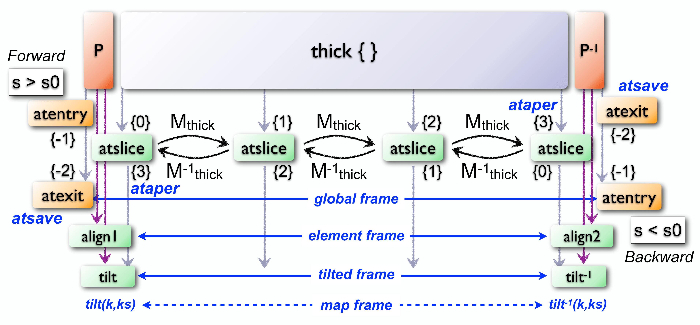

Track
=====
.. _ch.cmd.track:

The ``track`` command provides a simple interface to the *dynamic* tracking code. [#f1]_ The dynamic tracking can be used to track the particles in the *local reference system* (missing link) while running through the elements of a sequence. The particles coordinates can be expressed in the  while running through the elements of a sequence. The particles coordinates can be expressed in the *global reference system* (missing link) by changing from the local to the global frames using the information delivered by the  by changing from the local to the global frames using the information delivered by the :doc:`survey <survey>` command.

.. code-block:: lua
	:caption: Synopsis of the ``track`` command with default setup.
	:name: fig-track-synop

		mtbl, mflw [, eidx] = track { 
		 sequence=sequ, -- sequence (required) 
		 beam=nil, 	-- beam (or sequence.beam, required) 
		 range=nil,  	-- range of tracking (or sequence.range) 
		 dir=1,  	-- s-direction of tracking (1 or -1) 
		 s0=0,  	-- initial s-position offset [m]
		 X0=0,  	-- initial coordinates (or damap(s), or beta block(s)) 
		 O0=0,  	-- initial coordinates of reference orbit 
		 deltap=nil,  	-- initial deltap(s) 
		 nturn=1,  	-- number of turns to track 
		 nstep=-1,  	-- number of elements to track 
		 nslice=1,  	-- number of slices (or weights) for each element 
		 mapdef=false,  	-- setup for damap (or list of, true => {}) 
  		 method=2,  	-- method or order for integration (1 to 8) 
		 model='TKT',  	-- model for integration ('DKD' or 'TKT') 
		 ptcmodel=nil,  	-- use strict PTC thick model (override option) 
		 implicit=false,  	-- slice implicit elements too (e.g. plots) 
		 misalign=false,  	-- consider misalignment 
		 fringe=true,  	-- enable fringe fields (see element.flags.fringe) 
		 radiate=false,  	-- radiate at slices 
		 totalpath=false,  	-- variable 't' is the totalpath 
		 save=true,  	-- create mtable and save results 
		 title=nil,  	-- title of mtable (default seq.name) 
		 observe=1,  	-- save only in observed elements (every n turns) 
		 savesel=fnil,  	-- save selector (predicate) 
		 savemap=false,  	-- save damap in the column __map 
		 atentry=fnil,  	-- action called when entering an element 
		 atslice=fnil,  	-- action called after each element slices 
		 atexit=fnil,  	-- action called when exiting an element 
		 ataper=fnil,  	-- action called when checking for aperture 
		 atsave=fnil,  	-- action called when saving in mtable 
    	 atdebug=fnil,  	-- action called when debugging the element maps 
    	 info=nil,  	-- information level (output on terminal) 
		 debug=nil, 	-- debug information level (output on terminal) 
		 usrdef=nil,  	-- user defined data attached to the mflow 
		 mflow=nil,  	-- mflow, exclusive with other attributes except nstep 
	}

.. _sec.track.synop:

Command synopsis
----------------

The ``track`` command format is summarized in :numref:`fig-track-synop`, including the default setup of the attributes.

The ``track`` command supports the following attributes:

	**sequence**
	 The *sequence* to track. (no default, required). 
	 Example: :expr:`sequence = lhcb1`.

	**beam** 
	 The reference *beam* for the tracking. If no beam is provided, the command looks for a beam attached to the sequence, i.e. the attribute ``seq.beam``. [#f2]_ (default: ``nil``). 
	 Example: :expr:`beam = beam 'lhcbeam' { ... }` where ... are the *beam-attributes*.

	**range** 
	 A *range* specifying the span of the sequence track. If no range is provided, the command looks for a range attached to the sequence, i.e. the attribute . (default: ``nil``). 
	 Example: :expr:`range = "S.DS.L8.B1/E.DS.R8.B1"`.

	**dir**
	 The :math:`s`-direction of the tracking: ``1`` forward, ``-1`` backward. (default: 1). 
	 Example: :expr:`dir = - 1`.

	**s0** 
	 A *number* specifying the initial :math:`s`-position offset. (default: :math:`0` [m]). 
	 Example: :expr:`s0 = 5000`.

	**X0** 
 	 A *mappable* (or a list of *mappable*) specifying initial coordinates ``{x,px,y,py,t,pt}``, damap, or beta block for each tracked object, i.e. particle or damap. The beta blocks are converted to damaps, while the coordinates are converted to damaps only if ``mapdef`` is specified, but both will use ``mapdef`` to setup the damap constructor. Each tracked object may also contain a ``beam`` to override the reference beam, and a *logical* ``nosave`` to discard this object from being saved in the mtable. (default: 0). 
	 Example: :expr:`X0 = { x=1e- 3, px=- 1e- 5 }`.

	**O0**
	 A *mappable* specifying initial coordinates ``{x,px,y,py,t,pt}`` of the reference orbit around which X0 definitions take place. If it has the attribute :expr:`cofind == true`, it will be used as an initial guess to search for the reference closed orbit. (default: 0). 
	 Example: :expr:`O0 = { x=1e- 4, px=- 2e- 5, y=- 2e- 4, py=1e- 5 }`.

	**deltap**
	 A *number* (or list of *number*) specifying the initial :math:`\delta_p` to convert (using the beam) and add to the ``pt`` of each tracked particle or damap. (default: ``nil``). 
	 Example: :expr:`s0 = 5000`.

	**nturn**
	 A *number* specifying the number of turn to track. (default: 2). 
	 Example: :expr:`nturn = 2`.

	**nstep**
	 A *number* specifying the number of element to track. A negative value will track all elements. (default: -1). 
	 Example: :expr:`nstep = 1`.

	**nslice** 
	 A *number* specifying the number of slices or an *iterable* of increasing relative positions or a *callable* ``(elm, mflw, lw)`` returning one of the two previous kind of positions to track in the elements. The arguments of the callable are in order, the current element, the tracked map flow, and the length weight of the step. This attribute can be locally overridden by the element. (default: 1). 
	 Example: :expr:`nslice = 5`.

	**mapdef** 
	 A *logical* or a *damap* specification as defined by the :doc:`DAmap <diffmap>` module to track DA maps instead of particles coordinates. A value of ``true`` is equivalent to invoke the *damap* constructor with ``{}`` as argument. This attribute allows to track DA maps instead of particles. (default: ``nil``). 
	 Example: :expr:`mapdef = { xy=2, pt=5 }`.

	**method** 
	 A *number* specifying the order of integration from 1 to 8, or a *string* specifying a special method of integration. Odd orders are rounded to the next even order to select the corresponding Yoshida or Boole integration schemes. The special methods are ``simple`` (equiv. to ``DKD`` order 2), ``collim`` (equiv. to ``MKM`` order 2), and ``teapot`` (Teapot splitting order 2). (default: 2). 
	 Example: :expr:`method = 'teapot'`.

	**model** 
	 A *string* specifying the integration model, either ``'DKD'`` for *Drift-Kick-Drift* thin lens integration or ``'TKT'`` for *Thick-Kick-Thick* thick lens integration. [#f3]_ (default: ``'TKT'``)  
	 Example: :expr:`model = 'DKD'`.

	**ptcmodel** 
	 A *logical* indicating to use strict PTC model. [#f7]_ (default: ``nil``) 
	 Example: :expr:`ptcmodel = true`.

	**implicit**
	 A *logical* indicating that implicit elements must be sliced too, e.g. for smooth plotting. (default: ). 
	 Example: :expr:`implicit = true`.

	**misalign**
	 A *logical* indicating that misalignment must be considered. (default: ``false``). 
	 Example: :expr:`misalign = true`.

	**fringe**
	 A *logical* indicating that fringe fields must be considered or a *number* specifying a bit mask to apply to all elements fringe flags defined by the element module. The value ``true`` is equivalent to the bit mask , i.e. allow all elements (default) fringe fields. (default: ``true``). 
	 Example: :expr:`fringe = false`.

	**radiate**
	 A *logical* enabling or disabling the radiation or a *string* specifying the type of radiation: ``'average'`` or ``'quantum'``. The value ``true`` is equivalent to ``'average'``. The value ``'quantum+photon'`` enables the tracking of emitted photons. (default: ``false``). 
	 Example: :expr:`radiate = 'quantum'`.

	**totalpath** 
	 A *logical* indicating to use the totalpath for the fifth variable ``'t'`` instead of the local path. (default: ``false``). 
	 Example: :expr:`totalpath = true`.

	**save** 
	 A *logical* specifying to create a *mtable* and record tracking information at the observation points. The ``save`` attribute can also be a *string* specifying saving positions in the observed elements: ``"atentry"``, ``"atslice"``, ``"atexit"`` (i.e. ``true``), ``"atbound"`` (i.e. entry and exit), ``"atbody"`` (i.e. slices and exit) and ``"atall"``. (default: ``true``). 
	 Example: :expr:`save = false`.

	**title** 
	 A *string* specifying the title of the *mtable*. If no title is provided, the command looks for the name of the sequence, i.e. the attribute ``seq.name``. (default: ``nil``). 
	 Example: :expr:`title = "track around IP5"`.

	**observe** 
	 A *number* specifying the observation points to consider for recording the tracking information. A zero value will consider all elements, while a positive value will consider selected elements only, checked with method :meth:`:is_observed`, every ``observe`` :math:`>0` turns. (default: ``1`` ). 
	 Example: :expr:`observe = 1`.

	**savesel**
	 A *callable* ``(elm, mflw, lw, islc)`` acting as a predicate on selected elements for observation, i.e. the element is discarded if the predicate returns ``false``. The arguments are in order, the current element, the tracked map flow, the length weight of the slice and the slice index. (default: ``fnil``) 
	 Example: :expr:`savesel = \LMB e -> mylist ~= nil`.

	**savemap** 
	 A *logical* indicating to save the damap in the column ``__map`` of the *mtable*. (default: ``false``). 
	 Example: :expr:`savemap = true`.

	**atentry** 
	 A *callable* ``(elm, mflw, 0, - 1)`` invoked at element entry. The arguments are in order, the current element, the tracked map flow, zero length and the slice index . (default: ``fnil``). 
	 Example: :expr:`atentry = myaction`.

	**atslice** 
	 A *callable* ``(elm, mflw, lw, islc)`` invoked at element slice. The arguments are in order, the current element, the tracked map flow, the length weight of the slice and the slice index. (default: ``fnil``). 
	 Example: :expr:`atslice = myaction`.

	**atexit** 
	 A *callable* ``(elm, mflw, 0, - 2)`` invoked at element exit. The arguments are in order, the current element, the tracked map flow, zero length and the slice index . (default: ``fnil``). 
	 Example: :expr:`atexit = myaction`.

	**ataper** 
	 A *callable* ``(elm, mflw, lw, islc)`` invoked at element aperture checks, by default at last slice. The arguments are in order, the current element, the tracked map flow, the length weight of the slice and the slice index. If a particle or a damap hits the aperture, then its ``status = "lost"`` and it is removed from the list of tracked items. (default: ``fnil``). 
	 Example: :expr:`ataper = myaction`.

	**atsave** 
	 A *callable* ``(elm, mflw, lw, islc)`` invoked at element saving steps, by default at exit. The arguments are in order, the current element, the tracked map flow, the length weight of the slice and the slice index. (default: ``fnil``). 
	 Example: :expr:`atsave = myaction`.

	**atdebug** 
	 A *callable* ``(elm, mflw, lw, [msg], [...])`` invoked at the entry and exit of element maps during the integration steps, i.e. within the slices. The arguments are in order, the current element, the tracked map flow, the length weight of the integration step and a *string* specifying a debugging message, e.g. ``map_name:0`` for entry and ``":1"`` for exit. If the level ``debug`` :math:`\geq 4` and ``atdebug`` is not specified, the default *function* ``mdump`` is used. In some cases, extra arguments could be passed to the method. (default: ``fnil``). 
	 Example: :expr:`atdebug = myaction`.

	**info**
	 A *number* specifying the information level to control the verbosity of the output on the console. (default: ``nil``).
	 Example: :expr:`info = 2`.

	**debug**
	 A *number* specifying the debug level to perform extra assertions and to control the verbosity of the output on the console. (default: ``nil``). 
	 Example: :expr:`debug = 2`.

	**usrdef** 
	 Any user defined data that will be attached to the tracked map flow, which is internally passed to the elements method :meth:`:track` and to their underlying maps. (default: ``nil``). 
	 Example: :expr:`usrdef = { myvar=somevalue }`.

	**mflow** 
	 An *mflow* containing the current state of a ``track`` command. If a map flow is provided, all attributes are discarded except ``nstep``, ``info`` and ``debug``, as the command was already set up upon its creation. (default: ``nil``). 
	 Example: :expr:`mflow = mflow0`.

The ``track`` command returns the following objects in this order:

	**mtbl** 
		An *mtable* corresponding to the TFS table of the ``track`` command.

	**mflw** 
		An *mflow* corresponding to the map flow of the ``track`` command.

	**eidx**
		An optional *number* corresponding to the last tracked element index in the sequence when ``nstep`` was specified and stopped the command before the end of the ``range``.

Track mtable
------------
.. _sec.track.mtable:

The ``track`` command returns a *mtable* where the information described hereafter is the default list of fields written to the TFS files. [#f4]_ 

	**name**
	 The name of the command that created the ``"track"``.
	**type**
	 The type of the ``"track"``.
	**title**
	 The value of the command attribute ``title``.
	**origin**
	 The origin of the application that created the ``"MAD 1.0.0 OSX 64"``.
	**date**
	 The date of the creation of the ``"27/05/20"``.
	**time**
	 The time of the creation of the ``"19:18:36"``.
	**refcol**
	 The reference *column* for the *mtable* dictionnary, e.g. ``"name"``.
	**direction**
	 The value of the command attribute ``dir``.
	**observe**
	 The value of the command attribute ``observe``.
	**implicit**
	 The value of the command attribute ``implicit``.
	**misalign**
	 The value of the command attribute ``misalign``.
	**deltap**
	 The value of the command attribute ``deltap``.
	**lost**
	 The number of lost particle(s) or damap(s).
	**range**
	 The value of the command attribute ``range``. [#f5]_ 
	**__seq**
	 The *sequence* from the command attribute ``sequence``. [#f6]_ :

	**name**
	 The name of the element.
	**kind**
	 The kind of the element.
	**s**
	 The :math:`s`-position at the end of the element slice.
	**l**
	 The length from the start of the element to the end of the element slice.
	**id**
	 The index of the particle or damap as provided in ``X0``.
	**x**
	 The local coordinate :math:`x` at the :math:`s`-position.
	**px**
	 The local coordinate :math:`p_x` at the :math:`s`-position.
	**y**
	 The local coordinate :math:`y` at the :math:`s`-position.
	**py**
	 The local coordinate :math:`p_y` at the :math:`s`-position.
	**t**
	 The local coordinate :math:`t` at the :math:`s`-position.
	**pt**
	 The local coordinate :math:`p_t` at the :math:`s`-position.
	**pc**
	 The reference beam :math:`P_0c` in which :math:`p_t` is expressed.
	**slc**
	 The slice index ranging from ``- 2`` to ``nslice``.
	**turn**
	 The turn number.
	**tdir**
	 The :math:`t`-direction of the tracking in the element.
	**eidx**
	 The index of the element in the sequence.
	**status**
	 The status of the particle or damap.
	**__map**
	 The damap at the :math:`s`-position. [#f6]_

Dynamical tracking
------------------

:numref:`fig track trkslc` presents the scheme of the dynamical tracking through an element sliced with ``nslice=3``. The actions ``atentry`` (index ``- 1``), ``atslice`` (indexes ``0:math:`..`3``), and ``atexit`` (index ``- 2``) are reversed between the forward tracking (``dir=1`` with increasing :math:`s`-position) and the backward tracking (``dir=- 1`` with decreasing :math:`s`-position). By default, the action ``atsave`` is attached to the exit slice and the action ``ataper`` is attached to the last slice just before exit, i.e. to the last ``atslice`` action in the tilted frame, and hence they are also both reversed in the backward tracking.

.. _fig track trkslc:

	My Dynamical tracking with slices. 

Slicing
"""""""

	#.	 A *number* of the form :expr:`nslice=N` that specifies the number of slices with indexes :math:`0`..:math:`N`. This defines a uniform slicing with slice length :math:`l_{\text{slice}} = l_{\text{elem}}/N`.

	#.	 An *iterable* of the form ``nslice={lw_1,lw_2,..,lw_N}`` with :math:`\sum_i lw_i=1` that specifies the fraction of length of each slice with indexes :math:`0` .. :math:`N` where :math:`N`= ``#nslice``. This defines a non-uniform slicing with a slice length of :math:`l_i = lw_i\times l_{\text{elem}}`.

	#.	 A *callable* ``(elm, mflw, lw)`` returning one of the two previous forms of slicing. The arguments are in order, the current element, the tracked map flow, and the length weight of the step, which should allow to return a user-defined element-specific slicing.

The surrounding ``P`` and ``P^-1`` maps represent the patches applied around the body of the element to change the frames, after the ``atentry`` and before the ``atexit`` actions:

	#.	 The misalignment of the element to move from the *global frame* to the *element frame* if the command attribute ``misalign`` is set to ``true``.

	#.	 The tilt of the element to move from the element frame to the *titled frame* if the element attribute ``tilt`` is non-zero. The ``atslice`` actions take place in this frame.

The *map frame* is specific to some maps while tracking through the body of the element. In principle, the map frame is not visible to the user, only to the integrator. For example, a quadrupole with both ``k1`` and ``k1s`` defined will have a *map frame* tilted by the angle :math:`\alpha=-\frac{1}{2}\tan^{-1}\frac{k1s}{k1}` attached to its thick map, i.e. the focusing matrix handling only :math:`\tilde{k}_1 = \sqrt{k1^2+k1s^2}`, but not to its thin map, i.e. the kick from all multipoles (minus ``k1`` and ``k1s``) expressed in the *tilted frame* , during the integration steps.

Sub-elements
""""""""""""

The ``track`` command takes sub-elements into account. In this case, the slicing specification is taken between sub-elements, e.g. 3 slices with 2 sub-elements gives a final count of 9 slices. It is possible to adjust the number of slices between sub-elements with the third form of slicing specifier, i.e. by using a callable where the length weight argument is between the current (or the end of the element) and the last sub-elements (or the start of the element).

Particles status
""""""""""""""""

The ``track`` command initializes the map flow with particles or damaps or both, depending on the attributes ``X0`` and ``mapdef``. The ``status`` attribute of each particle or damap will be set to one of ``"Xset"``, ``"Mset"``, and ``"Aset"`` to track the origin of its initialization: coordinates, damap, or normalizing damap (normal form or beta block). After the tracking, some particles or damaps may have the status ``"lost"`` and their number being recorded in the counter ``lost`` from TFS table header. Other commands like ``cofind`` or ``twiss`` may add extra tags to the status value, like ``"stable"``, ``"unstable"`` and ``"singular"``.

Examples
--------

.. rubric:: Footnotes

.. [#f1] MAD-NG implements only two tracking codes denominated the *geometric* and the *dynamic* tracking.
.. [#f2] Initial coordinates ``X0`` may override it by providing per particle or damap beam.
.. [#f3] The ``TKT`` scheme (Yoshida) is automatically converted to the ``MKM`` scheme (Boole) when approriate.
.. [#f7] In all cases, MAD-NG uses PTC setup ``time=true, exact=true``.
.. [#f4] The output of mtable in TFS files can be fully customized by the user.
.. [#f5] This field is not saved in the TFS table by default.
.. [#f6] Fields and columns starting with two underscores are protected data and never saved to TFS files.
